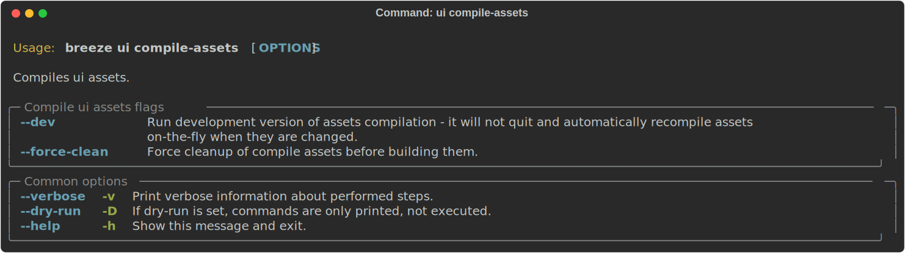
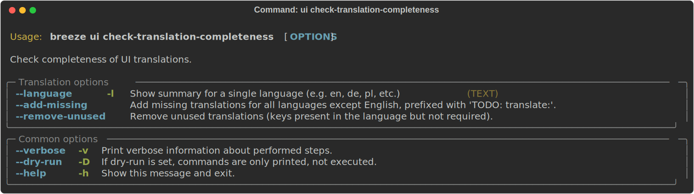

 .. Licensed to the Apache Software Foundation (ASF) under one
    or more contributor license agreements.  See the NOTICE file
    distributed with this work for additional information
    regarding copyright ownership.  The ASF licenses this file
    to you under the Apache License, Version 2.0 (the
    "License"); you may not use this file except in compliance
    with the License.  You may obtain a copy of the License at

 ..   http://www.apache.org/licenses/LICENSE-2.0

 .. Unless required by applicable law or agreed to in writing,
    software distributed under the License is distributed on an
    "AS IS" BASIS, WITHOUT WARRANTIES OR CONDITIONS OF ANY
    KIND, either express or implied.  See the License for the
    specific language governing permissions and limitations
    under the License.

UI tasks
--------

There are some Breeze commands that are used to support Apache Airflow project UI.

Those are all of the available ui commands:

.. image:: ./images/output_ui.svg
  :target: https://raw.githubusercontent.com/apache/airflow/main/dev/breeze/doc/images/output_ui.svg
  :width: 100%
  :alt: Breeze ui commands

Compiling ui assets
--------------------

Before starting Airflow, Airflow API server needs to prepare www assets - compiled with node and yarn. The
``breeze ui compile-assets`` command takes care about it. This is needed when you want to run API server
inside of the breeze.

Note

This command requires the ``prek`` tool, which should be installed by following
`this guide <../../../contributing-docs/03b_contributors_quick_start_seasoned_developers.rst#configuring-prek>`__.

Check translation completeness
""""""""""""""""""""""""""""""

To check if the UI translations are complete for all languages, you can use the
``breeze ui check-translation-completeness`` command. This command compares all non-English
locale translations against the English (base) translations to identify:

* Missing translation keys that need to be added
* Extra translation keys that should be removed
* TODO markers indicating incomplete translations
* Translation coverage percentages per language

The command supports language-specific plural forms (e.g., Polish has 4 forms, Arabic has 6)
and can automatically add missing keys or remove extra keys.

These are all available flags of ``check-translation-completeness`` command:

Example usage:

.. code-block:: bash

     # Check all languages
     breeze ui check-translation-completeness

     # Check a specific language
     breeze ui check-translation-completeness --language pl

     # Add missing translations with TODO markers
     breeze ui check-translation-completeness --add-missing

     # Remove extra translations not present in English
     breeze ui check-translation-completeness --remove-extra

     # Fix translations for a specific language
     breeze ui check-translation-completeness --language de --add-missing --remove-extra

-----

Next step: Follow the `Advanced Breeze topics <11_advanced_breeze_topics.rst>`__ instructions to learn more
about advanced Breeze topics and internals.
