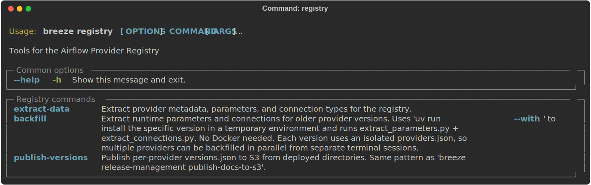
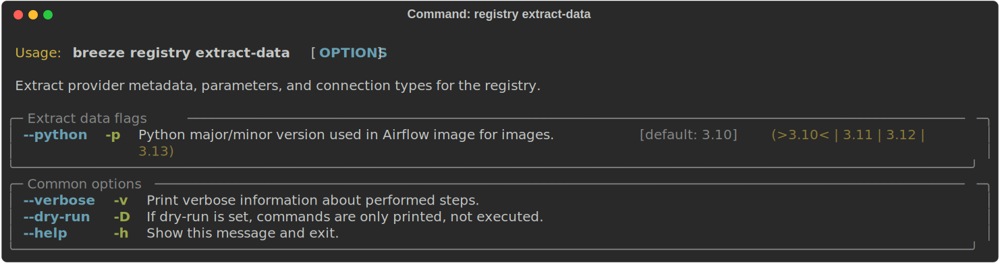
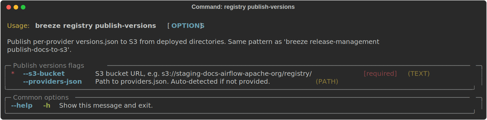

 .. Licensed to the Apache Software Foundation (ASF) under one
    or more contributor license agreements.  See the NOTICE file
    distributed with this work for additional information
    regarding copyright ownership.  The ASF licenses this file
    to you under the Apache License, Version 2.0 (the
    "License"); you may not use this file except in compliance
    with the License.  You may obtain a copy of the License at

 ..   http://www.apache.org/licenses/LICENSE-2.0

 .. Unless required by applicable law or agreed to in writing,
    software distributed under the License is distributed on an
    "AS IS" BASIS, WITHOUT WARRANTIES OR CONDITIONS OF ANY
    KIND, either express or implied.  See the License for the
    specific language governing permissions and limitations
    under the License.

Registry tasks
--------------

Breeze commands for building the Apache Airflow Provider Registry.

These are all of the available registry commands:

Extracting registry data
........................

The ``breeze registry extract-data`` command runs the three extraction scripts
(``extract_metadata.py``, ``extract_parameters.py``, ``extract_connections.py``)
inside a breeze CI container where all providers are installed. This is the same
command used by the ``registry-build.yml`` CI workflow.

Example usage:

.. code-block:: bash

     # Extract all registry data with default Python version
     breeze registry extract-data

     # Extract with a specific Python version
     breeze registry extract-data --python 3.12

Publishing version metadata
..........................

The ``breeze registry publish-versions`` command lists S3 directories under
``providers/{id}/`` to discover every deployed version, then writes
``api/providers/{id}/versions.json`` for each provider. It also invalidates
the CloudFront cache for the staging or live distribution.

This is the same command used by the ``registry-build.yml`` CI workflow after
syncing the built site to S3.

Example usage:

.. code-block:: bash

     # Publish to staging
     breeze registry publish-versions --s3-bucket s3://staging-docs-airflow-apache-org/registry/

     # Publish to live
     breeze registry publish-versions --s3-bucket s3://live-docs-airflow-apache-org/registry/

     # With a custom providers.json
     breeze registry publish-versions --s3-bucket s3://bucket/registry/ --providers-json path/to/providers.json

-----

Next step: Follow the `Advanced Breeze topics <13_advanced_breeze_topics.rst>`__ instructions to learn more
about advanced Breeze topics and internals.
