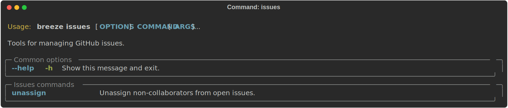
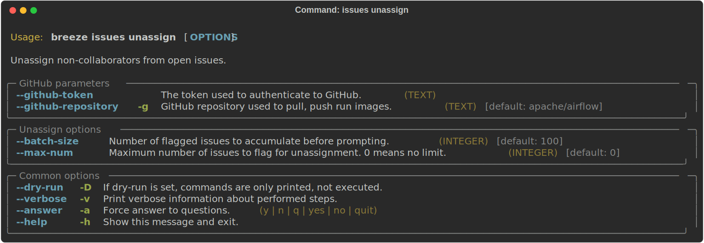

 .. Licensed to the Apache Software Foundation (ASF) under one
    or more contributor license agreements.  See the NOTICE file
    distributed with this work for additional information
    regarding copyright ownership.  The ASF licenses this file
    to you under the Apache License, Version 2.0 (the
    "License"); you may not use this file except in compliance
    with the License.  You may obtain a copy of the License at

 ..   http://www.apache.org/licenses/LICENSE-2.0

 .. Unless required by applicable law or agreed to in writing,
    software distributed under the License is distributed on an
    "AS IS" BASIS, WITHOUT WARRANTIES OR CONDITIONS OF ANY
    KIND, either express or implied.  See the License for the
    specific language governing permissions and limitations
    under the License.

Issues tasks
------------

There are some Breeze commands that are used to manage GitHub issues for the Apache Airflow project.

Those are all of the available issues commands:

Unassigning non-collaborators
"""""""""""""""""""""""""""""

The ``breeze issues unassign`` command finds open issues that have assignees who are not repository
collaborators, and removes those assignees. This is useful for maintainers to clean up stale assignments.

Example usage:

.. code-block:: bash

     # Dry run to see which assignees would be removed
     breeze issues unassign --dry-run

     # Run with confirmation prompts per batch
     breeze issues unassign

     # Use a custom batch size
     breeze issues unassign --batch-size 50

-----

Next step: Follow the `Advanced Breeze topics <12_advanced_breeze_topics.rst>`__ instructions to learn more
about advanced Breeze topics and internals.
