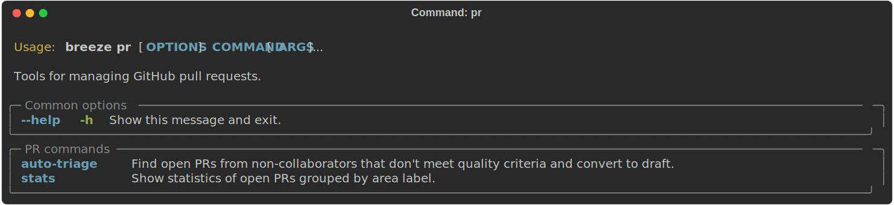
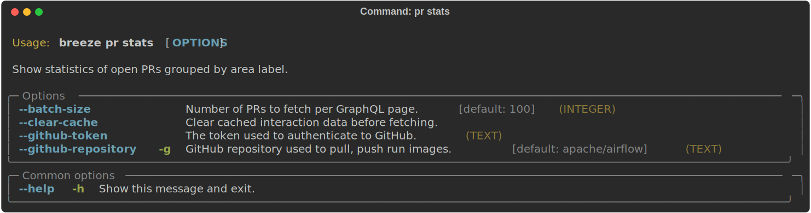

 .. Licensed to the Apache Software Foundation (ASF) under one
    or more contributor license agreements.  See the NOTICE file
    distributed with this work for additional information
    regarding copyright ownership.  The ASF licenses this file
    to you under the Apache License, Version 2.0 (the
    "License"); you may not use this file except in compliance
    with the License.  You may obtain a copy of the License at

 ..   http://www.apache.org/licenses/LICENSE-2.0

 .. Unless required by applicable law or agreed to in writing,
    software distributed under the License is distributed on an
    "AS IS" BASIS, WITHOUT WARRANTIES OR CONDITIONS OF ANY
    KIND, either express or implied.  See the License for the
    specific language governing permissions and limitations
    under the License.

Pull request tasks
------------------

There are Breeze commands that help maintainers manage GitHub pull requests for the Apache Airflow project.

Those are all of the available PR commands:

Triaging PRs
""""""""""""

The triage workflow that used to live in ``breeze pr auto-triage`` is now an
agentic Claude Code skill, ``pr-triage``, maintained as plain Markdown alongside
the codebase. See `Maintainer PR Triage and Review
<../../../contributing-docs/25_maintainer_pr_triage.md>`__ for the maintainer-facing
workflow, or the skill's `SKILL.md
<../../../.github/skills/pr-triage/SKILL.md>`__ for the implementation details
(classification matrix, GraphQL queries, comment templates, stale sweeps).

PR statistics
"""""""""""""

The ``breeze pr stats`` command produces aggregate statistics of open PRs grouped by area label.

-----

Next step: Follow the `Advanced breeze topics <14_advanced_breeze_topics.rst>`__ instructions to learn how to manage GitHub
pull requests with Breeze.
