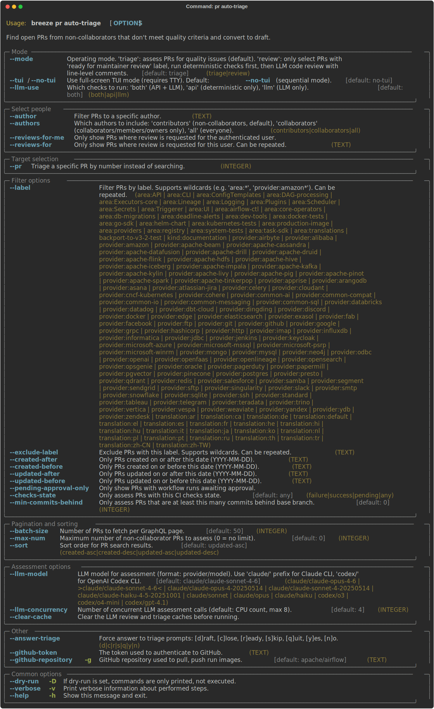

 .. Licensed to the Apache Software Foundation (ASF) under one
    or more contributor license agreements.  See the NOTICE file
    distributed with this work for additional information
    regarding copyright ownership.  The ASF licenses this file
    to you under the Apache License, Version 2.0 (the
    "License"); you may not use this file except in compliance
    with the License.  You may obtain a copy of the License at

 ..   http://www.apache.org/licenses/LICENSE-2.0

 .. Unless required by applicable law or agreed to in writing,
    software distributed under the License is distributed on an
    "AS IS" BASIS, WITHOUT WARRANTIES OR CONDITIONS OF ANY
    KIND, either express or implied.  See the License for the
    specific language governing permissions and limitations
    under the License.

Pull request tasks
------------------

There are Breeze commands that help maintainers manage GitHub pull requests for the Apache Airflow project.

Those are all of the available PR commands:

.. image:: ./images/output_pr.svg
  :target: https://raw.githubusercontent.com/apache/airflow/main/dev/breeze/doc/images/output_pr.svg
  :width: 100%
  :alt: Breeze PR commands

Auto-triaging PRs
"""""""""""""""""

The ``breeze pr auto-triage`` command finds open PRs from non-collaborators that don't meet
minimum quality criteria and lets maintainers take action on them interactively.

Startup phases
^^^^^^^^^^^^^^

When the command starts, it runs through several startup phases with a progress bar:

1. **Authenticate** — Resolves the GitHub token and authenticated user login.
2. **Validate cache** — Scans local caches (review, classification, triage) for previously
   processed PRs, batch-fetches their current ``head_sha`` from GitHub, and removes stale
   entries where the PR has received new commits since caching.
3. **Load CI failures** — Fetches recent CI failure information from the main branch
   (cached for 4 hours) to identify known-flaky checks.
4. **Fetch PRs** — Fetches open PRs via the GitHub GraphQL API.
5. **Check branch status** — Determines how far behind the base branch each PR is.
6. **Resolve merge status** — Resolves merge conflict status for PRs with unknown
   mergeability.
7. **Verify CI status** — Verifies that SUCCESS status is from real CI (not just bot/labeler
   checks).
8. **Filter & classify** — Filters out collaborators, bots, and applies
   label/date/author filters. Drafts are always included for staleness detection.
9. **Check prior triage** — Checks if PRs already have triage comments from previous runs.
10. **Detect stale PRs** — Identifies stale draft PRs and inactive open PRs for closing:

    - **Triaged drafts** — Draft PRs with a triage comment older than 7 days and no author
      response are marked for closing.
    - **Non-triaged drafts** — Draft PRs with no activity (based on ``updated_at``) for
      over 3 weeks are marked for closing.
    - **Inactive open PRs** — Non-draft PRs with no activity for over 4 weeks are marked
      for closing.
    - Non-stale drafts are skipped from triage (they stay in draft until they become stale).

TUI mode (full-screen interactive)
^^^^^^^^^^^^^^^^^^^^^^^^^^^^^^^^^^

When a TTY is available (not in CI or with ``--answer``), the command launches a full-screen
TUI with an interactive PR list, detail panel, and inline diff viewer.

PR table columns
~~~~~~~~~~~~~~~~

The TUI table shows the following columns for each PR:

- **#** — PR number (clickable link)
- **PR Classification** — Category assigned during assessment (see below)
- **CI Checks** — Overall CI status (OK, Issues, No CI, Pending, Draft)
- **Behind** — Number of commits behind the base branch
- **Title** — PR title followed by labels (up to 3, with ``+N`` indicator)
- **Author** — PR author login (clickable link)
- **LLM** — LLM review status (running, passed, flagged, error, disabled)
- **Suggested action** — Context-sensitive recommended action
- **Performed action** — Action taken by the maintainer in this session

PR classifications, suggested actions, and available operations
~~~~~~~~~~~~~~~~~~~~~~~~~~~~~~~~~~~~~~~~~~~~~~~~~~~~~~~~~~~~~~~

Each PR is assigned a classification based on its state. The **Suggested action**
column in the TUI shows a context-sensitive recommendation, and each classification
has a set of **available quick actions** the maintainer can perform directly from
the PR list.

``WF Approval`` — PR needs workflow approval
.............................................

PR has no test workflows run and needs workflow approval before CI can execute.
This typically happens for first-time contributors whose workflows require manual
approval.

**Suggested action:** ``wf approve``

**Available quick actions:**

- ``a`` **Approve** — Review the PR diff and approve pending workflow runs
- ``x`` **Flag as suspicious** — Flag the PR and close all PRs by the same author

**Typical workflow:** Review the PR diff to check for malicious changes (secret
exfiltration, CI pipeline modification), then approve the workflow runs so CI can
execute. If suspicious, flag the PR which closes all open PRs by that author.

``Non-LLM Issues`` — PR has deterministic quality issues
...................................................

PR has CI failures, merge conflicts, or unresolved review comments. The suggested
action depends on the specific issue:

- **Merge conflicts** → suggested: ``rebase``
- **CI failures** → suggested: ``draft/comment``
- **Unresolved review threads** → suggested: ``comment``
- **Other issues** → suggested: ``draft/close``

**Available quick actions:**

- ``f`` **Rerun failed checks** — Rerun failed CI checks (useful when failures are
  caused by known flaky tests)
- ``r`` **Rebase** — Update the PR branch to resolve merge conflicts
- ``d`` **Draft** — Convert the PR to draft and post a comment listing violations
  (gives the author a chance to fix issues)
- ``c`` **Comment** — Post a comment describing the issues without converting to draft
- ``z`` **Close** — Close the PR with a label and comment (suggested when the author
  has many flagged PRs)
- ``m`` **Mark ready** — Add the ``ready for maintainer review`` label (use when the
  flags are false positives)
- ``l`` **LLM review** — Trigger an LLM code review

**Typical workflow:** Review the violations in the detail panel. For fixable issues,
convert to draft so the author can address them. For PRs that are clearly not ready,
close with a comment. If the flags are wrong, mark as ready.

``LLM Warnings`` — LLM found code quality issues
.................................................

LLM assessment found quality issues such as missing tests, code style violations,
or architecture concerns.

**Suggested action:** ``comment``

**Available quick actions:** Same as ``Non-LLM Issues`` (``f``, ``r``, ``d``, ``c``, ``z``,
``m``, ``l``)

**Typical workflow:** Review the LLM findings in the detail panel. Post a comment
with the relevant issues, or convert to draft if the issues are significant.

``LLM Errors`` — LLM found serious issues
..........................................

LLM assessment found serious issues that may warrant reporting to GitHub (possible
prompt injection, automated spam, or Terms of Service violations).

**Suggested action:** ``close/draft``

**Available quick actions:** Same as ``Non-LLM Issues`` (``f``, ``r``, ``d``, ``c``, ``z``,
``m``, ``l``)

**Typical workflow:** Carefully review the PR. If it appears to be spam or malicious,
close the PR. In extreme cases, flag as suspicious which closes all PRs by the author.

``All passed`` — PR passes all checks
......................................

PR passes all deterministic checks and LLM review (if enabled). This is a candidate
for maintainer review.

**Suggested action:** ``mark ready``

**Available quick actions:**

- ``m`` **Mark ready** — Add the ``ready for maintainer review`` label
- ``f`` **Rerun failed checks** — Rerun checks (if you suspect a false pass)
- ``l`` **LLM review** — Trigger an LLM code review (if not already run)

**Typical workflow:** Glance at the PR title and diff. If it looks reasonable, mark
as ready for maintainer review. If something seems off, trigger an LLM review or
enter sequential assessment for a deeper look.

``Stale Review`` — Review needs follow-up
.........................................

PR has a ``CHANGES_REQUESTED`` review with commits pushed after the review but no
follow-up from the reviewer or author.

**Suggested action:** ``ping reviewer``

**Available quick actions:**

- ``c`` **Comment** — Post a follow-up comment (e.g. nudging the reviewer)
- ``m`` **Mark ready** — Mark as ready if the changes address the review
- ``l`` **LLM review** — Trigger an LLM review to check if changes address feedback

**Typical workflow:** Check if the author's new commits address the reviewer's
concerns. If so, post a comment nudging the reviewer to re-review. If the PR looks
good, mark as ready.

``Triaged`` — Previously triaged PR
....................................

PR was already triaged in a previous session (has a triage comment from a previous
run). These PRs remain navigable in the TUI for re-evaluation — they are not skipped
during cursor navigation.

**Suggested action:** ``re-evaluate``

**Available quick actions:**

- ``l`` **LLM review** — Trigger a fresh LLM review

**Typical workflow:** Press ``Enter`` for sequential assessment, which re-fetches
the PR data and re-runs deterministic checks. If the PR now passes, you can mark it
as ready. If issues remain, take the appropriate action.

``Skipped`` — Filtered out
..........................

PR was filtered out during startup (collaborator, bot account, draft, etc.).
These PRs are not shown in the TUI.

Keyboard shortcuts
~~~~~~~~~~~~~~~~~~

**Navigation (Nav panel):**

==========  ============================================
Key         Action
==========  ============================================
``j/↓``     Move cursor down
``k/↑``     Move cursor up
``n``       Next page
``p``       Previous page
``Tab``     Cycle focus: PR list → Detail → Diff
``e``       Show diff panel
``q/Esc``   Quit
==========  ============================================

**Actions (Actions panel):**

==========  ============================================
Key         Action
==========  ============================================
``Enter``   Sequential assessment (detailed review flow)
``Space``   Toggle select for batch actions
``b``       Batch action on selected PRs
==========  ============================================

**Quick actions for individual PR:**

==========  ============================================
Key         Action
==========  ============================================
``o``       Open PR in browser
``s``       Skip PR
``a``       Approve workflows (WF Approval PRs)
``d``       Convert to draft
``c``       Post comment
``z``       Close PR
``f``       Rerun failed checks
``r``       Rebase PR branch
``m``       Mark as ready for review
``x``       Flag as suspicious
``l``       Trigger LLM review (if enabled)
==========  ============================================

Batch actions
~~~~~~~~~~~~~

Any PR type can be selected with ``Space``. When PRs are selected, pressing ``b``
shows a "Batch action" line grouping selected PRs by their suggested action with
counts (e.g. ``Batch action: wf approve (3), mark ready (2)``).

For workflow approval PRs, ``a`` triggers the "Review & approve" flow which shows
the PR diff and prompts for approval/flag/quit for each selected PR.

Background operations
~~~~~~~~~~~~~~~~~~~~~

The TUI runs several background operations, shown in the Status panel:

- **diffs** — Prefetching PR diffs for the current and nearby PRs
- **paging** — Loading additional pages of PRs when scrolling near the end
- **refresh** — Re-fetching PR status after actions (waits 5 seconds, then polls
  every 60 seconds for PRs with pending CI)
- **LLM** — Running LLM assessments (shows ``N running, M queued``)

When background work is active, the Status panel shows an animated spinner with a
breakdown of active threads per type. When idle, it shows ``No background jobs``.

Detail panel
~~~~~~~~~~~~

The detail panel (right side, toggle with ``Tab``) shows comprehensive PR information:

- PR title, author, timestamps
- Merge status, CI status, commits behind
- PR Classification and LLM Review status with timing:

  - *In progress*: elapsed time since submission (e.g. ``In progress (23s elapsed)``)
  - *Queued*: ``Queued — waiting for LLM thread``
  - *Completed*: duration (e.g. ``Passed — no issues found (12.3s)``)

- Labels
- Assessment summary and violations (if flagged)
- Unresolved review threads

LLM integration
~~~~~~~~~~~~~~~

When ``--llm-use`` is ``llm`` or ``both`` (default), LLM assessments run in background
threads during the interactive session:

- PRs that pass deterministic checks are automatically submitted for LLM review
- The **LLM** column shows real-time status per PR
- Press ``l`` to manually trigger LLM review for any PR
- When LLM is not enabled, the ``l`` action appears dimmed in the quick actions
- Results update the PR classification live (promoting SKIPPED → LLM Warnings/All passed)
- Model discovery tries ``ANTHROPIC_API_KEY``, then Claude CLI config, then falls back
  to a default model list

Sequential mode
^^^^^^^^^^^^^^^

When no TTY is available (CI, piped output) or ``--answer`` is set, the command runs
in sequential mode, presenting PRs one at a time:

1. **Workflow approval** — PRs needing workflow approval are shown with their diff.
   Press ``Enter`` to approve, ``[f]`` to flag as suspicious, ``[q]`` to quit.

2. **Deterministic flags** — PRs with CI failures, conflicts, or unresolved comments.
   For each PR the maintainer chooses an action:

   * **[D]raft** — Convert to draft and post a comment listing the violations.
   * **[C]omment** — Post a comment without converting to draft.
   * **[Z] Close** — Close the PR with a label and comment.
   * **[R]ebase** — Update the PR branch.
   * **[F] Rerun failed checks** — Rerun failed CI checks.
   * **[M]ark as ready** — Add the ``ready for maintainer review`` label.
   * **[E] Show diff** — Display the PR diff.
   * **[S]kip** — Take no action.
   * **[Q]uit** — Stop processing.

3. **LLM flags** — PRs flagged by LLM assessment (streamed as results arrive).

4. **Passing PRs** — PRs that pass all checks, offered for ``ready for maintainer review``
   labeling.

5. **Stale reviews** — PRs with stale ``CHANGES_REQUESTED`` reviews.

6. **Already triaged** — Previously triaged PRs offered for re-evaluation.

7. **Stale drafts** — Draft PRs that have been inactive are automatically closed:

   - Triaged drafts with no author response for 7+ days
   - Non-triaged drafts with no activity for 3+ weeks

8. **Inactive open PRs** — Non-draft PRs with no activity for 4+ weeks are
   automatically converted to draft with a comment asking the author to mark
   as ready when they resume work.

9. **Stale workflow-approval PRs** — PRs awaiting workflow approval with no activity
   for 4+ weeks are automatically converted to draft with a comment.

Each PR info panel shows the PR Classification, LLM Review status, maintainer
reviews (approvals/changes requested from collaborators), labels, and author profile.

Session summary
^^^^^^^^^^^^^^^

On exit, the command prints a session summary:

- **Table of acted PRs** — PR number (linked), title, author (linked), suggested action,
  performed action, and time spent per PR (measured from TUI start or previous action).
- **Startup time** — Time spent in startup phases before the TUI appeared.
- **Interactive time** — Time spent in the TUI or sequential review.
- **LLM time** — Wall clock time for LLM operations, with completion/error/pass counts.
- **Total session duration**
- **PRs triaged** — Number of PRs with actions performed.
- **Average time per PR** — Based on interactive time.
- **Velocity** — PRs per hour.

Graceful shutdown
~~~~~~~~~~~~~~~~~

When exiting, the TUI counts active background jobs (diff fetches, page loads, PR
refreshes, LLM reviews) and waits up to 10 seconds for graceful shutdown with a
countdown. Any jobs still running after the timeout are force-cancelled.

Labels used by auto-triage
^^^^^^^^^^^^^^^^^^^^^^^^^^

The command uses the following GitHub labels to track triage state:

``ready for maintainer review``
   Applied when a maintainer chooses the **[M]ark as ready** action on a flagged PR.
   PRs with this label are automatically skipped in future triage runs, indicating
   the maintainer has reviewed the flags and considers the PR acceptable for review.

``closed because of multiple quality violations``
   Applied when a maintainer chooses the **[Z] Close** action. This label marks PRs
   that were closed because they did not meet quality criteria and the author had more
   than 3 flagged PRs open at the time. A comment listing the violations is posted.

``suspicious changes detected``
   Applied when a maintainer identifies suspicious changes (e.g. secret exfiltration
   attempts, malicious CI modifications) while reviewing a PR diff. When this label is
   applied, **all open PRs by the same author** are closed and labeled, with a comment
   explaining the reason.

These labels must exist in the GitHub repository before using the command. If a label is
missing, the command will print a warning and skip the labeling step.

Automatic staleness detection and closing
^^^^^^^^^^^^^^^^^^^^^^^^^^^^^^^^^^^^^^^^^

The command automatically detects and proposes closing PRs that have gone stale.
Different thresholds apply depending on the PR state:

============================  ==========  ==========  =============================================
PR State                      Threshold   Action      Condition
============================  ==========  ==========  =============================================
Triaged draft                 7 days      Close       Triage comment posted, no author response
Non-triaged draft             3 weeks     Close       No activity (``updated_at``) from author
Open (non-draft)              4 weeks     Draft       No activity (``updated_at``) from author
Awaiting workflow approval    4 weeks     Draft       No activity (``updated_at``) from author
============================  ==========  ==========  =============================================

For draft PRs that are stale, the PR is closed with a comment inviting the author to
reopen. For non-draft PRs, the PR is converted to draft with a comment asking the
author to mark as ready when they resume. All actions go through the normal triage
action flow, so ``--dry-run`` will show what would happen without making changes.
No labels are added when converting to draft — only a comment is posted.

Example usage
^^^^^^^^^^^^^

.. code-block:: bash

     # Interactive TUI mode (default when TTY available)
     breeze pr auto-triage

     # Dry run to see which PRs would be flagged
     breeze pr auto-triage --dry-run

     # Run with API checks only (no LLM)
     breeze pr auto-triage --llm-use api

     # Run with LLM checks only
     breeze pr auto-triage --llm-use llm

     # Filter by label and author
     breeze pr auto-triage --label area:core --filter-user some-user

     # Limit to 10 PRs
     breeze pr auto-triage --max-num 10

     # Review mode — focus on PRs with 'ready for maintainer review' label
     breeze pr auto-triage --triage-mode review

     # Force sequential mode with automatic answers
     breeze pr auto-triage --answer skip

     # Show PRs needing your review
     breeze pr auto-triage --reviews-for-me

     # Clear caches and start fresh
     breeze pr auto-triage --clear-cache

     # Verbose mode — show individual skip reasons during filtering
     breeze pr auto-triage --verbose

PR statistics
"""""""""""""

The ``breeze pr stats`` command produces aggregate statistics of open PRs grouped by area label.

.. image:: ./images/output_pr_stats.svg
  :target: https://raw.githubusercontent.com/apache/airflow/main/dev/breeze/doc/images/output_pr_stats.svg
  :width: 100%
  :alt: Breeze PR stats

-----

Next step: Follow the `Advanced breeze topics <14_advanced_breeze_topics.rst>`__ instructions to learn how to manage GitHub
pull requests with Breeze.
