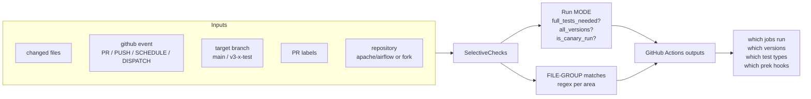
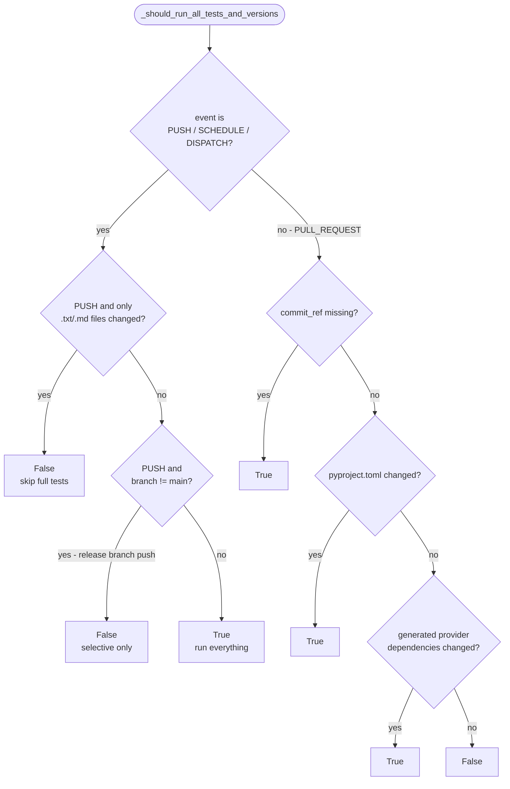
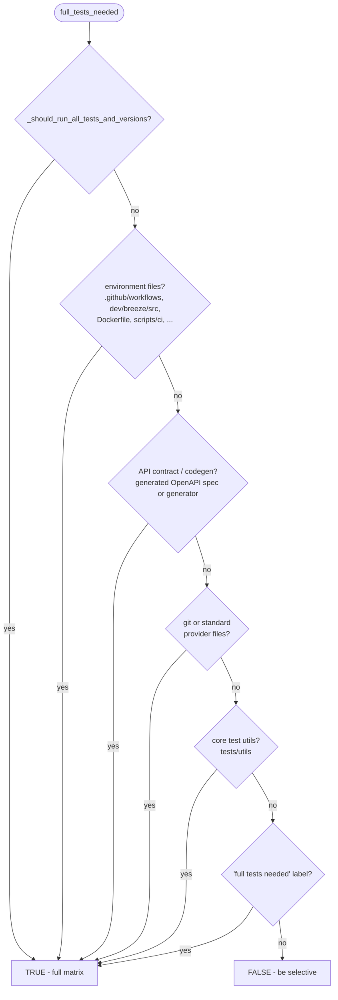
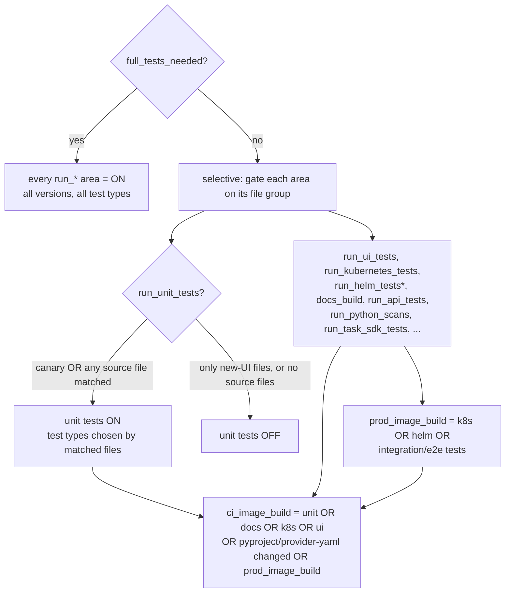

<!--
 Licensed to the Apache Software Foundation (ASF) under one
 or more contributor license agreements.  See the NOTICE file
 distributed with this work for additional information
 regarding copyright ownership.  The ASF licenses this file
 to you under the Apache License, Version 2.0 (the
 "License"); you may not use this file except in compliance
 with the License.  You may obtain a copy of the License at

   http://www.apache.org/licenses/LICENSE-2.0

 Unless required by applicable law or agreed to in writing,
 software distributed under the License is distributed on an
 "AS IS" BASIS, WITHOUT WARRANTIES OR CONDITIONS OF ANY
 KIND, either express or implied.  See the License for the
 specific language governing permissions and limitations
 under the License.
 -->

<!-- START doctoc generated TOC please keep comment here to allow auto update -->
<!-- DON'T EDIT THIS SECTION, INSTEAD RE-RUN doctoc TO UPDATE -->
**Table of Contents**  *generated with [DocToc](https://github.com/thlorenz/doctoc)*

- [Selective CI Checks](#selective-ci-checks)
  - [Why selective checks exist (the optimisation goal)](#why-selective-checks-exist-the-optimisation-goal)
  - [Mental model: events, modes, file groups, outputs](#mental-model-events-modes-file-groups-outputs)
  - [The decision pipeline](#the-decision-pipeline)
  - [Individually simple rules](#individually-simple-rules)
  - [Worked examples: pull requests, pushes, and canary runs](#worked-examples-pull-requests-pushes-and-canary-runs)
  - [Troubleshooting: my CI run does too much](#troubleshooting-my-ci-run-does-too-much)
  - [Groups of files that selective check make decisions on](#groups-of-files-that-selective-check-make-decisions-on)
  - [Selective check decision rules](#selective-check-decision-rules)
  - [Skipping prek hooks (Static checks)](#skipping-prek-hooks-static-checks)
  - [Suspended providers](#suspended-providers)
  - [Selective check outputs](#selective-check-outputs)
  - [Committer vs. Non-committer PRs](#committer-vs-non-committer-prs)
  - [Changing behaviours of the CI runs by setting labels](#changing-behaviours-of-the-ci-runs-by-setting-labels)

<!-- END doctoc generated TOC please keep comment here to allow auto update -->

# Selective CI Checks

In order to optimise our CI jobs, we've implemented optimisations to only run selected checks for some
kind of changes. The logic implemented reflects the internal architecture of Airflow 2.0 packages,
and it helps to keep down both the usage of jobs in GitHub Actions and CI feedback time to
contributors in case of simpler changes.

> [!NOTE]
> All the logic described here lives in a single file:
> [`dev/breeze/src/airflow_breeze/utils/selective_checks.py`](../../src/airflow_breeze/utils/selective_checks.py).
> When you change that file, **update this document in the same PR** so the behaviour and the
> documentation stay in sync.

## Why selective checks exist (the optimisation goal)

Airflow's full CI matrix is large: multiple Python versions, multiple databases (Postgres, MySQL,
SQLite), Kubernetes versions, Helm tests, 100+ provider packages, UI tests, doc builds, image builds
for two architectures, and dozens of static checks. Running *everything* for *every* change would burn
an enormous amount of GitHub Actions minutes and make contributors wait an hour or more for feedback on
a one-line doc fix.

Selective checks exist to answer one question, cheaply and conservatively:

> **Given exactly which files changed (plus the event, the branch and the labels), what is the
> smallest set of CI work that still gives us confidence the change is correct?**

Three design assumptions drive everything:

1. **The changed file list is a reliable proxy for risk.** A change to `airflow-core/.../scheduler`
   can break anything, so it must run broadly. A change confined to `providers/amazon` can only
   plausibly break Amazon (and its direct dependents), so only those need to run. A change to a
   `.md` file can't break runtime behaviour at all.
2. **Be conservative when in doubt — never trade correctness for speed.** Every rule is biased toward
   *running more*. If a change touches something foundational (the environment, the CI scripts, the
   dependency set, the API contract, core test utilities), selective checks fall back to the **full
   matrix**. Skipping is only ever done when a rule can *prove* the skipped work is irrelevant.
3. **Trust must be earned on `main`.** Pull-request runs are optimised aggressively for fast feedback,
   but the *merge* to `main` (and the nightly **canary** run) always runs the full matrix on all
   versions. So even if a PR-time optimisation was too aggressive, the canary catches it before a
   release.

## Mental model: events, modes, file groups, outputs

Selective checks take a handful of **inputs** and produce a set of GitHub Actions **outputs** that the
workflows read to decide what to run. Everything in between is pure, deterministic computation — same
inputs always give the same outputs, and you can reproduce it locally (see
[Troubleshooting](#troubleshooting-my-ci-run-does-too-much)).



The two halves that matter are:

* **The run MODE** — a few booleans (`full_tests_needed`, `all_versions`, `is_canary_run`) computed
  mostly from the *event*, the *branch* and a handful of high-impact files/labels. The mode decides
  whether we take the "run everything" shortcut or the "be selective" path.
* **The FILE-GROUP matches** — every area of the codebase (UI, Helm, docs, Kubernetes, each provider,
  each mypy target, …) has a list of regexps in `CI_FILE_GROUP_MATCHES`. A group is "active" when at
  least one changed file matches it. In selective mode, active groups are what turn individual jobs on.

The key helper that ties the two together is `_should_be_run(group)`:

```text
_should_be_run(group):
    if full_tests_needed:  return True          # full mode → every area is "on"
    return (any changed file matches group)     # selective mode → only matched areas are "on"
```

Almost every `run_*` / `*_build` output is just `_should_be_run(<some group>)`, so once you understand
those two halves you understand the whole system.

## The decision pipeline

The computation happens in three conceptual stages. Each individual rule is tiny; the apparent
complexity is only the *number* of rules, not their difficulty.

### Stage 1 — pick the run mode

First selective checks decide whether this run takes the **full-matrix shortcut**. The foundational
helper is `_should_run_all_tests_and_versions()`, which is driven by the *event* and a few
high-blast-radius signals:



`full_tests_needed` then layers a short-circuit ladder on top: it is `True` if
`_should_run_all_tests_and_versions()` is true **or** any one of a small list of high-impact file
groups changed **or** the `full tests needed` label is set. The first matching rule wins — order does
not matter because any single hit forces the full matrix:



Two related booleans share this machinery:

* **`all_versions`** — whether to expand the Python/Kubernetes/DB version axis to *all* supported
  versions instead of just the defaults. Labels (`default versions only`, `latest versions only`,
  `all versions`) override; otherwise it follows `_should_run_all_tests_and_versions()`.
* **`is_canary_run`** — `True` for SCHEDULE/PUSH/DISPATCH events **on `apache/airflow`** (not forks)
  when more than just `.txt`/`.md` changed, or whenever the `canary` label is set. Canary runs always
  run unit tests even when `full_tests_needed` is `False` (this is what makes a *release-branch push*
  still run its relevant unit tests — see the examples).

### Stage 2 — decide which jobs run

In **full mode** every area is "on". In **selective mode**, each job is gated on its file group via
`_should_be_run`. The image builds are derived (they turn on only because something that needs them
turned on):



`*` Helm tests only run on the `main` branch.

### Stage 3 — choose which test types

When unit tests run, selective checks narrow *which* test types execute, separately for **core** and
**providers**:

* **Core test types** (`_get_core_test_types_to_run`): `Always` is always included. Each specific type
  (`API`, `CLI`, `Serialization`, …) is added if its files matched. Then the **escape hatch**: if any
  changed source file is left over after removing provider files, test files, UI files, etc. — i.e.
  something "core/other" changed — *all* core test types are added, because a core change can affect
  anything. In full mode, all core types run unconditionally.
* **Provider test types** (`_get_providers_test_types_to_run`): empty on non-`main` branches. In full
  mode (or when dependencies were upgraded) → `Providers` (all). Otherwise selective checks compute the
  **affected providers** from the changed files and add their **direct upstream and downstream
  dependents** (not the whole transitive closure). Changes to *common* provider code (tests/utils that
  don't belong to a single provider) escalate to *all* providers. Suspended providers are excluded (and
  a PR that touches one fails unless it carries the `allow suspended provider changes` label).

The same matched-file approach drives the **prek hook skip list** (`skip_prek_hooks`): each mypy /
compile / lint hook is skipped when nothing in its area changed. See
[Skipping prek hooks](#skipping-prek-hooks-static-checks).

## Individually simple rules

The list of rules is long, but each rule is a one-liner you can reason about in isolation. A few
representative examples (file → effect):

| A change to …                                         | … turns on                                                            | because |
|-------------------------------------------------------|-----------------------------------------------------------------------|---------|
| `README.md` only                                      | (almost) nothing                                                      | `.md`/`.txt` are text-non-doc; on a push this even skips full tests |
| `airflow-core/docs/...rst`                            | `docs_build` (+ CI image)                                             | matches `DOC_FILES`; docs need the CI image to render |
| `providers/amazon/.../s3.py`                          | unit tests with `Providers[amazon, …dependents]` + `Always`          | a provider file → only that provider and its direct dependents |
| `airflow-core/src/airflow/jobs/scheduler_job_runner.py` | unit tests with **all** core test types                            | a core/other file → escape hatch runs all core types |
| `pyproject.toml`                                       | **full matrix, all versions**                                        | dependency surface changed → `_should_run_all_tests_and_versions` |
| `.github/workflows/ci-amd.yml` or `dev/breeze/src/...` | **full matrix**                                                      | environment files → can change the whole CI environment |
| the generated OpenAPI spec                             | **full matrix**                                                      | the API *contract* ripples to UI codegen + every client |
| `chart/templates/...yaml` (on `main`)                  | `run_helm_tests` (+ PROD image)                                      | matches `HELM_FILES`; Helm tests only on `main` |
| `airflow-core/src/airflow/ui/...tsx` only              | `run_ui_tests`, **no** unit tests                                    | "only new-UI files" short-circuit skips Python unit tests |

The "complexity" you feel reading the code is just *many* such rules stacked up — each one on its own
is simple, conservative, and independently testable (see `dev/breeze/tests/test_selective_checks.py`).

## Worked examples: pull requests, pushes, and canary runs

The same engine produces very different results depending on the **event**, the **branch** and the
**files**. These four scenarios cover the common cases:

```mermaid
flowchart TD
    subgraph PR[Pull request - small provider change]
        PR1[event=PULL_REQUEST<br/>files=providers/amazon/.../s3.py] --> PR2[full_tests_needed=False<br/>all_versions=False<br/>is_canary_run=False]
        PR2 --> PR3[unit tests: Providers amazon + Always<br/>default versions only<br/>amazon prek/mypy only]
    end
    subgraph PUSHMAIN[Push / merge to main]
        PM1[event=PUSH, branch=main] --> PM2[full_tests_needed=True<br/>all_versions=True<br/>is_canary_run=True]
        PM2 --> PM3[full matrix, all versions,<br/>all canary-only jobs]
    end
    subgraph RELPUSH[Push to release branch v3-x-test]
        RP1[event=PUSH, branch!=main] --> RP2[full_tests_needed=False<br/>is_canary_run=True]
        RP2 --> RP3[unit tests run via canary<br/>but selective test types<br/>default versions]
    end
    subgraph CANARY[Scheduled nightly canary]
        CN1[event=SCHEDULE on apache/airflow] --> CN2[full_tests_needed=True<br/>all_versions=True<br/>is_canary_run=True]
        CN2 --> CN3[everything, all versions]
    end
```



1. **Pull request, small provider change** (`providers/amazon/.../s3.py`). Not an environment/contract
   file, `commit_ref` present, no special label → `full_tests_needed=False`, `all_versions=False`.
   Result: unit tests run only `Providers[amazon]` (plus amazon's direct dependents) and `Always`, on
   default versions only; only the amazon-related prek/mypy hooks run. Fast PR feedback.
2. **Pull request, core change** (`scheduler_job_runner.py`). Still `full_tests_needed=False`, but the
   core/other escape hatch adds **all core test types**. Providers are not pulled in (no provider files
   changed). Default versions.
3. **Pull request that changes `pyproject.toml`** (or `.github/workflows/...`, or the OpenAPI spec).
   `full_tests_needed=True` (and for `pyproject.toml` also `all_versions=True`). The PR runs the **full
   matrix** — same as a canary — because the change can affect everything.
4. **Push / merge to `main`.** `_should_run_all_tests_and_versions()` is true for PUSH on `main` →
   `full_tests_needed=True`, `all_versions=True`, `is_canary_run=True`. The full matrix plus all
   canary-only jobs run. This is the safety net that backstops aggressive PR-time optimisation.
5. **Push to a release branch** (`v3-1-test`). PUSH but `branch != main` → `full_tests_needed=False`
   (selective), yet `is_canary_run=True`, so `run_unit_tests=True`. The branch runs its *relevant*
   unit tests on default versions rather than the entire matrix — release branches don't need the full
   cross-version sweep on every push.
6. **Scheduled nightly canary** (SCHEDULE on `apache/airflow`). Full matrix on all versions, every
   canary-only job. The most thorough run; it is what gives us confidence that the PR-time shortcuts
   never let a regression through.

## Troubleshooting: my CI run does too much

If a CI run is slower or broader than you expect (full matrix on a small change, all providers running,
all versions), the cause is almost always a single rule that fired. To find it:

1. **Read the `selective-checks` job output.** Selective checks print a `[warning] …` line for every
   decision, e.g. *"Running full set of tests because env files changed"* or *"Running everything with
   all versions: changed pyproject.toml"*. That line names the exact rule (and usually the file group)
   that escalated the run. This is the fastest way to diagnose.
2. **Reproduce locally** with Breeze, pointing at the squashed commit of your change:

   ```bash
   breeze selective-checks --commit-ref <commit_sha>
   ```

   It prints the same outputs and the same `[warning]` reasons CI uses, so you can iterate without
   pushing.
3. **Check the usual escalation triggers** (any one of these forces the full matrix):
   * an **environment file** changed — `.github/workflows/*`, `dev/breeze/src/*`, `Dockerfile*`,
     `scripts/ci/*`, `scripts/docker/*`, `generated/provider_dependencies.json` (often this is the
     surprise: editing CI/breeze itself runs everything);
   * **`pyproject.toml`** or generated provider dependencies changed (also forces `all_versions`);
   * the **generated OpenAPI spec** or the client generator changed (the API contract);
   * **`tests/utils`** or **git/standard provider** files changed;
   * the **`full tests needed`** or **`all versions`** label is set on the PR.
4. **All providers running?** That means selective checks decided *all* providers are affected — usually
   because *common* provider code (shared tests/utils not owned by one provider) changed, or because
   dependencies were upgraded, or `full_tests_needed` is on. The reason is printed in the
   provider-selection `[warning]` lines.
5. **Want to confirm an optimisation is safe?** Remember the canary on `main` always runs everything —
   the worst case of an over-aggressive *skip* is caught at merge time, not in production.

The authoritative, exhaustive rule list (kept in sync with the code) is in
[Selective check decision rules](#selective-check-decision-rules) below; the sections above are the
"why" and the shape, this is the "what" in full detail.

## Groups of files that selective check make decisions on

We have the following Groups of files for CI that determine which tests are run:

* `Environment files` - if any of those changes, that forces 'full tests needed' mode, because changes
  there might simply change the whole environment of what is going on in CI (Container image, dependencies)
* `Python production files` and `Javascript production files` - this area is useful in CodeQL Security scanning
  - if any of the python or javascript files for airflow "production" changed, this means that the security
    scans should run
* `Always test files` - Files that belong to "Always" run tests.
* `API tests files` and `Codegen test files` - those are OpenAPI definition files that impact
  Open API specification and determine that we should run dedicated API tests.
* `Helm files` - change in those files impacts helm "rendering" tests - `chart` folder (which contains the chart sources and tests under `chart/tests/`).
* `Build files` - change in the files indicates that we should run  `upgrade to newer dependencies` -
  build dependencies in `pyproject.toml` and  generated dependencies files in `generated` folder.
  The dependencies are automatically generated from the `provider.yaml` files in provider by
  the `hatch_build.py` build hook. The provider.yaml is a single source of truth for each
  provider and `hatch_build.py` for all regular dependencies.
* `DOC files` - change in those files indicate that we should run documentation builds (both airflow sources
  and airflow documentation)
* `UI files` - those are files for the new full React UI (useful to determine if UI tests should run)
* `WWW files` - those are files for the WWW part of our UI (useful to determine if UI tests should run)
* `System test files` - those are the files that are part of system tests (system tests are not automatically
  run in our CI, but Airflow stakeholders are running the tests and expose dashboards for them at
  [System Test Dashbards](https://airflow.apache.org/ecosystem/#airflow-provider-system-test-dashboards)
* `Kubernetes files` - determine if any of Kubernetes related tests should be run
* `All Python files` - if none of the Python file changed, that indicates that we should not run unit tests
* `All source files` - if none of the sources change, that indicates that we should probably not build
  an image and run any image-based static checks
* `All Airflow Python files` - files that are checked by `mypy-airflow-core` static checks
* `All Providers Python files` - files that are checked by `mypy-providers` static checks
* `All Dev Python files` - files that are checked by `mypy-dev` static checks
* `All Scripts Python files` - files that are checked by `mypy-scripts` static checks
* `Task SDK files` - files that are checked by `mypy-task-sdk` static checks
* `All Airflow CTL Python files` - files that are checked by `mypy-airflow-ctl` static checks
* `All Devel Common Python files` - files that are checked by `mypy-devel-common` static checks
* `All Helm Tests Python files` / `All Docker Tests Python files` /
  `All Kubernetes Tests Python files` / `All Airflow E2E Tests Python files` /
  `Airflow CTL Integration Test files` / `Task SDK Integration Test files` - files that are
  checked by the respective `mypy-helm-tests` / `mypy-docker-tests` / `mypy-kubernetes-tests` /
  `mypy-airflow-e2e-tests` / `mypy-airflow-ctl-tests` / `mypy-task-sdk-integration-tests` hooks
* `shared/<dist>/**/*.py` - each `shared/<dist>` workspace member has its own `mypy-shared-<dist>`
  hook (selective-checks enumerates them at runtime)
* `All Provider Yaml files` - all provider yaml files

We have a number of `TEST_TYPES` that can be selectively disabled/enabled based on the
content of the incoming PR. Usually they are limited to a sub-folder of the "tests" folder but there
are some exceptions. You can read more about those in `testing.rst <contributing-docs/09_testing.rst>`. Those types
are determined by selective checks and are used to run `DB` and `Non-DB` tests.

The `DB` tests inside each `TEST_TYPE` are run sequentially (because they use DB as state) while `TEST_TYPES`
are run in parallel - each within separate docker-compose project. The `Non-DB` tests are all executed
together using `pytest-xdist` (pytest-xdist distributes the tests among parallel workers).

## Selective check decision rules

* `Full tests` case is enabled when the event is PUSH **to `main`**, SCHEDULE or WORKFLOW_DISPATCH, or we
  miss commit info, or any of the important environment files (`pyproject.toml`, `Dockerfile`, `scripts`,
  `generated/provider_dependencies.json` etc.) changed, or the API *contract* changed (the generated
  OpenAPI spec or the client generator — plain API source/test edits that leave the committed spec
  untouched do **not** force full tests), or `tests/utils` / git / standard provider files changed, or
  when the `full tests needed` label is set.
  That enables all matrix combinations of variables (representative) and all possible test type. No further
  checks are performed. See also [1] note below. Two exceptions narrow this: a PUSH that changed **only**
  `.txt`/`.md` files skips full tests, and a PUSH to a **release branch** (`v3-X-test`, i.e. not `main`)
  runs selective tests only (it is still a `canary` run, so its *relevant* unit tests run on default
  versions). The high-level flow and worked examples for these cases are in
  [The decision pipeline](#the-decision-pipeline) and
  [Worked examples](#worked-examples-pull-requests-pushes-and-canary-runs) above.
* Python, Kubernetes, Backend, Kind, Helm versions are limited to "defaults" only unless `Full tests` mode
  is enabled.
* `Python scans`, `Javascript scans`, `API tests/codegen`, `UI`, `WWW`, `Kubernetes` tests and `DOC builds`
  are enabled if any of the relevant files have been changed.
* `Helm` tests are run only if relevant files have been changed and if current branch is `main`.
* If no Source files are changed - no tests are run and no further rules below are checked.
* `CI Image building` is enabled if either test are run, docs are build.
* `PROD Image building` is enabled when kubernetes tests are run.
* In case of `Providers` test in regular PRs, additional check is done in order to determine which
  providers are affected and the actual selection is made based on that:
  * if directly provider code is changed (either in the provider, test or system tests) then this provider
    is selected.
  * if there are any providers that depend on the affected providers, they are also included in the list
    of affected providers (but not recursively - only direct dependencies are added)
  * if there are any changes to "common" provider code not belonging to any provider (usually system tests
    or tests), then tests for all Providers are run
* The specific unit test type is enabled only if changed files match the expected patterns for each type
  (`API`, `CLI`, `WWW`, `Providers` etc.). The `Always` test type is added always if any unit
  tests are run. `Providers` tests are removed if current branch is different than `main`
* If there are no files left in sources after matching the test types and Kubernetes files,
  then apparently some Core/Other files have been changed. This automatically adds all test
  types to execute. This is done because changes in core might impact all the other test types.
* if `CI Image building` is disabled, only basic prek hooks are enabled - no 'image-depending` prek hooks
  are enabled.
* If there are some build dependencies changed (`hatch_build.py` and updated system dependencies in
  the `pyproject.toml` - then `upgrade to newer dependencies` is enabled.
* If docs are build, the `docs-list-as-string` will determine which docs packages to build. This is based on
  several criteria: if any of the airflow core, charts, docker-stack, providers files or docs have changed,
  then corresponding packages are build (including cross-dependent providers). If any of the core files
  changed, also providers docs are built because all providers depend on airflow docs. If any of the docs
  build python files changed or when build is "canary" type in main - all docs packages are built.

## Skipping prek hooks (Static checks)

Our CI always run prek checks with `--all-files` flag. This is in order to avoid cases where
different check results are run when only subset of files is used. This has an effect that the prek
tests take a long time to run when all of them are run. Selective checks allow to save a lot of time
for those tests in regular PRs of contributors by smart detection of which prek hooks should be skipped
when some files are not changed. Those are the rules implemented:

* The `identity` check is always skipped (saves space to display all changed files in CI)
* The provider specific checks are skipped when builds are running in v2_* branches (we do not build
  providers from those branches. Those are the checks skipped in this case:
  * check-airflow-provider-compatibility
  * check-extra-packages-references
  * check-provider-yaml-valid
  * lint-helm-chart
  * mypy-providers
* If "full tests" mode is detected, no more prek hooks are skipped - we run all of them
* The following checks are skipped if those files are not changed:
  * if no `All Providers Python files` changed - `mypy-providers` check is skipped
  * if no `All Airflow Python files` changed - `mypy-airflow-core` check is skipped
  * if no `All Dev Python files` changed - `mypy-dev` check is skipped
  * if no `All Scripts Python files` changed - `mypy-scripts` check is skipped
  * if no `Task SDK files` changed - `mypy-task-sdk` check is skipped
  * if no `All Airflow CTL Python files` changed - `mypy-airflow-ctl` check is skipped
  * if no `All Devel Common Python files` changed - `mypy-devel-common` check is skipped
  * if no files under the matching folder changed, the corresponding per-folder mypy hook
    is skipped (`mypy-airflow-ctl-tests`, `mypy-helm-tests`, `mypy-airflow-e2e-tests`,
    `mypy-task-sdk-integration-tests`, `mypy-docker-tests`, `mypy-kubernetes-tests`)
  * for each `shared/<dist>` workspace member, `mypy-shared-<dist>` is skipped when no
    file under `shared/<dist>/` changed (enumerated at runtime)
  * if no `UI files` changed - `ts-compile-format-lint-ui` check is skipped
  * if no `WWW files` changed - `ts-compile-format-lint-www` check is skipped
  * if no `All Python files` changed - `flynt` check is skipped
  * if no `Helm files` changed - `lint-helm-chart` check is skipped
  * if no `Java SDK files` changed - `ktlint` check is skipped (it runs the java-sdk Gradle
    wrapper, which downloads the Gradle distribution, so we avoid that download on PRs that do
    not touch `java-sdk/`)
  * if no `All Providers Python files` and no `All Providers Yaml files` are changed -
    `check-provider-yaml-valid` check is skipped

## Suspended providers

The selective checks will fail in PR if it contains changes to a suspended provider unless you set the
label `allow suspended provider changes` in the PR. This is to prevent accidental changes to suspended
providers.


## Selective check outputs

The selective check outputs available are described below. In case of `list-as-string` values,
empty string means `everything`, where lack of the output means `nothing` and list elements are
separated by spaces. This is to accommodate for the way how outputs of this kind can be easily used by
GitHub Actions to pass the list of parameters to a command to execute


| Output                                                  | Meaning of the output                                                                                   | Example value                            | List |
|---------------------------------------------------------|---------------------------------------------------------------------------------------------------------|------------------------------------------|------|
| all-python-versions                                     | List of all python versions there are available in the form of JSON array                               | \['3.10', '3.11'\]                       |      |
| all-python-versions-list-as-string                      | List of all python versions there are available in the form of space separated string                   | 3.10 3.11                                | *    |
| all-versions                                            | If set to true, then all python, k8s, DB versions are used for tests.                                   | false                                    |      |
| basic-checks-only                                       | Whether to run all static checks ("false") or only basic set of static checks ("true")                  | false                                    |      |
| ci-image-build                                          | Whether CI image build is needed                                                                        | true                                     |      |
| core-test-types-list-as-strings-in-json                 | Which test types should be run for unit tests for core                                                  | API Always Providers                     | *    |
| debug-resources                                         | Whether resources usage should be printed during parallel job execution ("true"/ "false")               | false                                    |      |
| default-branch                                          | Which branch is default for the build ("main" for main branch, "v2-4-test" for 2.4 line etc.)           | main                                     |      |
| default-constraints-branch                              | Which branch is default for the build ("constraints-main" for main branch, "constraints-2-4" etc.)      | constraints-main                         |      |
| default-helm-version                                    | Which Helm version to use as default                                                                    | v3.9.4                                   |      |
| default-kind-version                                    | Which Kind version to use as default                                                                    | v0.16.0                                  |      |
| default-kubernetes-version                              | Which Kubernetes version to use as default                                                              | v1.25.2                                  |      |
| default-mysql-version                                   | Which MySQL version to use as default                                                                   | 5.7                                      |      |
| default-postgres-version                                | Which Postgres version to use as default                                                                | 10                                       |      |
| default-python-version                                  | Which Python version to use as default                                                                  | 3.10                                     |      |
| disable-airflow-repo-cache                              | Disables cache of the repo main cache in CI - airflow will be installed without main installation cache | true                                     |      |
| docker-cache                                            | Which cache should be used for images ("registry", "local" , "disabled")                                | registry                                 |      |
| docs-build                                              | Whether to build documentation ("true"/"false")                                                         | true                                     |      |
| docs-list-as-string                                     | What filter to apply to docs building - based on which documentation packages should be built           | apache-airflow helm-chart google         | *    |
| excluded-providers-as-string                            | List of providers that should be excluded from the build as space-separated string                      | amazon google                            | *    |
| force-pip                                               | Whether pip should be forced in the image build instead of uv ("true"/"false")                          | false                                    |      |
| full-tests-needed                                       | Whether this build runs complete set of tests or only subset (for faster PR builds) \[1\]               | false                                    |      |
| generated-dependencies-changed                          | Whether generated dependencies have changed ("true"/"false")                                            | false                                    |      |
| has-migrations                                          | Whether the PR has migrations ("true"/"false")                                                          | false                                    |      |
| hatch-build-changed                                     | When hatch build.py changed in the PR.                                                                  | false                                    |      |
| helm-test-packages-list-as-string                       | List of helm packages to test as JSON array                                                             | \["airflow_aux", "airflow_core"\]        | *    |
| helm-version                                            | Which Helm version to use for tests                                                                     | v3.15.3                                  |      |
| include-success-outputs                                 | Whether to include outputs of successful parallel tests ("true"/"false")                                | false                                    |      |
| individual-providers-test-types-list-as-strings-in-json | Which test types should be run for unit tests for providers (individually listed)                       | Providers[\amazon\] Providers\[google\]  | *    |
| is-committer-build                                      | Whether the build is triggered by a committer                                                           | false                                    |      |
| is-legacy-ui-api-labeled                                | Whether the PR is labeled as legacy UI/API                                                              | false                                    |      |
| kind-version                                            | Which Kind version to use for tests                                                                     | v0.24.0                                  |      |
| kubernetes-combos-list-as-string                        | All combinations of Python version and Kubernetes version to use for tests as space-separated string    | 3.10-v1.25.2 3.11-v1.28.13               | *    |
| kubernetes-versions                                     | All Kubernetes versions to use for tests as JSON array                                                  | \['v1.25.2'\]                            |      |
| kubernetes-versions-list-as-string                      | All Kubernetes versions to use for tests as space-separated string                                      | v1.25.2                                  | *    |
| latest-versions-only                                    | If set, the number of Python, Kubernetes, DB versions will be limited to the latest ones.               | false                                    |      |
| mypy-checks                                             | List of folders to be considered for mypy checks                                                        | \["airflow_aux", "airflow_core"\]        |      |
| mysql-exclude                                           | Which versions of MySQL to exclude for tests as JSON array                                              | []                                       |      |
| mysql-versions                                          | Which versions of MySQL to use for tests as JSON array                                                  | \['8.0'\]                                |      |
| postgres-exclude                                        | Which versions of Postgres to exclude for tests as JSON array                                           | []                                       |      |
| postgres-versions                                       | Which versions of Postgres to use for tests as JSON array                                               | \['12'\]                                 |      |
| prod-image-build                                        | Whether PROD image build is needed                                                                      | true                                     |      |
| providers-compatibility-tests-matrix                    | Matrix of providers compatibility tests: (python_version, airflow_version, removed_providers)           | \[{}\]                                   |      |
| providers-test-types-list-as-strings-in-json            | Which test types should be run for unit tests for providers                                             | Providers Providers\[-google\]           | *    |
| pyproject-toml-changed                                  | When pyproject.toml changed in the PR.                                                                  | false                                    |      |
| python-versions                                         | List of python versions to use for that build                                                           | \['3.10'\]                               |      |
| python-versions-list-as-string                          | Which versions of MySQL to use for tests as space-separated string                                      | 3.10                                     | *    |
| run-amazon-tests                                        | Whether Amazon tests should be run ("true"/"false")                                                     | true                                     |      |
| run-api-codegen                                         | Whether "api-codegen" are needed to run ("true"/"false")                                                | true                                     |      |
| run-api-tests                                           | Whether "api-tests" are needed to run ("true"/"false")                                                  | true                                     |      |
| run-helm-tests                                          | Whether Helm tests are needed to run ("true"/"false")                                                   | true                                     |      |
| run-kubernetes-tests                                    | Whether Kubernetes tests should be run ("true"/"false")                                                 | true                                     |      |
| run-mypy                                                | Whether mypy check is supposed to run in this build                                                     | true                                     |      |
| run-system-tests                                        | Whether system tests should be run ("true"/"false")                                                     | true                                     |      |
| run-task-sdk-tests                                      | Whether Task SDK tests should be run ("true"/"false")                                                   | true                                     |      |
| run-ui-tests                                            | Whether UI tests should be run ("true"/"false")                                                         | true                                     |      |
| run-unit-tests                                          | Whether unit tests should be run ("true"/"false")                                                       | true                                     |      |
| run-www-tests                                           | Whether Legacy WWW tests should be run ("true"/"false")                                                 | true                                     |      |
| amd-runners                                             | List of labels assigned for runners for that build for public AMD runners                               | \["ubuntu-22.04"\]                       |      |
| arm-runners                                             | List of labels assigned for runners for that build for public ARM runners                               | \["ubuntu-22.04-arm"\]                   |      |
| selected-providers-list-as-string                       | List of providers affected when they are selectively affected.                                          | airbyte http                             | *    |
| skip-prek-hooks                                         | Which prek hooks should be skipped during the static-checks run                                         | flynt,identity                           |      |
| skip-providers-tests                                    | When provider tests should be skipped (on non-main branch or when no provider changes detected)         | true                                     |      |
| sqlite-exclude                                          | Which versions of Sqlite to exclude for tests as JSON array                                             | []                                       |      |
| testable-core-integrations                              | List of core integrations that are testable in the build as JSON array                                  | \['celery', 'kerberos'\]                 |      |
| testable-providers-integrations                         | List of core integrations that are testable in the build as JSON array                                  | \['mongo', 'kafka'\]                     |      |
| upgrade-to-newer-dependencies                           | Whether the image build should attempt to upgrade all dependencies (true/false or commit hash)          | false                                    |      |


[1] Note for deciding if `full tests needed` mode is enabled and provider.yaml files.

When we decided whether to run `full tests` we do not check (directly) if provider.yaml files changed,
even if they are single source of truth for provider dependencies and when you add a dependency there,
the environment changes and generally full tests are advised.

This is because provider.yaml change will automatically trigger (via `update-provider-dependencies` prek)
generation of `generated/provider_dependencies.json` and `pyproject.toml` gets updated as well. This is a far
better indication if we need to run full tests than just checking if provider.yaml files changed, because
provider.yaml files contain more information than just dependencies - they are the single source of truth
for a lot of information for each provider and sometimes (for example when we update provider documentation
or when new Hook class is added), we do not need to run full tests.

That's why we do not base our `full tests needed` decision on changes in dependency files that are generated
from the `provider.yaml` files, but on `generated/provider_dependencies.json` and `pyproject.toml` files being
modified. This can be overridden by setting `full tests needed` label in the PR.

## Committer vs. Non-committer PRs

There is a difference in how the CI jobs are run for committer and non-committer PRs from forks.
The main reason is security; we do not want to run untrusted code on our infrastructure for self-hosted runners.

Currently there is no difference because we are not using `self-hosted` runners (until we implement `Action
Runner Controller` but most of the jobs, committer builds will use "Self-hosted" runners by default,
while non-committer builds will use "Public" runners. For committers, this can be overridden by setting the
`use public runners` label in the PR.

## Changing behaviours of the CI runs by setting labels

Also, currently for most of the jobs, committer builds by default use "Self-hosted" runners, while
non-committer builds use "Public" runners. For committers, this can be overridden by setting the
`use public runners` label in the PR. In the future when we might also switch committers to public runners.
Committers will be able to use `use self-hosted runners` label in the PR to force using self-hosted runners.
The `use public runners` label will still be available for committers and they will be able to set it for
builds that also have `canary` label set to also switch the `canary` builds to public runners.

If you are testing CI workflow changes and want to test it for more complete matrix combinations generated by
the jobs - you can set `all versions` label in the PR. This will run the PRs with the same combinations
of versions as the `canary` main build. Using `all versions` is automatically set when build dependencies
change in `pyproject.toml` or when dependencies change for providers in `generated/provider_dependencies.json`
or when `hatch_build.py` changes.

If you are running an `apache` PR, you can also set `canary` label for such PR and in this case, all the
`canary` properties of build will be used: `self-hosted` runners, `full tests needed` mode, `all versions`
as well as all canary-specific jobs will run there. You can modify this behaviour of the `canary` run by
applying `use public runners`, and `default versions only` labels to the PR as well which will still run
a `canary` equivalent build but with public runners an default Python/K8S versions only - respectively.

If you are testing CI workflow changes and change `pyproject.toml` or `generated/provider_dependencies.json`
and you want to limit the number of matrix combinations generated by
the jobs - you can set `default versions only` label in the PR. This will limit the number of versions
used in the matrix to the default ones (default Python version and default Kubernetes version).

If you are testing CI workflow changes and want to limit the number of matrix combinations generated by
the jobs - you can also set `latest versions only` label in the PR. This will limit the number of versions
used in the matrix to the latest ones (latest Python version and latest Kubernetes version).

You can also disable cache if you want to make sure your tests will run with image that does not have
left-over package installed from the past cached image - by setting `disable image cache` label in the PR.

By default, all outputs of successful parallel tests are not shown. You can enable them by setting
`include success outputs` label in the PR. This makes the logs of mostly successful tests a lot longer
and more difficult to sift through, but it might be useful in case you want to compare successful and
unsuccessful runs of the tests.

This table summarizes the labels you can use on PRs to control the selective checks and the CI runs:

| Label                            | Affected outputs                 | Meaning                                                                                   |
|----------------------------------|----------------------------------|-------------------------------------------------------------------------------------------|
| all versions                     | all-versions, *-versions-*       | Run tests for all python and k8s versions.                                                |
| allow suspended provider changes | allow-suspended-provider-changes | Allow changes to suspended providers.                                                     |
| canary                           | is-canary-run                    | If set, the PR run from apache/airflow repo behaves as `canary` run.                      |
| debug ci resources               | debug-ci-resources               | If set, then debugging resources is enabled during parallel tests and you can see them.   |
| default versions only            | all-versions, *-versions-*       | If set, the number of Python and Kubernetes, DB versions are limited to the default ones. |
| disable image cache              | docker-cache                     | If set, the image cache is disables when building the image.                              |
| force pip                        | force-pip                        | If set, the image build uses pip instead of uv.                                           |
| full tests needed                | full-tests-needed                | If set, complete set of tests are run                                                     |
| include success outputs          | include-success-outputs          | If set, outputs of successful parallel tests are shown not only failed outputs.           |
| latest versions only             | *-versions-*, *-versions-*       | If set, the number of Python, Kubernetes, DB versions will be limited to the latest ones. |
| non committer build              | is-committer-build               | If set, the scripts used for images are used from target branch for committers.           |
| upgrade to newer dependencies    | upgrade-to-newer-dependencies    | If set to true (default false) then dependencies in the CI image build are upgraded.      |

-----

Read next about [Workflows](05_workflows.md)
