<!--
 Licensed to the Apache Software Foundation (ASF) under one
 or more contributor license agreements.  See the NOTICE file
 distributed with this work for additional information
 regarding copyright ownership.  The ASF licenses this file
 to you under the Apache License, Version 2.0 (the
 "License"); you may not use this file except in compliance
 with the License.  You may obtain a copy of the License at

   http://www.apache.org/licenses/LICENSE-2.0

 Unless required by applicable law or agreed to in writing,
 software distributed under the License is distributed on an
 "AS IS" BASIS, WITHOUT WARRANTIES OR CONDITIONS OF ANY
 KIND, either express or implied.  See the License for the
 specific language governing permissions and limitations
 under the License.
 -->

<!-- START doctoc generated TOC please keep comment here to allow auto update -->
<!-- DON'T EDIT THIS SECTION, INSTEAD RE-RUN doctoc TO UPDATE -->
**Table of Contents**  *generated with [DocToc](https://github.com/thlorenz/doctoc)*

- [CI Sequence diagrams](#ci-sequence-diagrams)
  - [Pull request flow from fork](#pull-request-flow-from-fork)
  - [Pull request flow from "apache/airflow" repo](#pull-request-flow-from-apacheairflow-repo)
  - [Merge "Canary" run](#merge-canary-run)
  - [Scheduled run](#scheduled-run)

<!-- END doctoc generated TOC please keep comment here to allow auto update -->

# CI Sequence diagrams

You can see here the sequence diagrams of the flow happening during the CI Jobs.

## Pull request flow from fork

This is the flow that happens when a pull request is created from a fork - which is the most frequent
pull request flow that happens in Airflow. The "pull_request" workflow does not have write access
to the GitHub Registry, so it cannot push the CI/PROD images there. Instead, we push the images
from the "pull_request_target" workflow, which has write access to the GitHub Registry. Note that
this workflow always uses scripts and workflows from the "target" branch of the "apache/airflow"
repository, so the user submitting such pull request cannot override our build scripts and inject malicious
code into the workflow that has potentially write access to the GitHub Registry (and can override cache).

Security is the main reason why we have two workflows for pull requests and such complex workflows.

```mermaid
sequenceDiagram
    Note over Airflow Repo: pull request
    Note over Tests: pull_request<br>[Read Token]
    Note over Build Images: pull_request_target<br>[Write Token]
    activate Airflow Repo
    Airflow Repo -->> Tests: Trigger 'pull_request'
    activate Tests
    Tests -->> Build Images: Trigger 'pull_request_target'
    activate Build Images
    Note over Tests: Build info
    Note over Tests: Selective checks<br>Decide what to do
    Note over Build Images: Build info
    Note over Build Images: Selective checks<br>Decide what to do
    Note over Tests: Skip Build<br>(Runs in 'Build Images')<br>CI Images
    Note over Tests: Skip Build<br>(Runs in 'Build Images')<br>PROD Images
    par
        GitHub Registry ->> Build Images: Use cache from registry
        Airflow Repo ->> Build Images: Use constraints from `constraints-BRANCH`
        Note over Build Images: Build CI Images<br>[COMMIT_SHA]<br>Upgrade to newer dependencies if deps changed
        Build Images ->> GitHub Registry: Push CI Images<br>[COMMIT_SHA]
        Build Images ->> Artifacts: Upload source constraints
    and
        Note over Tests: OpenAPI client gen
    and
        Note over Tests: React WWW tests
    and
        Note over Tests: Test git clone on Windows
    and
        Note over Tests: Helm release tests
    and
        opt
            Note over Tests: Run basic <br>static checks
        end
    end
    loop Wait for CI images
        GitHub Registry ->> Tests: Pull CI Images<br>[COMMIT_SHA]
    end
    par
        GitHub Registry ->> Tests: Pull CI Images<br>[COMMIT_SHA]
        Note over Tests: Verify CI Images<br>[COMMIT_SHA]
        Note over Tests: Generate constraints<br>source,pypi,no-providers
        Tests ->> Artifacts: Upload source,pypi,no-providers constraints
    and
        Artifacts ->> Build Images: Download source constraints
        GitHub Registry ->> Build Images: Use cache from registry
        Note over Build Images: Build PROD Images<br>[COMMIT_SHA]
        Build Images ->> GitHub Registry: Push PROD Images<br>[COMMIT_SHA]
    and
        opt
            GitHub Registry ->> Tests: Pull CI Images<br>[COMMIT_SHA]
            Note over Tests: Run static checks
        end
    and
        opt
            GitHub Registry ->> Tests: Pull CI Images<br>[COMMIT_SHA]
            Note over Tests: Build docs
        end
    and
        opt
            GitHub Registry ->> Tests: Pull CI Images<br>[COMMIT_SHA]
            Note over Tests: Spellcheck docs
        end
    and
        opt
            GitHub Registry ->> Tests: Pull CI Images<br>[COMMIT_SHA]
            Note over Tests: Unit Tests<br>Python/DB matrix
        end
    and
        opt
            GitHub Registry ->> Tests: Pull CI Images<br>[COMMIT_SHA]
            Note over Tests: Unit Tests<br>Python/Non-DB matrix
        end
    and
        opt
            GitHub Registry ->> Tests: Pull CI Images<br>[COMMIT_SHA]
            Note over Tests: Integration Tests
        end
    and
        opt
            GitHub Registry ->> Tests: Pull CI Images<br>[COMMIT_SHA]
            Note over Tests: Quarantined Tests
        end
    and
        opt
            GitHub Registry ->> Tests: Pull CI Images<br>[COMMIT_SHA]
            Note over Tests: Build/test provider packages<br>wheel, sdist, old airflow
        end
    and
        opt
            GitHub Registry ->> Tests: Pull CI Images<br>[COMMIT_SHA]
            Note over Tests: Test airflow <br>release commands
        end
    and
        opt
            GitHub Registry ->> Tests: Pull CI Images<br>[COMMIT_SHA]
            Note over Tests: Helm tests
        end
    end
    par
        Note over Tests: Summarize Warnings
    and
        opt
            Artifacts ->> Tests: Download source,pypi,no-providers constraints
            Note over Tests: Display constraints diff
        end
    and
        opt
            loop Wait for PROD images
                GitHub Registry ->> Tests: Pull PROD Images<br>[COMMIT_SHA]
            end
        end
    and
        opt
            Note over Tests: Build ARM CI images
        end
    end
    par
        opt
            GitHub Registry ->> Tests: Pull PROD Images<br>[COMMIT_SHA]
            Note over Tests: Test examples<br>PROD image building
        end
    and
        opt
            GitHub Registry ->> Tests: Pull PROD Images<br>[COMMIT_SHA]
            Note over Tests: Run Kubernetes <br>tests
        end
    and
        opt
            GitHub Registry ->> Tests: Pull PROD Images<br>[COMMIT_SHA]
            Note over Tests: Verify PROD Images<br>[COMMIT_SHA]
            Note over Tests: Run docker-compose <br>tests
        end
    end
    Tests -->> Airflow Repo: Status update
    deactivate Airflow Repo
    deactivate Tests
```

## Pull request flow from "apache/airflow" repo

The difference between this flow and the previous one is that the CI/PROD images are built in the
CI workflow and pushed to the GitHub Registry from there. This cannot be done in case of fork
pull request, because Pull Request from forks cannot have "write" access to GitHub Registry. All the steps
except "Build Info" from the "Build Images" workflows are skipped in this case.

THis workflow can be used by maintainers in case they have a Pull Request that changes the scripts and
CI workflows used to build images, because in this case the "Build Images" workflow will use them
from the Pull Request. This is safe, because the Pull Request is from the "apache/airflow" repository
and only maintainers can push to that repository and create Pull Requests from it.

```mermaid
sequenceDiagram
    Note over Airflow Repo: pull request
    Note over Tests: pull_request<br>[Write Token]
    Note over Build Images: pull_request_target<br>[Unused Token]
    activate Airflow Repo
    Airflow Repo -->> Tests: Trigger 'pull_request'
    activate Tests
    Tests -->> Build Images: Trigger 'pull_request_target'
    activate Build Images
    Note over Tests: Build info
    Note over Tests: Selective checks<br>Decide what to do
    Note over Build Images: Build info
    Note over Build Images: Selective checks<br>Decide what to do
    Note over Build Images: Skip Build<br>(Runs in 'Tests')<br>CI Images
    Note over Build Images: Skip Build<br>(Runs in 'Tests')<br>PROD Images
    deactivate Build Images
    Note over Tests: Build info
    Note over Tests: Selective checks<br>Decide what to do
    par
        GitHub Registry ->> Tests: Use cache from registry
        Airflow Repo ->> Tests: Use constraints from `constraints-BRANCH`
        Note over Tests: Build CI Images<br>[COMMIT_SHA]<br>Upgrade to newer dependencies if deps changed
        Tests ->> GitHub Registry: Push CI Images<br>[COMMIT_SHA]
        Tests ->> Artifacts: Upload source constraints
    and
        Note over Tests: OpenAPI client gen
    and
        Note over Tests: React WWW tests
    and
        Note over Tests: Test examples<br>PROD image building
    and
        Note over Tests: Test git clone on Windows
    and
        Note over Tests: Helm release tests
    and
        opt
            Note over Tests: Run basic <br>static checks
        end
    end
    Note over Tests: Skip waiting for CI images
    par
        GitHub Registry ->> Tests: Pull CI Images<br>[COMMIT_SHA]
        Note over Tests: Verify CI Images<br>[COMMIT_SHA]
        Note over Tests: Generate constraints<br>source,pypi,no-providers
        Tests ->> Artifacts: Upload source,pypi,no-providers constraints
    and
        Artifacts ->> Tests: Download source constraints
        GitHub Registry ->> Tests: Use cache from registry
        Note over Tests: Build PROD Images<br>[COMMIT_SHA]
        Tests ->> GitHub Registry: Push PROD Images<br>[COMMIT_SHA]
    and
        opt
            GitHub Registry ->> Tests: Pull CI Images<br>[COMMIT_SHA]
            Note over Tests: Run static checks
        end
    and
        opt
            GitHub Registry ->> Tests: Pull CI Images<br>[COMMIT_SHA]
            Note over Tests: Build docs
        end
    and
        opt
            GitHub Registry ->> Tests: Pull CI Images<br>[COMMIT_SHA]
            Note over Tests: Spellcheck docs
        end
    and
        opt
            GitHub Registry ->> Tests: Pull CI Images<br>[COMMIT_SHA]
            Note over Tests: Unit Tests<br>Python/DB matrix
        end
    and
        opt
            GitHub Registry ->> Tests: Pull CI Images<br>[COMMIT_SHA]
            Note over Tests: Unit Tests<br>Python/Non-DB matrix
        end
    and
        opt
            GitHub Registry ->> Tests: Pull CI Images<br>[COMMIT_SHA]
            Note over Tests: Integration Tests
        end
    and
        opt
            GitHub Registry ->> Tests: Pull CI Images<br>[COMMIT_SHA]
            Note over Tests: Quarantined Tests
        end
    and
        opt
            GitHub Registry ->> Tests: Pull CI Images<br>[COMMIT_SHA]
            Note over Tests: Build/test provider packages<br>wheel, sdist, old airflow
        end
    and
        opt
            GitHub Registry ->> Tests: Pull CI Images<br>[COMMIT_SHA]
            Note over Tests: Test airflow <br>release commands
        end
    and
        opt
            GitHub Registry ->> Tests: Pull CI Images<br>[COMMIT_SHA]
            Note over Tests: Helm tests
        end
    end
    Note over Tests: Skip waiting for PROD images
    par
        Note over Tests: Summarize Warnings
    and
        opt
            Artifacts ->> Tests: Download source,pypi,no-providers constraints
            Note over Tests: Display constraints diff
        end
    and
        Note over Tests: Build ARM CI images
    and
        opt
            GitHub Registry ->> Tests: Pull PROD Images<br>[COMMIT_SHA]
            Note over Tests: Run Kubernetes <br>tests
        end
    and
        opt
            GitHub Registry ->> Tests: Pull PROD Images<br>[COMMIT_SHA]
            Note over Tests: Verify PROD Images<br>[COMMIT_SHA]
            Note over Tests: Run docker-compose <br>tests
        end
    end
    Tests -->> Airflow Repo: Status update
    deactivate Airflow Repo
    deactivate Tests
```

## Merge "Canary" run

This is the flow that happens when a pull request is merged to the "main" branch or pushed to any of
the "v2-*-test" branches. The "Canary" run attempts to upgrade dependencies to the latest versions
and quickly pushes an early cache the CI/PROD images to the GitHub Registry - so that pull requests
can quickly use the new cache - this is useful when Dockerfile or installation scripts change because such
cache will already have the latest Dockerfile and scripts pushed even if some tests will fail.
When successful, the run updates the constraints files in the "constraints-BRANCH" branch with the latest
constraints and pushes both cache and latest  CI/PROD images to the GitHub Registry.

```mermaid
sequenceDiagram
    Note over Airflow Repo: push/merge
    Note over Tests: push<br>[Write Token]
    activate Airflow Repo
    Airflow Repo -->> Tests: Trigger 'push'
    activate Tests
    Note over Tests: Build info
    Note over Tests: Selective checks<br>Decide what to do
    par
        GitHub Registry ->> Tests: Use cache from registry<br>(Not for scheduled run)
        Airflow Repo ->> Tests: Use constraints from `constraints-BRANCH`
        Note over Tests: Build CI Images<br>[COMMIT_SHA]<br>Always upgrade to newer deps
        Tests ->> GitHub Registry: Push CI Images<br>[COMMIT_SHA]
        Tests ->> Artifacts: Upload source constraints
    and
        GitHub Registry ->> Tests: Use cache from registry<br>(Not for scheduled run)
        Note over Tests: Check that image builds quickly
    and
        GitHub Registry ->> Tests: Use cache from registry<br>(Not for scheduled run)
        Note over Tests: Push early CI Image cache
        Tests ->> GitHub Registry: Push CI cache Images
    and
        Note over Tests: OpenAPI client gen
    and
        Note over Tests: React WWW tests
    and
        Note over Tests: Test git clone on Windows
    and
        Note over Tests: Run upgrade checks
    end
    Note over Tests: Skip waiting for CI images
    par
        GitHub Registry ->> Tests: Pull CI Images<br>[COMMIT_SHA]
        Note over Tests: Verify CI Images<br>[COMMIT_SHA]
        Note over Tests: Generate constraints<br>source,pypi,no-providers
        Tests ->> Artifacts: Upload source,pypi,no-providers constraints
    and
        Artifacts ->> Tests: Download source constraints
        GitHub Registry ->> Tests: Use cache from registry
        Note over Tests: Build PROD Images<br>[COMMIT_SHA]
        Tests ->> GitHub Registry: Push PROD Images<br>[COMMIT_SHA]
    and
        Artifacts ->> Tests: Download source constraints
    and
        GitHub Registry ->> Tests: Pull CI Images<br>[COMMIT_SHA]
        Note over Tests: Run static checks
    and
        GitHub Registry ->> Tests: Pull CI Images<br>[COMMIT_SHA]
        Note over Tests: Build docs
    and
        GitHub Registry ->> Tests: Pull CI Images<br>[COMMIT_SHA]
        Note over Tests: Spellcheck docs
    and
        GitHub Registry ->> Tests: Pull CI Images<br>[COMMIT_SHA]
        Note over Tests: Unit Tests<br>Python/DB matrix
    and
        GitHub Registry ->> Tests: Pull CI Images<br>[COMMIT_SHA]
        Note over Tests: Unit Tests<br>Python/Non-DB matrix
    and
        GitHub Registry ->> Tests: Pull CI Images<br>[COMMIT_SHA]
        Note over Tests: Integration Tests
    and
        GitHub Registry ->> Tests: Pull CI Images<br>[COMMIT_SHA]
        Note over Tests: Quarantined Tests
    and
        GitHub Registry ->> Tests: Pull CI Images<br>[COMMIT_SHA]
        Note over Tests: Build/test provider packages<br>wheel, sdist, old airflow
    and
        GitHub Registry ->> Tests: Pull CI Images<br>[COMMIT_SHA]
        Note over Tests: Test airflow <br>release commands
    and
        GitHub Registry ->> Tests: Pull CI Images<br>[COMMIT_SHA]
        Note over Tests: Helm tests
    end
    Note over Tests: Skip waiting for PROD images
    par
        Note over Tests: Summarize Warnings
    and
        Artifacts ->> Tests: Download source,pypi,no-providers constraints
        Note over Tests: Display constraints diff
        Tests ->> Airflow Repo: Push constraints if changed to 'constraints-BRANCH'
    and
        GitHub Registry ->> Tests: Pull PROD Images<br>[COMMIT_SHA]
        Note over Tests: Test examples<br>PROD image building
    and
        GitHub Registry ->> Tests: Pull PROD Image<br>[COMMIT_SHA]
        Note over Tests: Run Kubernetes <br>tests
    and
        GitHub Registry ->> Tests: Pull PROD Image<br>[COMMIT_SHA]
        Note over Tests: Verify PROD Images<br>[COMMIT_SHA]
        Note over Tests: Run docker-compose <br>tests
    end
    par
        GitHub Registry ->> Tests: Use cache from registry
        Airflow Repo ->> Tests: Get latest constraints from 'constraints-BRANCH'
        Note over Tests: Build CI latest images/cache
        Tests ->> GitHub Registry: Push CI latest images/cache
        GitHub Registry ->> Tests: Use cache from registry
        Airflow Repo ->> Tests: Get latest constraints from 'constraints-BRANCH'
        Note over Tests: Build PROD latest images/cache
        Tests ->> GitHub Registry: Push PROD latest images/cache
    and
        GitHub Registry ->> Tests: Use cache from registry
        Airflow Repo ->> Tests: Get latest constraints from 'constraints-BRANCH'
        Note over Tests: Build ARM CI cache
        Tests ->> GitHub Registry: Push ARM CI cache
        GitHub Registry ->> Tests: Use cache from registry
        Airflow Repo ->> Tests: Get latest constraints from 'constraints-BRANCH'
        Note over Tests: Build ARM PROD cache
        Tests ->> GitHub Registry: Push ARM PROD cache
    end
    Tests -->> Airflow Repo: Status update
    deactivate Airflow Repo
    deactivate Tests
```

## Scheduled run

This is the flow that happens when a scheduled run is triggered. The "scheduled" workflow is aimed to
run regularly (overnight) even if no new PRs are merged to "main". Scheduled run is generally the
same as "Canary" run, with the difference that the image used to run the tests is built without using
cache - it's always built from the scratch. This way we can check that no "system" dependencies in debian
base image have changed and that the build is still reproducible. No separate diagram is needed for
scheduled run as it is identical to that of "Canary" run.

-----

Read next about [Debugging](07_debugging.md)
