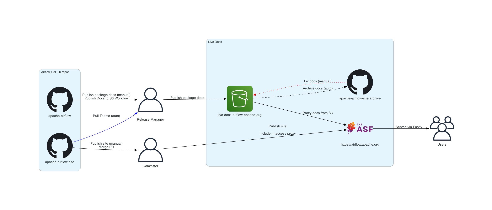
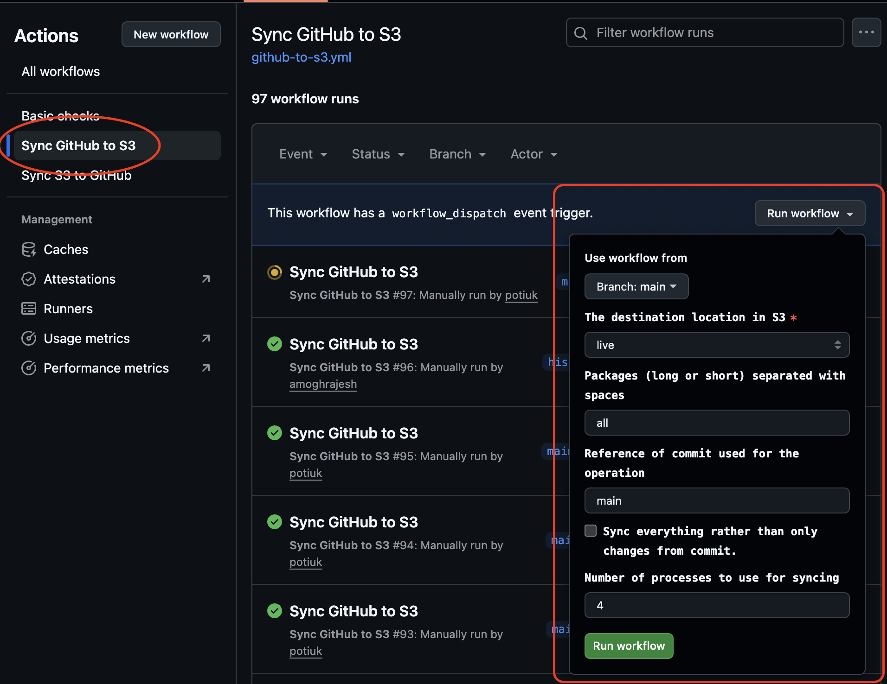

<!--
 Licensed to the Apache Software Foundation (ASF) under one
 or more contributor license agreements.  See the NOTICE file
 distributed with this work for additional information
 regarding copyright ownership.  The ASF licenses this file
 to you under the Apache License, Version 2.0 (the
 "License"); you may not use this file except in compliance
 with the License.  You may obtain a copy of the License at

   http://www.apache.org/licenses/LICENSE-2.0

 Unless required by applicable law or agreed to in writing,
 software distributed under the License is distributed on an
 "AS IS" BASIS, WITHOUT WARRANTIES OR CONDITIONS OF ANY
 KIND, either express or implied.  See the License for the
 specific language governing permissions and limitations
 under the License.
 -->

<!-- START doctoc generated TOC please keep comment here to allow auto update -->
<!-- DON'T EDIT THIS SECTION, INSTEAD RE-RUN doctoc TO UPDATE -->
**Table of contents**

- [Documentation configuration](#documentation-configuration)
- [Architecture of documentation for Airflow](#architecture-of-documentation-for-airflow)
- [Diagrams of the documentation architecture](#diagrams-of-the-documentation-architecture)
- [Staging site](#staging-site)
- [Typical workflows](#typical-workflows)
  - [Publishing the documentation by the release manager](#publishing-the-documentation-by-the-release-manager)
  - [Publishing changes to the website (including theme)](#publishing-changes-to-the-website-including-theme)
- [Publishing changes manually](#publishing-changes-manually)
- [Fixing historical documentation](#fixing-historical-documentation)
  - [Manually publishing documentation directly to S3](#manually-publishing-documentation-directly-to-s3)
  - [Manually publishing documentation via `apache-airflow-site-archive` repo](#manually-publishing-documentation-via-apache-airflow-site-archive-repo)

<!-- END doctoc generated TOC please keep comment here to allow auto update -->


# Documentation configuration

This directory used to contain all the documentation files for the project. The documentation has
been split into separate folders - the documentation is now in the folders in sub-projects that they
are referring to.

If you look for the documentation, it is stored as follows:

Documentation in separate distributions:

* `airflow-core/docs` - documentation for Airflow Core
* `providers/**/docs` - documentation for Providers
* `chart/docs` - documentation for the Helm Chart
* `task-sdk/docs` - documentation for Task SDK (new format not yet published)
* `airflow-ctl/docs` - documentation for Airflow CLI

Documentation for a general overview and summaries not connected with any specific distribution:

* `docker-stack-docs` - documentation for Docker Stack
* `providers-summary-docs` - documentation for the provider summary page

# Architecture of documentation for Airflow

Building documentation for Airflow is optimized for speed and for the convenience workflows of the release
managers and committers who publish and fix the documentation - that's why it's a little complex, as we have
multiple repositories and multiple sources of documentation involved.

There are a few repositories under `apache` organization that are used to build the documentation for Airflow:

* `apache-airflow` - the repository with the code and the documentation sources for Airflow distributions,
   provider distributions, providers' summary, and docker summary: [apache-airflow](https://github.com/apache/airflow).
   From here, we publish the documentation to an S3 bucket where the documentation is hosted.
* `airflow-site` - the repository with the website theme and content where we keep sources of the website
   structure, navigation, and theme for the website [airflow-site](https://github.com/apache/airflow-site). From here,
   we publish the website to the ASF servers so they are published as the [official website](https://airflow.apache.org)
* `airflow-site-archive` - here we keep the archived historical versions of the generated documentation
   of all the documentation packages that we keep on S3. This repository is automatically synchronized from
   the S3 buckets and is only used in case we need to perform a bulk update of historical documentation. Here, only
   generated `html`, `css`, `js`, and `images` files are kept; no sources of the documentation are kept here.

We have two S3 buckets where we can publish the documentation generated from the `apache-airflow` repository:

* `s3://live-docs-airflow-apache-org/docs/` - live, [official documentation](https://airflow.apache.org/docs/)
* `s3://staging-docs-airflow-apache-org/docs/` - staging documentation [official documentation](https://staging-airflow.apache.org/docs/)

Note that those S3 buckets are not served directly to Apache Server, but they are served via Cloudfront
in order to provide caching and automated resolution of folders into index.html files.

The cloudfront distributions of ours are:

* Live cloudfront url: https://d7fnmbhf26p21.cloudfront.net
* Staging cloudfront url: https://d3a2du7x0n8ydr.cloudfront.net

Those cloudfront caches are automatically invalidated when we publish new documentation to S3 using
GitHub Actions workflows, but you can also manually invalidate them using the AWS Console if needed.


# Diagrams of the documentation architecture

This is the diagram of live documentation architecture:



# Staging site

Staging documentation architecture is similar, but uses staging bucket and staging Apache Website. The main
differences are:

* The staging bucket is `s3://staging-docs-airflow-apache-org/docs/`
* The staging website is `https://airflow.staged.apache.org/docs/`
* The staging site is deployed by merging PR or pushing the `staging` branch in the `airflow-site` repository
  rather than `main`. The `staging` branch should be periodically rebased to the `main` branch, but while
  some changes are developed in `staging`, it can diverge from the `main` branch.
* Merging into the `staging` branch of the `airflow-site` repository or pushing the `staging` branch
  will automatically trigger the build of the website and publish it to the `publish-staging` branch and
  effectively to the staging site.

Documentation of pre-release versions of Airflow distributions should be published to the staging S3
bucket so that we can test the documentation before we publish it to the `live` bucket.

# Typical workflows

There are a few typical workflows that we support:

## Publishing the documentation by the release manager

The release manager publishes the documentation using GitHub Actions workflow
[Publish Docs to S3](https://github.com/apache/airflow/actions/workflows/publish-docs-to-s3.yml).
The same workflow can be used to publish Airflow, Helm chart, and providers' documentation.

This workflow is used twice:

* when pre-release distributions are prepared (alpha/beta/rc) - the documentation should be published to
  the `staging` bucket and `staging` site should be built and published.
* when final releases of distributions are prepared - the documentation should be published to the `live`
  bucket and the `live` website should be built and published.

When the release manager publishes the documentation, they choose `auto` destination by default - depending on the
tag they use - `staging` will be used to publish from pre-release tag and `live` will be used ot publish
from the release tag.

You can also specify whether `live` or `staging` documentation should be published manually - overriding
the auto-detection.

The person who triggers the build (release manager) should specify the tag name of the docs to be published
and the list of documentation packages to be published. Usually it is:

* Airflow: `apache-airflow docker-stack task-sdk apache-airflow-ctl`
* Helm chart: `helm-chart`
* Providers: `provider_id1 provider_id2` or `all providers` if all providers should be published.

Optionally - specifically if we run `all-providers` and the release manager wants to exclude some providers,
they can specify documentation packages to exclude. Leaving "no-docs-excluded" will publish all packages
specified to be published without exclusions.


Example screenshot of the workflow triggered from the GitHub UI:


Note that this just publishes the documentation but does not update the "site" with version numbers or
stable links to providers and airflow - if you release a new documentation version, it will be available
with direct URL (say https://apache.airflow.org/docs/apache-airflow/3.0.1/), but the main site will still
point to the previous version of the documentation as `stable` and the version drop-downs will not be updated.

In order to do it, you need to run the [Build docs](https://github.com/apache/airflow-site/actions/workflows/build.yml)
workflow in `airflow-site` repository.

For `live` site you should run the workflow in `main` branch. For `staging` site it should be staging branch.
This will build the website and publish it to the `publish` branch of `airflow-site` repository (for `live`
site) or `publish-staging` branch (for `staging` site). The workflow will also update the website,
including refreshing the version numbers in the drop-downs and stable links.

The `staging` documentation is produced automatically with `staging` watermark added.


This workflow also invalidates cache in Fatly that Apache Software Foundation uses to serve the website,
so you should always run it after you modify the documentation for the website. Other than that Fatly is
configured with 3600 seconds TTL - which means that changes will propagate to the website in ~1 hour.

Shortly after the workflow succeeds and documentation is published, in the live bucket, the [airflow-site-archive](https://github.com/apache/airflow-site-archive)
repository is automatically synchronized with the live S3 bucket. TODO: IMPLEMENT THIS, FOR NOW IT HAS
TO BE MANUALLY SYNCHRONIZED VIA [Sync s3 to GitHub](https://github.com/apache/airflow-site-archive/actions/workflows/s3-to-github.yml)
workflow in `airflow-site-archive` repository. The `airflow-site-archive` essentially keeps the history of
snapshots of the `live` documentation.

## Publishing changes to the website (including theme)

The workflows in `apache-airflow` only update the documentation for the packages (Airflow, Helm chart,
Providers, Docker Stack) that we publish from airflow sources. If we want to publish changes to the website
itself or to the theme (css, javascript) we need to do it in `airflow-site` repository.

Publishing of airflow-site happens automatically when a PR from `airflow-site` is merged to `main` or when
the [Build docs](https://github.com/apache/airflow-site/actions/workflows/build.yml) workflow is triggered
manually in the main branch of `airflow-site` repository. The workflow builds the website and publishes it to
`publish` branch of `airflow-site` repository, which in turn gets picked up by the ASF servers and is
published as the official website. This includes any changes to `.htaccess` of the website.

Such a main build also publishes the latest "sphinx-airflow-theme" package to GitHub so that the next build
of documentation can automatically pick it up from there. This means that if you want to make changes to
`javascript` or `css` that are part of the theme, you need to do it in `airflow-site` repository and
merge it to `main` branch in order to be able to run the documentation build in `apache-airflow` repository
and pick up the latest version of the theme.

The version of sphinx theme is fixed in both repositories:

* https://github.com/apache/airflow-site/blob/main/sphinx_airflow_theme/sphinx_airflow_theme/__init__.py#L21
* https://github.com/apache/airflow/blob/main/devel-common/pyproject.toml#L77 in "docs" section

In case of bigger changes to the theme, we can first iterate on the website and merge a new theme version,
and only after that can we switch to the new version of the theme.

# Publishing changes manually

Sometimes you do not want to use Publishing workflows to publish individual files and caches might get
into the way as both Cloudfront and Fatly caches might take some time to invalidate. In such a case, when
you manually upload the files to S3 bucket, you can immediately invalidate the caches:

1) Manually run invalidation request in Cloudfront for the documentation S3 bucket you uploaded the files
   to via AWS Console or AWS CLI (You can use `/*` to invalidate all files).


2) Run the `Build docs` workflow in `airflow-site` repository to invalidate Fatly cache for the website.
   Use `main` branch to rebuild site for `live` site and `staging` to rebuild the `staging` site:


# Fixing historical documentation

Sometimes we need to update historical documentation (modify generated `html`) - for example, when we find
bad links or when we change some of the structure in the documentation. This can be done via the
`airflow-site-archive` repository. The workflow is as follows:

1. Get the latest version of the documentation from S3 to `airflow-site-archive` repository using
   `Sync S3 to GitHub` workflow. This will download the latest version of the documentation from S3 to
   `airflow-site-archive` repository (this should normally not be needed, if automated synchronization works).
2. Make the changes to the documentation in `airflow-site-archive` repository. This can be done using any
   text editor, script, etc. Those files are generated as `html` files and are not meant to be regenerated,
   they should be modified as `html` files in-place
3. Commit the changes to `airflow-site-archive` repository and push them to `some` branch of the repository.
4. Create a Pull Request from that branch and merge it to `main`
5. Run `Sync GitHub to S3` workflow in `airflow-site-archive` repository. This will upload the modified
   documentation to the S3 bucket. Use `main` branch (default) as "Reference of the commit used
   for synchronization". You can choose whether to sync the changes to `live` or `staging` bucket.
   The default is `live`:
   
6. By default, the workflow will synchronize all documentation modified in a single last commit pushed to
   the `main`. You can also specify `full_sync` to synchronize all files in the repository if you want to
   make sure that S3 reflects `main`. The workflow might run for a long time (hours) in case of full sync
   or many changes to the `.html` files.
7. In case you specify `full_sync`, you can also synchronize `all` docs or only selected documentation
   packages (for example `apache-airflow` or `docker-stack` or `amazon` or `helm-chart`) - you can specify
   more than one package separated by spaces.
8. The workflow will invalidate Cloudfront cache for "live" or "staging" bucket respectively.
9. Run the `Build docs` workflow in `airflow-site` repository to make sure that Fastly cache of the
   https://airflow.apache.org or https://airflow.staged.apache.org/ invalidated. Use `main` to rebuild site
   for `live` site and `staging` to rebuild the `staging` site:
   


## Manually publishing documentation directly to S3

The regular publishing workflows involve running a GitHub Actions workflow, and they cover the majority of cases.
However, sometimes, some manual updates and cherry-picks are needed, when we discover problems with the
publishing and doc building code - for example, when we find that we need to fix extensions to sphinx.

In such a case, the release manager or a committer can build and publish documentation locally - providing that
they configure AWS credentials to be able to upload files to S3. You can ask in
the #internal-airflow-ci-cd channel on Airflow Slack to get your AWS credentials configured.

You can checkout locally a version of airflow repo that you need and apply any cherry-picks you need before
running publishing.

This is done using breeze. You also need to have AWS CLI installed and configured credentials to be able
to upload files to S3. You can get credentials from one of the admins of Airflow's AWS account. The
region to set for AWS is `us-east-2`.

Note that it is advised to add `--dry-run` if you just want to see what would happen. Also, you can use
the `s3://staging-docs-airflow-apache-org/docs/` bucket to test the publishing using staging site.

```bash
breeze build-docs "<package_id1>" "<package_id2>" --docs-only
mkdir /tmp/airflow-site
breeze release-management publish-docs --override-versioned --airflow-site-directory /tmp/airflow-site
breeze release-management publish-docs-to-s3 --source-dir-path /tmp/airflow-site/docs-archive \
 --destination-location s3://live-docs-airflow-apache-org/docs/ --stable-versions \
 --exclude-docs "<package_id1_to_exclude> <package_id2_to_exclude>" [--dry-run]
```

## Manually publishing documentation via `apache-airflow-site-archive` repo

If you do not have S3 credentials and want to be careful about publishing the documentation, you can also
use publishing via `apache-airflow-site-archive` repository. This is a little more complex, but it allows
you to publish documentation without having S3 credentials.

The process is as follows:

1. Run `Sync s3 to GitHub` workflow in `apache-airflow-site-archive` repository. This will download the
   latest version of the documentation from S3 to `airflow-site-archive` repository (this should normally not
   be needed, if automated synchronization works).
2. Checkout the `apache-airflow-site-archive` repository and create a branch for your changes.
3. Build documentation locally in `apache-airflow` repo with any cherry-picks and modifications you need, and
   publish the docs to the checked out `airflow-site-archive` branch.

```bash
breeze build-docs "<package_id1>" "<package_id2>" --docs-only
breeze release-management publish-docs --override-versioned --airflow-site-directory <PATH_TO_THE_ARCHIVE_REPO>
```

4. Commit the changes to `apache-airflow-site-archive` repository and push them to `some` branch of the
   repository.
5. Run `Sync GitHub to S3` workflow in `apache-airflow-site-archive` repository. This will upload the modified
   documentation to S3 bucket. You can choose whether to sync the changes to `live` or `staging` bucket.
   The default is `live`. You can also specify which folders to sync - by default, all modified folders are synced.
6. After you synchronize the changes to S3, the Sync `S3 to GitHub` workflow will be triggered
   automatically and the changes will be synchronized to `airflow-site-archive` `main` branch - so there
   is no need to merge your changes to `main` branch of `airflow-site-archive` repository. You can safely
   delete the branch you created in step 2.
