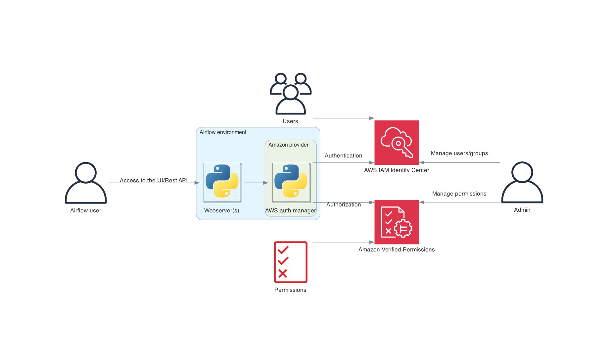

 .. Licensed to the Apache Software Foundation (ASF) under one
    or more contributor license agreements.  See the NOTICE file
    distributed with this work for additional information
    regarding copyright ownership.  The ASF licenses this file
    to you under the Apache License, Version 2.0 (the
    "License"); you may not use this file except in compliance
    with the License.  You may obtain a copy of the License at

 ..   http://www.apache.org/licenses/LICENSE-2.0

 .. Unless required by applicable law or agreed to in writing,
    software distributed under the License is distributed on an
    "AS IS" BASIS, WITHOUT WARRANTIES OR CONDITIONS OF ANY
    KIND, either express or implied.  See the License for the
    specific language governing permissions and limitations
    under the License.

================
AWS auth manager
================

.. warning::
  The AWS auth manager is alpha/experimental at the moment and may be subject to change without warning.

.. note::
    Before reading this, you should be familiar with the concept of auth manager.
    See :doc:`apache-airflow:core-concepts/auth-manager/index`.

The AWS auth manager is an auth manager powered by AWS. It uses two services:

* `AWS IAM Identity Center <https://aws.amazon.com/iam/identity-center/>`_ for authentication purposes
* `Amazon Verified Permissions <https://aws.amazon.com/verified-permissions/>`_ for authorization purposes

**Getting started**

.. toctree::
    :maxdepth: 2

    setup/config
    setup/identity-center
    setup/amazon-verified-permissions

**Manage the environment**

.. toctree::
    :maxdepth: 2

    manage/index
