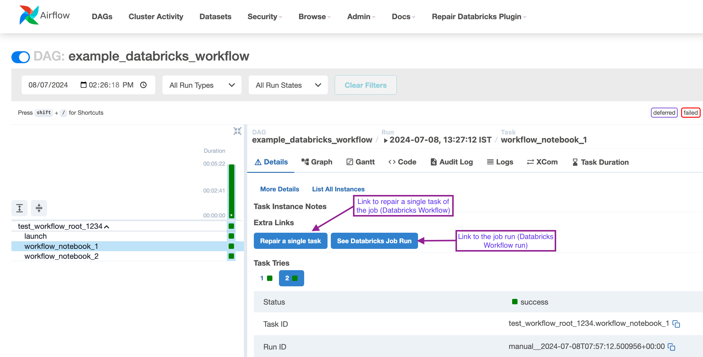
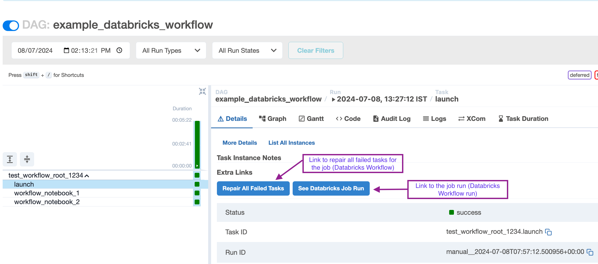

 .. Licensed to the Apache Software Foundation (ASF) under one
    or more contributor license agreements.  See the NOTICE file
    distributed with this work for additional information
    regarding copyright ownership.  The ASF licenses this file
    to you under the Apache License, Version 2.0 (the
    "License"); you may not use this file except in compliance
    with the License.  You may obtain a copy of the License at

 ..   http://www.apache.org/licenses/LICENSE-2.0

 .. Unless required by applicable law or agreed to in writing,
    software distributed under the License is distributed on an
    "AS IS" BASIS, WITHOUT WARRANTIES OR CONDITIONS OF ANY
    KIND, either express or implied.  See the License for the
    specific language governing permissions and limitations
    under the License.

.. _howto/plugin:DatabricksWorkflowPlugin:

DatabricksWorkflowPlugin
========================

Overview
--------

The ``DatabricksWorkflowPlugin`` enhances the Airflow UI by providing links for tasks that allow users to view the
Databricks job run in the Databricks workspace. Additionally, it offers links to repair task(s) within the workflow.

Features
--------

- **Task-Level Links**: Within the workflow, each task includes links to the job run and a repair link for the individual task.

- **Workflow-Level Links**: At the workflow level, for the job launch task, the plugin provides a link to repair all failed tasks and a link to the job run(allows users to monitor the job in the Databricks account) in the Databricks workspace.

Examples
--------

- **Job Run Link and Repair link for Single Task**:

- **Workflow-Level Links to the job run and to repair all failed tasks**:

Notes
-----

Databricks does not allow repairing jobs with single tasks launched outside the workflow. Hence, for these tasks, only the job run link is provided.

Usage
-----

Ideally, installing the provider will also install the plugin, and it should work automatically in your deployment.
However, if custom configurations are preventing the use of plugins, ensure the plugin is properly installed and
configured in your Airflow environment to utilize its features. The plugin will automatically detect Databricks jobs,
as the links are embedded in the relevant operators.
