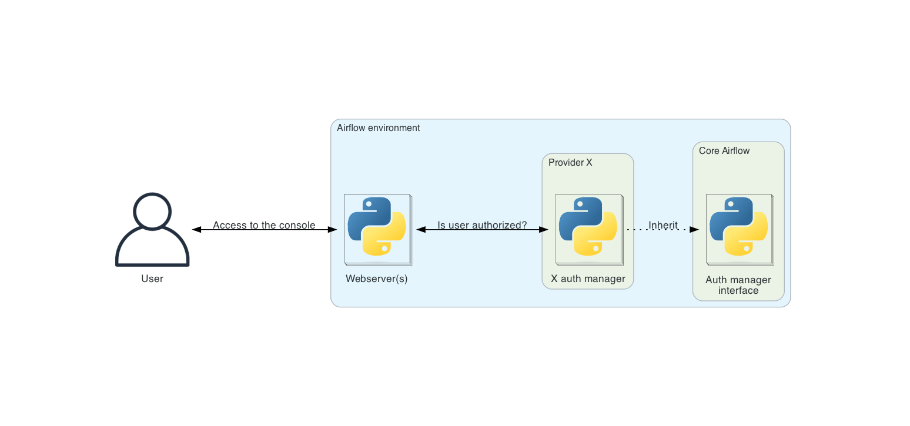

 .. Licensed to the Apache Software Foundation (ASF) under one
    or more contributor license agreements.  See the NOTICE file
    distributed with this work for additional information
    regarding copyright ownership.  The ASF licenses this file
    to you under the Apache License, Version 2.0 (the
    "License"); you may not use this file except in compliance
    with the License.  You may obtain a copy of the License at

 ..   http://www.apache.org/licenses/LICENSE-2.0

 .. Unless required by applicable law or agreed to in writing,
    software distributed under the License is distributed on an
    "AS IS" BASIS, WITHOUT WARRANTIES OR CONDITIONS OF ANY
    KIND, either express or implied.  See the License for the
    specific language governing permissions and limitations
    under the License.

Auth manager
============

Auth (for authentication/authorization) manager is the component in Airflow to handle user authentication and user authorization. They have a common
API and are "pluggable", meaning you can swap auth managers based on your installation needs.

Airflow can only have one auth manager configured at a time; this is set by the ``auth_manager`` option in the
``[core]`` section of :doc:`the configuration file </howto/set-config>`.

.. note::
    For more information on Airflow's configuration, see :doc:`/howto/set-config`.

If you want to check which auth manager is currently set, you can use the
``airflow config get-value core auth_manager`` command:

.. code-block:: bash

    $ airflow config get-value core auth_manager
    airflow.providers.fab.auth_manager.fab_auth_manager.FabAuthManager

Why pluggable auth managers?
----------------------------

Airflow is used by a lot of different users with a lot of different configurations. Some Airflow environment might be
used by only one user and some might be used by thousand of users. An Airflow environment with only one (or very few)
users does not need the same user management as an environment used by thousand of them.

This is why the whole user management (user authentication and user authorization) is packaged in one component
called auth manager. So that it is easy to plug-and-play an auth manager that suits your specific needs.

By default, Airflow comes with the :doc:`apache-airflow-providers-fab:auth-manager/index`.

.. note::
    Switching to a different auth manager is a heavy operation and should be considered as such. It will
    impact users of the environment. The sign-in and sign-off experience will very likely change and disturb them if
    they are not advised. Plus, all current users and permissions will have to be copied over from the previous auth
    manager to the next.

Writing your own auth manager
-----------------------------

All Airflow auth managers implement a common interface so that they are pluggable and any auth manager has access
to all abilities and integrations within Airflow. This interface is used across Airflow to perform all user
authentication and user authorization related operation.

The public interface is :class:`~airflow.auth.managers.base_auth_manager.BaseAuthManager`.
You can look through the code for the most detailed and up to date interface, but some important highlights are
outlined below.

.. note::
    For more information about Airflow's public interface see :doc:`/public-airflow-interface`.

Some reasons you may want to write a custom auth manager include:

* An auth manager does not exist which fits your specific use case, such as a specific tool or service for user management.
* You'd like to use an auth manager that leverages an identity provider from your preferred cloud provider.
* You have a private user management tool that is only available to you or your organization.

Authentication related BaseAuthManager methods
^^^^^^^^^^^^^^^^^^^^^^^^^^^^^^^^^^^^^^^^^^^^^^

* ``is_logged_in``: Return whether the user is signed-in.
* ``get_user``: Return the signed-in user.
* ``get_url_login``: Return the URL the user is redirected to for signing in.
* ``get_url_logout``: Return the URL the user is redirected to for signing out.

Authorization related BaseAuthManager methods
^^^^^^^^^^^^^^^^^^^^^^^^^^^^^^^^^^^^^^^^^^^^^

Most of authorization methods in :class:`~airflow.auth.managers.base_auth_manager.BaseAuthManager` look the same.
Let's go over the different parameters used by most of these methods.

* ``method``: Use HTTP method naming to determine the type of action being done on a specific resource.

  * ``GET``: Can the user read the resource?
  * ``POST``: Can the user create a resource?
  * ``PUT``: Can the user modify the resource?
  * ``DELETE``: Can the user delete the resource?
  * ``MENU``: Can the user see the resource in the menu?

* ``details``: Optional details about the resource being accessed.
* ``user``: The user trying to access the resource.

These authorization methods are:

* ``is_authorized_configuration``: Return whether the user is authorized to access Airflow configuration. Some details about the configuration can be provided (e.g. the config section).
* ``is_authorized_connection``: Return whether the user is authorized to access Airflow connections. Some details about the connection can be provided (e.g. the connection ID).
* ``is_authorized_dag``: Return whether the user is authorized to access a DAG. Some details about the DAG can be provided (e.g. the DAG ID).
  Also, ``is_authorized_dag`` is called for any entity related to DAGs (e.g. task instances, dag runs, ...). This information is passed in ``access_entity``.
  Example: ``auth_manager.is_authorized_dag(method="GET", access_entity=DagAccessEntity.Run, details=DagDetails(id="dag-1"))`` asks
  whether the user has permission to read the Dag runs of the dag "dag-1".
* ``is_authorized_dataset``: Return whether the user is authorized to access Airflow datasets. Some details about the dataset can be provided (e.g. the dataset uri).
* ``is_authorized_pool``: Return whether the user is authorized to access Airflow pools. Some details about the pool can be provided (e.g. the pool name).
* ``is_authorized_variable``: Return whether the user is authorized to access Airflow variables. Some details about the variable can be provided (e.g. the variable key).
* ``is_authorized_view``: Return whether the user is authorized to access a specific view in Airflow. The view is specified through ``access_view`` (e.g. ``AccessView.CLUSTER_ACTIVITY``).
* ``is_authorized_custom_view``: Return whether the user is authorized to access a specific view not defined in Airflow. This view can be provided by the auth manager itself or a plugin defined by the user.

Optional methods recommended to override for optimization
^^^^^^^^^^^^^^^^^^^^^^^^^^^^^^^^^^^^^^^^^^^^^^^^^^^^^^^^^

The following methods aren't required to override to have a functional Airflow auth manager. However, it is recommended to override these to make your auth manager faster (and potentially less costly):

* ``batch_is_authorized_dag``: Batch version of ``is_authorized_dag``. If not overridden, it will call ``is_authorized_dag`` for every single item.
* ``batch_is_authorized_connection``: Batch version of ``is_authorized_connection``. If not overridden, it will call ``is_authorized_connection`` for every single item.
* ``batch_is_authorized_pool``: Batch version of ``is_authorized_pool``. If not overridden, it will call ``is_authorized_pool`` for every single item.
* ``batch_is_authorized_variable``: Batch version of ``is_authorized_variable``. If not overridden, it will call ``is_authorized_variable`` for every single item.
* ``get_permitted_dag_ids``: Return the list of DAG IDs the user has access to.  If not overridden, it will call ``is_authorized_dag`` for every single DAG available in the environment.
* ``filter_permitted_menu_items``: Return the menu items the user has access to.  If not overridden, it will call ``has_access`` in :class:`~airflow.www.security_manager.AirflowSecurityManagerV2` for every single menu item.

CLI
^^^

Auth managers may vend CLI commands which will be included in the ``airflow`` command line tool by implementing the ``get_cli_commands`` method. The commands can be used to setup required resources. Commands are only vended for the currently configured auth manager. A pseudo-code example of implementing CLI command vending from an auth manager can be seen below:

.. code-block:: python

    @staticmethod
    def get_cli_commands() -> list[CLICommand]:
        sub_commands = [
            ActionCommand(
                name="command_name",
                help="Description of what this specific command does",
                func=lazy_load_command("path.to.python.function.for.command"),
                args=(),
            ),
        ]

        return [
            GroupCommand(
                name="my_cool_auth_manager",
                help="Description of what this group of commands do",
                subcommands=sub_commands,
            ),
        ]

.. note::
    Currently there are no strict rules in place for the Airflow command namespace. It is up to developers to use names for their CLI commands that are sufficiently unique so as to not cause conflicts with other Airflow components.

.. note::
    When creating a new auth manager, or updating any existing auth manager, be sure to not import or execute any expensive operations/code at the module level. Auth manager classes are imported in several places and if they are slow to import this will negatively impact the performance of your Airflow environment, especially for CLI commands.

Rest API
^^^^^^^^

Auth managers may vend Rest API endpoints which will be included in the :doc:`/stable-rest-api-ref` by implementing the ``get_api_endpoints`` method. The endpoints can be used to manage resources such as users, groups, roles (if any) handled by your auth manager. Endpoints are only vended for the currently configured auth manager.

Next Steps
^^^^^^^^^^

Once you have created a new auth manager class implementing the :class:`~airflow.auth.managers.base_auth_manager.BaseAuthManager` interface, you can configure Airflow to use it by setting the ``core.auth_manager`` configuration value to the module path of your auth manager:

.. code-block:: ini

    [core]
    auth_manager = my_company.auth_managers.MyCustomAuthManager

.. note::
    For more information on Airflow's configuration, see :doc:`/howto/set-config` and for more information on managing Python modules in Airflow see :doc:`/administration-and-deployment/modules_management`.
