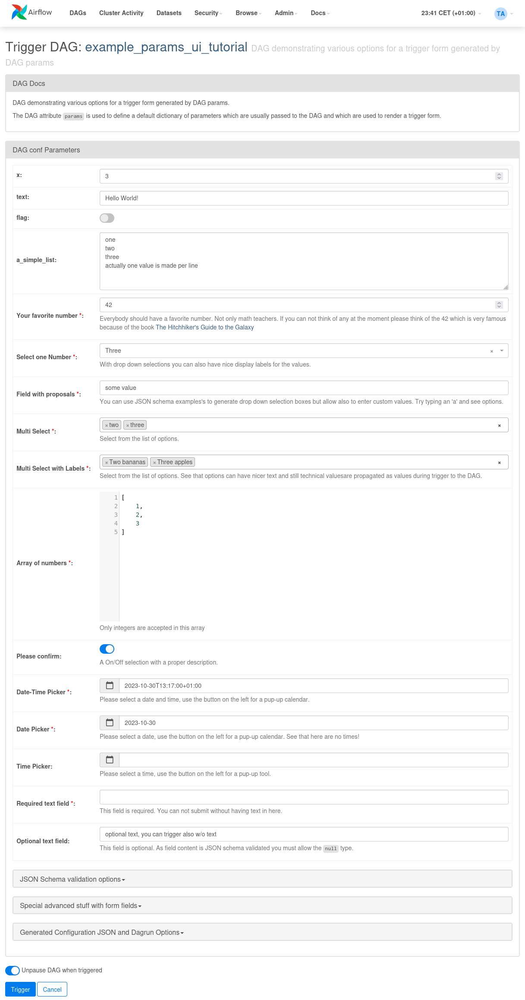

 .. Licensed to the Apache Software Foundation (ASF) under one
    or more contributor license agreements.  See the NOTICE file
    distributed with this work for additional information
    regarding copyright ownership.  The ASF licenses this file
    to you under the Apache License, Version 2.0 (the
    "License"); you may not use this file except in compliance
    with the License.  You may obtain a copy of the License at

 ..   http://www.apache.org/licenses/LICENSE-2.0

 .. Unless required by applicable law or agreed to in writing,
    software distributed under the License is distributed on an
    "AS IS" BASIS, WITHOUT WARRANTIES OR CONDITIONS OF ANY
    KIND, either express or implied.  See the License for the
    specific language governing permissions and limitations
    under the License.

.. _concepts:params:

Params
======

Params enable you to provide runtime configuration to tasks. You can configure default Params in your DAG
code and supply additional Params, or overwrite Param values, at runtime when you trigger a DAG. Param values
are validated with JSON Schema. For scheduled DAG runs, default Param values are used.

Also defined Params are used to render a nice UI when triggering manually.
When you trigger a DAG manually, you can modify its Params before the dagrun starts.
If the user-supplied values don't pass validation, Airflow shows a warning instead of creating the dagrun.

DAG-level Params
----------------

To add Params to a :class:`~airflow.models.dag.DAG`, initialize it with the ``params`` kwarg.
Use a dictionary that maps Param names to either a :class:`~airflow.models.param.Param` or an object indicating the parameter's default value.

.. code-block::
   :emphasize-lines: 6-9

    from airflow import DAG
    from airflow.models.param import Param

    with DAG(
        "the_dag",
        params={
            "x": Param(5, type="integer", minimum=3),
            "y": 6
        },
    ):

Task-level Params
-----------------

You can also add Params to individual tasks.

.. code-block::

    PythonOperator(
        task_id="print_x",
        params={"x": 10},
        python_callable=print_it,
    )

Task-level params take precedence over DAG-level params, and user-supplied params (when triggering the DAG)
take precedence over task-level params.

Referencing Params in a Task
----------------------------

Params can be referenced in :ref:`templated strings <templates-ref>` under ``params``. For example:

.. code-block::
   :emphasize-lines: 4

    PythonOperator(
        task_id="from_template",
        op_args=[
            "{{ params.int_param + 10 }}",
        ],
        python_callable=(
            lambda x: print(x)
        ),
    )

Even though Params can use a variety of types, the default behavior of templates is to provide your task with a string.
You can change this by setting ``render_template_as_native_obj=True`` while initializing the :class:`~airflow.models.dag.DAG`.

.. code-block::
   :emphasize-lines: 4

    with DAG(
        "the_dag",
        params={"x": Param(5, type="integer", minimum=3)},
        render_template_as_native_obj=True
    ):

This way, the Param's type is respected when it's provided to your task:

.. code-block::

    # prints <class 'str'> by default
    # prints <class 'int'> if render_template_as_native_obj=True
    PythonOperator(
        task_id="template_type",
        op_args=[
            "{{ params.int_param }}",
        ],
        python_callable=(
            lambda x: print(type(x))
        ),
    )

Another way to access your param is via a task's ``context`` kwarg.

.. code-block::
   :emphasize-lines: 1,2

    def print_x(**context):
        print(context["params"]["x"])

    PythonOperator(
        task_id="print_x",
        python_callable=print_x,
    )

JSON Schema Validation
----------------------

:class:`~airflow.modules.param.Param` makes use of `JSON Schema <https://json-schema.org/>`_, so you can use the full JSON Schema specifications mentioned at https://json-schema.org/draft/2020-12/json-schema-validation.html to define ``Param`` objects.

.. code-block::

    with DAG(
        "my_dag",
        params={
            # an int with a default value
            "int_param": Param(10, type="integer", minimum=0, maximum=20),

            # a required param which can be of multiple types
            # a param must have a default value
            "dummy": Param(5, type=["null", "number", "string"]),

            # an enum param, must be one of three values
            "enum_param": Param("foo", enum=["foo", "bar", 42]),

            # a param which uses json-schema formatting
            "email": Param(
                default="example@example.com",
                type="string",
                format="idn-email",
                minLength=5,
                maxLength=255,
            ),
        },
    ):

.. note::
    As of now, for security reasons, one can not use Param objects derived out of custom classes. We are
    planning to have a registration system for custom Param classes, just like we've for Operator ExtraLinks.

Use Params to Provide a Trigger UI Form
---------------------------------------

:class:`~airflow.models.dag.DAG` level params are used to render a user friendly trigger form.
This form is provided when a user clicks on the "Trigger DAG w/ config" button.

The Trigger UI Form is rendered based on the pre-defined DAG Prams. If the DAG has no params defined, a JSON entry mask is shown.
The form elements can be defined with the :class:`~airflow.modules.param.Param` class and attributes define how a form field is displayed.

The following features are supported in the Trigger UI Form:

- Direct scalar values (boolean, int, string, lists, dicts) from top-level DAG params are interpreted and render a corresponding field type.
  The name of the param is used as label and no further validation is made, all values are treated as optional.
- If you use the :class:`~airflow.modules.param.Param` class as definition of the param value, the following parameters can be added:

  - The Param attribute ``title`` is used to render the form field label of the entry box
  - The Param attribute ``description`` is rendered below an entry field as help text in gray color.
    Note that if you want to provide HTML tags for special formatting or links you need to use the Param attribute
    ``description_html``, see tutorial DAG ``example_params_ui_tutorial`` for an example.
  - The Param attribute ``type`` influences how a field is rendered. The following types are supported:

    - ``string``: Generates a text box to edit text.
      You can add the parameters ``minLength`` and ``maxLength`` to restrict the text length.
    - ``number`` or ``integer``: Generates a field which restricts adding numeric values only.
      You can add the parameters ``minimum`` and ``maximum`` to restrict number range accepted.
    - ``boolean``: Generates a toggle button to be used as ``True`` or ``False``.
    - ``date``, ``datetime`` and ``time``: Generate date and/or time picker
    - ``list``: Generates a HTML multi line text field, every line edited will be made into a string array as value
    - ``object``: Generates a JSON entry field
    - Note: Per default if you specify a type, a field will be made required with input - because of JSON validation.
      If you want to have a field value being added optional only, you must allow JSON schema validation allowing null values via:
      ``type=["null", "string"]``

- The Param attribute ``enum`` generates a drop-down select list. As of JSON validation, a value must be selected.
- If a form field is left empty, it is passed as ``None`` value to the params dict.
- Form fields are rendered in the order of definition.
- If you want to add sections to the Form, add the parameter ``section`` to each field. The text will be used as section label.
  Fields w/o ``section`` will be rendered in the default area.
  Additional sections will be collapsed per default.
- If you want to have params not being displayed, use the ``const`` attribute. These Params will be submitted but hidden in the Form.
- On the bottom of the form the generated JSON configuration can be expanded.
  If you want to change values manually, the JSON configuration can be adjusted. Changes are overridden when form fields change.
- If you want to render custom HTML as form on top of the provided features, you can use the ``custom_html_form`` attribute.

For examples also please take a look to two example DAGs provided: ``example_params_trigger_ui`` and ``example_params_ui_tutorial``.

Disabling Runtime Param Modification
------------------------------------

The ability to update params while triggering a DAG depends on the flag ``core.dag_run_conf_overrides_params``.
Setting this config to ``False`` will effectively turn your default params into constants.
