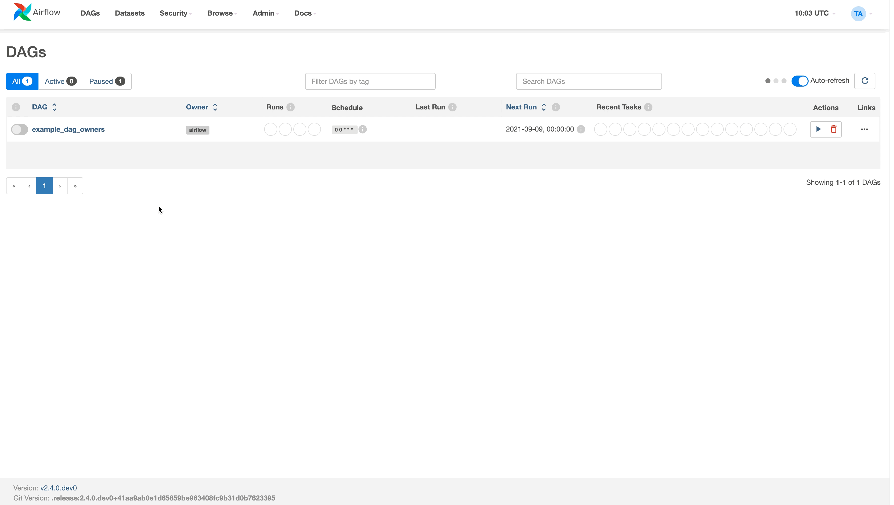

 .. Licensed to the Apache Software Foundation (ASF) under one
    or more contributor license agreements.  See the NOTICE file
    distributed with this work for additional information
    regarding copyright ownership.  The ASF licenses this file
    to you under the Apache License, Version 2.0 (the
    "License"); you may not use this file except in compliance
    with the License.  You may obtain a copy of the License at

 ..   http://www.apache.org/licenses/LICENSE-2.0

 .. Unless required by applicable law or agreed to in writing,
    software distributed under the License is distributed on an
    "AS IS" BASIS, WITHOUT WARRANTIES OR CONDITIONS OF ANY
    KIND, either express or implied.  See the License for the
    specific language governing permissions and limitations
    under the License.

Add Owner Links to DAG
=======================

.. versionadded:: 2.4.0

You can pass the ``owner_link`` parameter for your DAG object, which will make the owner to become a clickable link
in the main DAGs view page.
You can use it to set a custom HTTP link (for example, the owner's Slack channel), or use a
`maitlo <https://en.wikipedia.org/wiki/Mailto>`_ link to have an automated email message (up to 500 characters).

Example:
In your DAG file, add a ``owners_link`` parameter to the DAG object that will hold a dictionary of an owner and it's link.
After that, define a task that will use this owner, and the link in the DAGs view will become clickable

.. code-block:: python

  dag = DAG(
      dag_id="example_dag_owners",
      schedule="0 0 * * *",
      start_date=datetime(2022, 8, 5),
      owner_links={"airflow": "https://airflow.apache.org/"},
  )

  with dag:
      bash_task = BashOperator(task_id='task_using_linked_owner', bash_command='echo 1', owner='airflow')

**Screenshot**:

