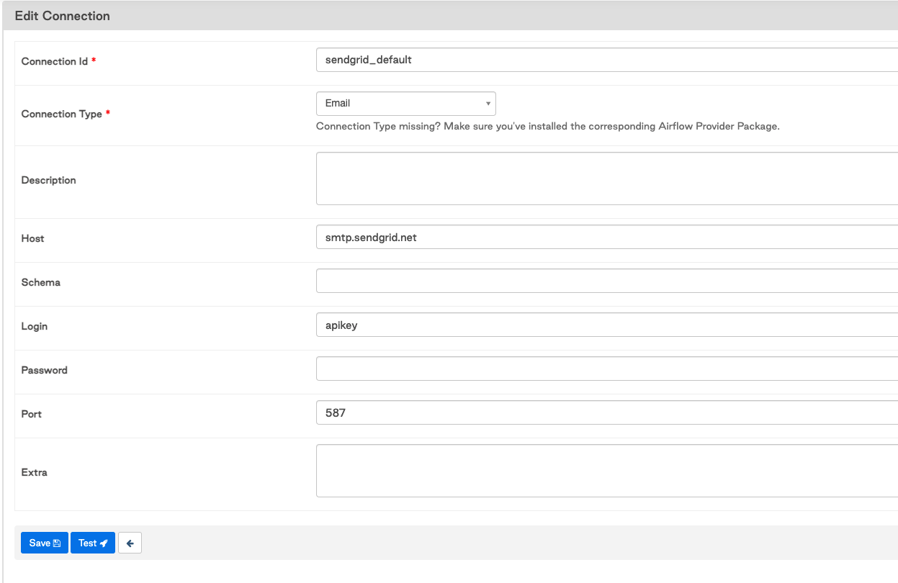

 .. Licensed to the Apache Software Foundation (ASF) under one
    or more contributor license agreements.  See the NOTICE file
    distributed with this work for additional information
    regarding copyright ownership.  The ASF licenses this file
    to you under the Apache License, Version 2.0 (the
    "License"); you may not use this file except in compliance
    with the License.  You may obtain a copy of the License at

 ..   http://www.apache.org/licenses/LICENSE-2.0

 .. Unless required by applicable law or agreed to in writing,
    software distributed under the License is distributed on an
    "AS IS" BASIS, WITHOUT WARRANTIES OR CONDITIONS OF ANY
    KIND, either express or implied.  See the License for the
    specific language governing permissions and limitations
    under the License.

Email Configuration
===================

You can configure the email that is being sent in your ``airflow.cfg``
by setting a ``subject_template`` and/or a ``html_content_template``
in the ``[email]`` section.

.. code-block:: ini

  [email]
  email_backend = airflow.utils.email.send_email_smtp
  subject_template = /path/to/my_subject_template_file
  html_content_template = /path/to/my_html_content_template_file

Equivalent environment variables look like:

.. code-block:: sh

  AIRFLOW__EMAIL__EMAIL_BACKEND=airflow.utils.email.send_email_smtp
  AIRFLOW__EMAIL__SUBJECT_TEMPLATE=/path/to/my_subject_template_file
  AIRFLOW__EMAIL__HTML_CONTENT_TEMPLATE=/path/to/my_html_content_template_file

You can configure a sender's email address by setting ``from_email`` in the ``[email]`` section like:

.. code-block:: ini

  [email]
  from_email = "John Doe <johndoe@example.com>"

Equivalent environment variables look like:

.. code-block:: sh

  AIRFLOW__EMAIL__FROM_EMAIL="John Doe <johndoe@example.com>"

To configure SMTP settings, checkout the :ref:`SMTP <config:smtp>` section in the standard configuration.
If you do not want to store the SMTP credentials in the config or in the environment variables, you can create a
connection called ``smtp_default`` of ``Email`` type, or choose a custom connection name and set the ``email_conn_id`` with it's name in
the configuration & store SMTP username-password in it. Other SMTP settings like host, port etc always gets picked up
from the configuration only. The connection can be of any type (for example 'HTTP connection').

If you want to check which email backend is currently set, you can use ``airflow config get-value email email_backend`` command as in
the example below.

.. code-block:: bash

    $ airflow config get-value email email_backend
    airflow.utils.email.send_email_smtp

To access the task's information you use `Jinja Templating <http://jinja.pocoo.org/docs/dev/>`_  in your template files.

For example a ``html_content_template`` file could look like this:

.. code-block::

  Try {{try_number}} out of {{max_tries + 1}} 
  Exception: {{exception_html}} 
  Log: <a href="{{ti.log_url}}">Link</a> 
  Host: {{ti.hostname}} 
  Mark success: <a href="{{ti.mark_success_url}}">Link</a> 

.. note::
    For more information on setting the configuration, see :doc:`set-config`

.. _email-configuration-sendgrid:

Send email using SendGrid
-------------------------

Using Default SMTP
^^^^^^^^^^^^^^^^^^

You can use the default airflow SMTP backend to send email with SendGrid

  .. code-block:: ini

     [smtp]
     smtp_host=smtp.sendgrid.net
     smtp_starttls=False
     smtp_ssl=False
     smtp_user=apikey
     smtp_password=<generated-api-key>
     smtp_port=587
     smtp_mail_from=<your-from-email>

Equivalent environment variables looks like

  .. code-block::

     AIRFLOW__SMTP__SMTP_HOST=smtp.sendgrid.net
     AIRFLOW__SMTP__SMTP_STARTTLS=False
     AIRFLOW__SMTP__SMTP_SSL=False
     AIRFLOW__SMTP__SMTP_USER=apikey
     AIRFLOW__SMTP__SMTP_PASSWORD=<generated-api-key>
     AIRFLOW__SMTP__SMTP_PORT=587
     AIRFLOW__SMTP__SMTP_MAIL_FROM=<your-from-email>

Using SendGrid Provider
^^^^^^^^^^^^^^^^^^^^^^^

Airflow can be configured to send e-mail using `SendGrid <https://sendgrid.com/>`__.

Follow the steps below to enable it:

1. Setup your SendGrid account, The SMTP and copy username and API Key.

2. Include ``sendgrid`` provider as part of your Airflow installation, e.g.,

  .. code-block:: bash

     pip install 'apache-airflow[sendgrid]' --constraint ...

or
  .. code-block:: bash

     pip install 'apache-airflow-providers-sendgrid' --constraint ...

3. Update ``email_backend`` property in ``[email]`` section in ``airflow.cfg``, i.e.

   .. code-block:: ini

      [email]
      email_backend = airflow.providers.sendgrid.utils.emailer.send_email
      email_conn_id = sendgrid_default
      from_email = "hello@eg.com"

   Equivalent environment variables looks like

   .. code-block::

      AIRFLOW__EMAIL__EMAIL_BACKEND=airflow.providers.sendgrid.utils.emailer.send_email
      AIRFLOW__EMAIL__EMAIL_CONN_ID=sendgrid_default
      SENDGRID_MAIL_FROM=hello@thelearning.dev

4. Create a connection called ``sendgrid_default``, or choose a custom connection
   name and set it in ``email_conn_id`` of  'Email' type. Only login and password
   are used from the connection.

.. note:: The callbacks for success, failure and retry will use the same configuration to send the email

.. _email-configuration-ses:

Send email using AWS SES
------------------------

Airflow can be configured to send e-mail using `AWS SES <https://aws.amazon.com/ses/>`__.

Follow the steps below to enable it:

1. Include ``amazon`` subpackage as part of your Airflow installation:

  .. code-block:: ini

     pip install 'apache-airflow[amazon]'

2. Update ``email_backend`` property in ``[email]`` section in ``airflow.cfg``:

   .. code-block:: ini

      [email]
      email_backend = airflow.providers.amazon.aws.utils.emailer.send_email
      email_conn_id = aws_default
      from_email = From email <email@example.com>

Note that for SES, you must configure from_email to the valid email that can send messages from SES.

3. Create a connection called ``aws_default``, or choose a custom connection
   name and set it in ``email_conn_id``. The type of connection should be ``Amazon Web Services``.
