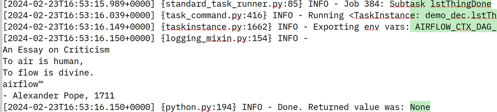

 .. Licensed to the Apache Software Foundation (ASF) under one
    or more contributor license agreements.  See the NOTICE file
    distributed with this work for additional information
    regarding copyright ownership.  The ASF licenses this file
    to you under the Apache License, Version 2.0 (the
    "License"); you may not use this file except in compliance
    with the License.  You may obtain a copy of the License at

 ..   http://www.apache.org/licenses/LICENSE-2.0

 .. Unless required by applicable law or agreed to in writing,
    software distributed under the License is distributed on an
    "AS IS" BASIS, WITHOUT WARRANTIES OR CONDITIONS OF ANY
    KIND, either express or implied.  See the License for the
    specific language governing permissions and limitations
    under the License.

What is Airflow™?
=========================================

`Apache Airflow™ <https://github.com/apache/airflow>`_ is an open-source
platform for developing, scheduling, and monitoring distributable,
batch-oriented workflows. Airflow's extensible Python framework enables you to
build workflows connecting with virtually any technology. A web interface helps
manage the state of your workflows. Airflow is deployable in many ways, varying
from a single process on your laptop to a distributed setup across a network of
many machines to support even the largest of workflows.

Workflows as code
=========================================
An Airflow™ workflow is defined in Python code as a
`Directed Acyclic Graph <https://en.wikipedia.org/wiki/Directed_acyclic_graph>`__.

"Workflow as code" is useful because it is:

:**Dynamic**:  pipelines are configured as Python code, allowing for dynamic pipeline generation.
:**Extensible**: the framework contains operators to connect with numerous technologies. All Airflow™ components are extensible to easily adjust to your environment.
:**Flexible**:  workflows can be easily parameterized by using the built-in `Jinja <https://jinja.palletsprojects.com>`_ templating engine.

Hello World in Airflow™
-----------------------

Take a look at the following snippet of code:

.. code-block:: python

  import datetime
  from airflow import DAG
  from airflow.operators.bash import BashOperator

  with DAG(dag_id="demo_hw", start_date=datetime.datetime.now(), tags=["demo"]) as dag:
      hello = BashOperator(task_id="hello", bash_command="echo hello")
      world = BashOperator(task_id="world", bash_command="echo world")

      hello >> world

Here you can see:

- A `DAG <https://en.wikipedia.org/wiki/Directed_acyclic_graph>`__ named "demo_hw" created via the ``DAG`` function, starting today.
- A ``hello`` bash operator that runs first because it is not dependent on anything else.
- A ``world`` bash operator that runs second because the ``>>`` operator makes it dependent on ```hello``

Airflow™ evaluates this script after you save it into the ``dags/`` folder:


When you press the arrow button shown for the ``demo_hw`` ``DAG``, the bash
operators in it will be run in the specified sequence. The status of this
``DAG`` is visible in the web interface:


Each green column on the left represents one DAG run.
The network diagram at the bottom of the page shows the structure of the ``DAG``.
The result of running this ``DAG`` can be seen in the ``logs/`` folder.


Python Tasks in Airflow™
------------------------

Suppose we wish to schedule Python code in a more complex ``DAG`` with the ability to
transfer data from earlier tasks to later tasks:

.. code-block:: python

  """Create some tasks using a decorated DAG and pass values between them using xcoms."""

  import datetime
  from airflow.decorators import task, dag


  @dag(  # Decorate the following function to make a dag.
      dag_id="demo_dec",
      start_date=datetime.datetime.now(),  # A start date is always required, so start today
      tags=["demo", "decorators"],  # Tag the dag
  )
  def define_dag():

      @task
      def fireMeUp():  # Title of the piece
          return "An Essay on Criticism"

      @task
      def ret__air():  # Create some data
          return "air"

      @task
      def ret_flow():  # Create some data
          return "flow"

      @task
      def concatAF(a, b):  # Concatenate data to make Airflow
          return a + b

      @task
      def part_one(prb):  # To err is human
          return f"To {prb} is human, "

      @task
      def part_two(ban):  # To flow is divine
          return f"To {ban} is divine."

      @task
      def lstThingDone(s, p, q, c):  # Complete article
          print(f"\n{s}\n{p}\n{q}\n{c}™\n- Alexander Pope, 1711")

      s = fireMeUp()  # First task

      a = ret__air()  # Generate 'air'
      f = ret_flow()  # Generate 'flow™'

      c = concatAF(a, f)  # Concatenate message

      p = part_one(a)  # First part of the quote
      q = part_two(f)  # Second part of the quite

      lstThingDone(s, p, q, c)  # Final task runs after all tasks have been completed


  define_dag()  # Call the decorated routine to define the dag

Here you can see:

- A `DAG <https://en.wikipedia.org/wiki/Directed_acyclic_graph>`__ named "demo_dec" created via the ``@dag`` decorator, starting today.
- Seven Python methods decorated with ``@task`` to make them into separate, distributable tasks.
- A Python task ``lstThingDone`` which uses the data returned by the earlier tasks to print a message.

Airflow™ evaluates this script after you save it into the ``dags/`` folder and
executes the tasks in the specified order. The status of this "demo_dec" ``DAG`` is visible in the web interface:


The network diagram at the bottom of the page shows the structure of the
``DAG`` showing that task ``fireMeUp`` was not run first but later when its results
were actually needed!

The result of running this ``DAG`` can be seen in the ``logs/`` folder:




Why Airflow™?
=========================================
Airflow™ is a batch workflow orchestration platform. The Airflow framework contains operators to connect with
many technologies and is easily extensible to connect with a new technology. If your workflows have a clear
start and end, and run at regular intervals, they can be programmed as an Airflow DAG.

If you prefer coding over clicking, Airflow is the tool for you. Workflows are defined as Python code which
means:

- Workflows can be stored in version control so that you can roll back to previous versions
- Workflows can be developed by multiple people simultaneously
- Tests can be written to validate functionality
- Components are extensible and you can build on a wide collection of existing components

Rich scheduling and execution semantics enable you to easily define complex pipelines, running at regular
intervals. Backfilling allows you to (re-)run pipelines on historical data after making changes to your logic.
And the ability to rerun partial pipelines after resolving an error helps maximize efficiency.

Airflow's user interface provides:

  1. In-depth views of two things:

    i. Pipelines
    ii. Tasks

  2. Overview of your pipelines over time

From the interface, you can inspect logs and manage tasks, for example retrying a task in
case of failure.

The open-source nature of Airflow ensures you work on components developed, tested, and used by many other
`companies <https://github.com/apache/airflow/blob/main/INTHEWILD.md>`_ around the world. In the active
`community <https://airflow.apache.org/community>`_ you can find plenty of helpful resources in the form of
blog posts, articles, conferences, books, and more. You can connect with other peers via several channels
such as `Slack <https://s.apache.org/airflow-slack>`_ and mailing lists.

Airflow as a Platform is highly customizable. By utilizing :doc:`public-airflow-interface` you can extend
and customize almost every aspect of Airflow.

Take a look at the following snippet of code:

.. code-block:: python

  '''Create some tasks using a decorated DAG and pass values between them using xcoms.'''
  from datetime import datetime
  from airflow.decorators import task, dag

  @dag(dag_id="demo", start_date=datetime(2024, 2, 21))                           # Decorate the following function to make a dag.
  def define_dag():

    @task
    def start():                                                                  # Start message
      print("Started")

    @task
    def make_air(p):                                                              # Create some data
      return "air"

    @task
    def make_flow(p):                                                             # Create some data
      return "flow"

    @task
    def concatenate(a, b):                                                        # Concatenate
      return f"{a} {b}"

    @task
    def say_it(ban):                                                              # Print the sum
      print(f"AAAAAA:  {ban}")                                                    # Look in the airflow/logs folder to see the results

    @task
    def say_it_twice(ban):                                                        # Print the sum again
      print(f"BBBBBB:  {ban} {ban}")                                              # Look in the airflow/logs folder to see the results

    @task
    def finished(s1, s2):                                                         # Finish message
      print("Finished")

    s = start       ()                                                            # First task
    c = concatenate (make_air(s), make_flow(s))                                   # Make the data after the start task has run and concatenate it
    p = say_it      (c)                                                           # Print the concatenated data once it is ready
    q = say_it_twice(c)
    finished        (p, q)                                                        # Final task runs after all prints have been completed

  define_dag()                                                                    # Call the decorated routine to define the dag

Here you can see:

- A `DAG <https://en.wikipedia.org/wiki/Directed_acyclic_graph>`__ named "demo" created via the ``@dag`` decorator, starting on Feb 21st 2024 and running once a day.
- A ``start`` task that runs first because it is not dependent on anything else.
- Two ``make`` tasks that create some data and return it through xcoms.
- A ``concatenate`` task that uses the data created by the ``make`` tasks.
- Two ``print`` tasks that print the data in different ways.
- A final ``finish`` task that runs after the ``print`` tasks have finished.

Airflow™ evaluates this script after you save it into the ``dags/`` folder and
executes the tasks at the set interval and in the defined order. The status of
the "demo" ``DAG`` is visible in the web interface:

.. image:: /img/demo_graph_view.png
  :alt: Demo DAG in the Graph View, showing the status of one ``DAG`` run

The result of running this ``DAG`` can be seen in the ``logs/`` folder, where
each green column on the left represents one DAG run:

.. image:: /img/demo_log.png
  :alt: Output from Demo DAG

This example demonstrates a simple Python script, but such tasks can run any
arbitrary code: think of running a Spark job, or moving data between two
buckets or sending an email.

Why Airflow™?
=========================================
Airflow™ is a batch workflow orchestration platform. The Airflow framework contains operators to connect with
many technologies and is easily extensible to connect with a new technology. If your workflows have a clear
start and end, and run at regular intervals, they can be programmed as an Airflow DAG.

If you prefer coding over clicking, Airflow is the tool for you. Workflows are defined as Python code which
means:

- Workflows can be stored in version control so that you can roll back to previous versions
- Workflows can be developed by multiple people simultaneously
- Tests can be written to validate functionality
- Components are extensible and you can build on a wide collection of existing components

Rich scheduling and execution semantics enable you to easily define complex pipelines, running at regular
intervals. Backfilling allows you to (re-)run pipelines on historical data after making changes to your logic.
And the ability to rerun partial pipelines after resolving an error helps maximize efficiency.

Airflow's user interface provides:

  1. In-depth views of two things:

    i. Pipelines
    ii. Tasks

  2. Overview of your pipelines over time

From the interface, you can inspect logs and manage tasks, for example retrying a task in
case of failure.

The open-source nature of Airflow ensures you work on components developed, tested, and used by many other
`companies <https://github.com/apache/airflow/blob/main/INTHEWILD.md>`_ around the world. In the active
`community <https://airflow.apache.org/community>`_ you can find plenty of helpful resources in the form of
blog posts, articles, conferences, books, and more. You can connect with other peers via several channels
such as `Slack <https://s.apache.org/airflow-slack>`_ and mailing lists.

Airflow as a Platform is highly customizable. By utilizing :doc:`public-airflow-interface` you can extend
and customize almost every aspect of Airflow.

Why not Airflow™?
=================

Airflow™ was built for finite batch workflows. While the CLI and REST API do allow triggering workflows,
Airflow was not built for infinitely running event-based workflows. Airflow is not a streaming solution.
However, a streaming system such as Apache Kafka is often seen working together with Apache Airflow. Kafka can
be used for ingestion and processing in real-time, event data is written to a storage location, and Airflow
periodically starts a workflow processing a batch of data.

If you prefer clicking over coding, Airflow is probably not the right solution. The web interface aims to make
managing workflows as easy as possible and the Airflow framework is continuously improved to make the
developer experience as smooth as possible. However, the philosophy of Airflow is to define workflows as code
so coding will always be required.


.. toctree::
    :hidden:
    :caption: Content

    Overview <self>
    start
    installation/index
    security/index
    tutorial/index
    howto/index
    ui
    core-concepts/index
    authoring-and-scheduling/index
    administration-and-deployment/index
    integration
    public-airflow-interface
    best-practices
    faq
    Release Policies <release-process>
    release_notes
    privacy_notice
    project
    license

.. toctree::
    :hidden:
    :caption: References

    Operators and hooks <operators-and-hooks-ref>
    CLI <cli-and-env-variables-ref>
    Templates <templates-ref>
    Stable REST API <stable-rest-api-ref>
    deprecated-rest-api-ref
    Configurations <configurations-ref>
    Extra packages <extra-packages-ref>

.. toctree::
    :hidden:
    :caption: Internal DB details

    Database Migrations <migrations-ref>
    Database ERD Schema <database-erd-ref>
