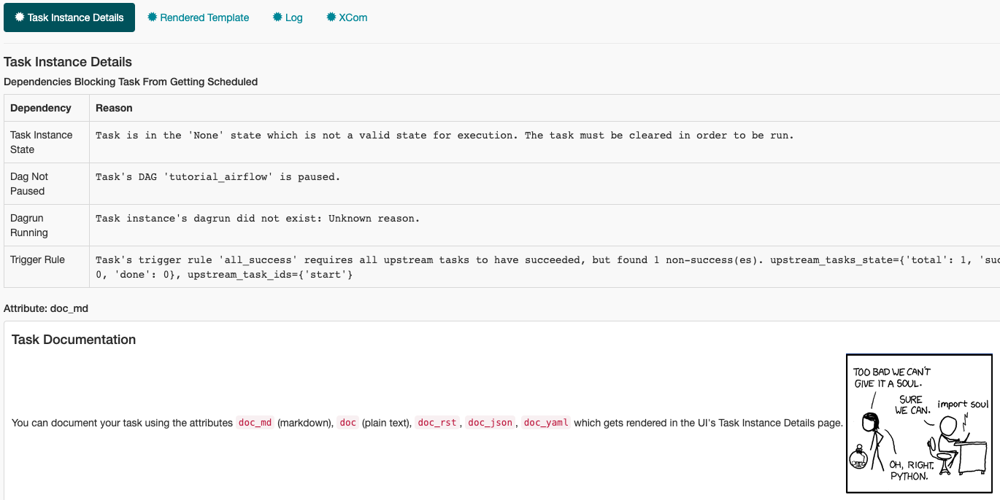
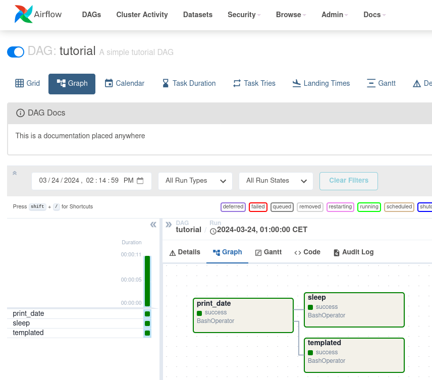
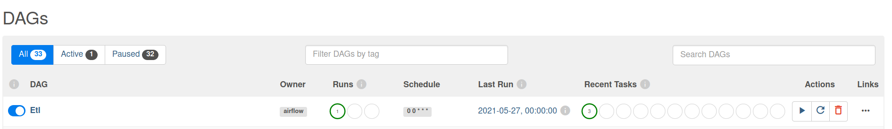
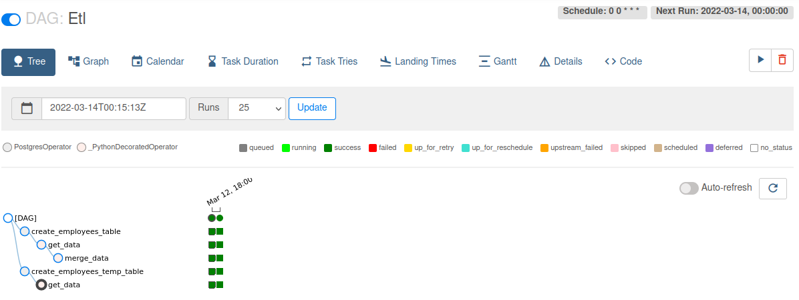

 .. Licensed to the Apache Software Foundation (ASF) under one
    or more contributor license agreements.  See the NOTICE file
    distributed with this work for additional information
    regarding copyright ownership.  The ASF licenses this file
    to you under the Apache License, Version 2.0 (the
    "License"); you may not use this file except in compliance
    with the License.  You may obtain a copy of the License at

 ..   http://www.apache.org/licenses/LICENSE-2.0

 .. Unless required by applicable law or agreed to in writing,
    software distributed under the License is distributed on an
    "AS IS" BASIS, WITHOUT WARRANTIES OR CONDITIONS OF ANY
    KIND, either express or implied.  See the License for the
    specific language governing permissions and limitations
    under the License.

Tutorial
================

This tutorial walks you through some of the fundamental Airflow concepts,
objects, and their usage while writing your first pipeline.

Example Pipeline definition
---------------------------

Here is an example of a basic pipeline definition. Do not worry if this looks
complicated, a line by line explanation follows below.

.. exampleinclude:: /../../airflow/example_dags/tutorial.py
    :language: python
    :start-after: [START tutorial]
    :end-before: [END tutorial]

It's a DAG definition file
--------------------------

One thing to wrap your head around (it may not be very intuitive for everyone
at first) is that this Airflow Python script is really
just a configuration file specifying the DAG's structure as code.
The actual tasks defined here will run in a different context from
the context of this script. Different tasks run on different workers
at different points in time, which means that this script cannot be used
to cross communicate between tasks. Note that for this
purpose we have a more advanced feature called :doc:`/concepts/xcoms`.

People sometimes think of the DAG definition file as a place where they
can do some actual data processing - that is not the case at all!
The script's purpose is to define a DAG object. It needs to evaluate
quickly (seconds, not minutes) since the scheduler will execute it
periodically to reflect the changes if any.

Importing Modules
-----------------

An Airflow pipeline is just a Python script that happens to define an
Airflow DAG object. Let's start by importing the libraries we will need.

.. exampleinclude:: /../../airflow/example_dags/tutorial.py
    :language: python
    :start-after: [START import_module]
    :end-before: [END import_module]

See :doc:`modules_management` for details on how Python and Airflow manage modules.

Default Arguments
-----------------
We're about to create a DAG and some tasks, and we have the choice to
explicitly pass a set of arguments to each task's constructor
(which would become redundant), or (better!) we can define a dictionary
of default parameters that we can use when creating tasks.

.. exampleinclude:: /../../airflow/example_dags/tutorial.py
    :language: python
    :dedent: 4
    :start-after: [START default_args]
    :end-before: [END default_args]

For more information about the BaseOperator's parameters and what they do,
refer to the :py:class:`airflow.models.BaseOperator` documentation.

Also, note that you could easily define different sets of arguments that
would serve different purposes. An example of that would be to have
different settings between a production and development environment.

Instantiate a DAG
-----------------

We'll need a DAG object to nest our tasks into. Here we pass a string
that defines the ``dag_id``, which serves as a unique identifier for your DAG.
We also pass the default argument dictionary that we just defined and
define a ``schedule`` of 1 day for the DAG.

.. exampleinclude:: /../../airflow/example_dags/tutorial.py
    :language: python
    :start-after: [START instantiate_dag]
    :end-before: [END instantiate_dag]

Operators
---------

An operator defines a unit of work for Airflow to complete. Using operators is the classic approach
to defining work in Airflow. For some use cases, it's better to use the TaskFlow API to define
work in a Pythonic context as described in :doc:`/tutorial_taskflow_api`. For now, using operators helps to
visualize task dependencies in our DAG code.

All operators inherit from the BaseOperator, which includes all of the required arguments for
running work in Airflow. From here, each operator includes unique arguments for
the type of work it's completing. Some of the most popular operators are the PythonOperator, the BashOperator, and the
KubernetesPodOperator.

Airflow completes work based on the arguments you pass to your operators. In this tutorial, we
use the BashOperator to run a few bash scripts.

Tasks
-----

To use an operator in a DAG, you have to instantiate it as a task. Tasks
determine how to execute your operator's work within the context of a DAG.

In the following example, we instantiate the BashOperator as two separate tasks in order to run two
separate bash scripts. The first argument for each instantiation, ``task_id``,
acts as a unique identifier for the task.

.. exampleinclude:: /../../airflow/example_dags/tutorial.py
    :language: python
    :dedent: 4
    :start-after: [START basic_task]
    :end-before: [END basic_task]

Notice how we pass a mix of operator specific arguments (``bash_command``) and
an argument common to all operators (``retries``) inherited
from BaseOperator to the operator's constructor. This is simpler than
passing every argument for every constructor call. Also, notice that in
the second task we override the ``retries`` parameter with ``3``.

The precedence rules for a task are as follows:

1.  Explicitly passed arguments
2.  Values that exist in the ``default_args`` dictionary
3.  The operator's default value, if one exists

A task must include or inherit the arguments ``task_id`` and ``owner``,
otherwise Airflow will raise an exception.

Templating with Jinja
---------------------
Airflow leverages the power of
`Jinja Templating <https://jinja.palletsprojects.com/en/2.11.x/>`_ and provides
the pipeline author
with a set of built-in parameters and macros. Airflow also provides
hooks for the pipeline author to define their own parameters, macros and
templates.

This tutorial barely scratches the surface of what you can do with
templating in Airflow, but the goal of this section is to let you know
this feature exists, get you familiar with double curly brackets, and
point to the most common template variable: ``{{ ds }}`` (today's "date
stamp").

.. exampleinclude:: /../../airflow/example_dags/tutorial.py
    :language: python
    :dedent: 4
    :start-after: [START jinja_template]
    :end-before: [END jinja_template]

Notice that the ``templated_command`` contains code logic in ```` blocks,
references parameters like ``{{ ds }}``, and calls a function as in
``{{ macros.ds_add(ds, 7)}}``.

Files can also be passed to the ``bash_command`` argument, like
``bash_command='templated_command.sh'``, where the file location is relative to
the directory containing the pipeline file (``tutorial.py`` in this case). This
may be desirable for many reasons, like separating your script's logic and
pipeline code, allowing for proper code highlighting in files composed in
different languages, and general flexibility in structuring pipelines. It is
also possible to define your ``template_searchpath`` as pointing to any folder
locations in the DAG constructor call.

Using that same DAG constructor call, it is possible to define
``user_defined_macros`` which allow you to specify your own variables.
For example, passing ``dict(foo='bar')`` to this argument allows you
to use ``{{ foo }}`` in your templates. Moreover, specifying
``user_defined_filters`` allows you to register your own filters. For example,
passing ``dict(hello=lambda name: 'Hello %s' % name)`` to this argument allows
you to use ``{{ 'world' | hello }}`` in your templates. For more information
regarding custom filters have a look at the
`Jinja Documentation <https://jinja.palletsprojects.com/en/latest/api/#custom-filters>`_.

For more information on the variables and macros that can be referenced
in templates, make sure to read through the :ref:`templates-ref`.

Adding DAG and Tasks documentation
----------------------------------
We can add documentation for DAG or each single task. DAG documentation only supports
markdown so far, while task documentation supports plain text, markdown, reStructuredText,
json, and yaml. The DAG documentation can be written as a doc string at the beginning
of the DAG file (recommended), or anywhere else in the file. Below you can find some examples
on how to implement task and DAG docs, as well as screenshots:

.. exampleinclude:: /../../airflow/example_dags/tutorial.py
    :language: python
    :dedent: 4
    :start-after: [START documentation]
    :end-before: [END documentation]

Setting up Dependencies
-----------------------
We have tasks ``t1``, ``t2`` and ``t3`` that do not depend on each other. Here's a few ways
you can define dependencies between them:

.. code-block:: python

    t1.set_downstream(t2)

    # This means that t2 will depend on t1
    # running successfully to run.
    # It is equivalent to:
    t2.set_upstream(t1)

    # The bit shift operator can also be
    # used to chain operations:
    t1 >> t2

    # And the upstream dependency with the
    # bit shift operator:
    t2 << t1

    # Chaining multiple dependencies becomes
    # concise with the bit shift operator:
    t1 >> t2 >> t3

    # A list of tasks can also be set as
    # dependencies. These operations
    # all have the same effect:
    t1.set_downstream([t2, t3])
    t1 >> [t2, t3]
    [t2, t3] << t1

Note that when executing your script, Airflow will raise exceptions when
it finds cycles in your DAG or when a dependency is referenced more
than once.

Using time zones
----------------

Creating a time zone aware DAG is quite simple. Just make sure to supply a time zone aware dates
using ``pendulum``. Don't try to use standard library
`timezone <https://docs.python.org/3/library/datetime.html#timezone-objects>`_ as they are known to
have limitations and we deliberately disallow using them in DAGs.

Recap
-----
Alright, so we have a pretty basic DAG. At this point your code should look
something like this:

.. exampleinclude:: /../../airflow/example_dags/tutorial.py
    :language: python
    :start-after: [START tutorial]
    :end-before: [END tutorial]

.. _testing:

Testing
--------

Running the Script
''''''''''''''''''

Time to run some tests. First, let's make sure the pipeline
is parsed successfully.

Let's assume we are saving the code from the previous step in
``tutorial.py`` in the DAGs folder referenced in your ``airflow.cfg``.
The default location for your DAGs is ``~/airflow/dags``.

.. code-block:: bash

    python ~/airflow/dags/tutorial.py

If the script does not raise an exception it means that you have not done
anything horribly wrong, and that your Airflow environment is somewhat
sound.

Command Line Metadata Validation
'''''''''''''''''''''''''''''''''
Let's run a few commands to validate this script further.

.. code-block:: bash

    # initialize the database tables
    airflow db init

    # print the list of active DAGs
    airflow dags list

    # prints the list of tasks in the "tutorial" DAG
    airflow tasks list tutorial

    # prints the hierarchy of tasks in the "tutorial" DAG
    airflow tasks list tutorial --tree

Testing
'''''''
Let's test by running the actual task instances for a specific date. The date
specified in this context is called the *logical date* (also called *execution
date* for historical reasons), which simulates the scheduler running your task
or DAG for a specific date and time, even though it *physically* will run now
(or as soon as its dependencies are met).

We said the scheduler runs your task *for* a specific date and time, not *at*.
This is because each run of a DAG conceptually represents not a specific date
and time, but an interval between two times, called a
:ref:`data interval <data-interval>`. A DAG run's logical date is the start of
its data interval.

.. code-block:: bash

    # command layout: command subcommand dag_id task_id date

    # testing print_date
    airflow tasks test tutorial print_date 2015-06-01

    # testing sleep
    airflow tasks test tutorial sleep 2015-06-01

Now remember what we did with templating earlier? See how this template
gets rendered and executed by running this command:

.. code-block:: bash

    # testing templated
    airflow tasks test tutorial templated 2015-06-01

This should result in displaying a verbose log of events and ultimately
running your bash command and printing the result.

Note that the ``airflow tasks test`` command runs task instances locally, outputs
their log to stdout (on screen), does not bother with dependencies, and
does not communicate state (running, success, failed, ...) to the database.
It simply allows testing a single task instance.

The same applies to ``airflow dags test [dag_id] [logical_date]``, but on a DAG
level. It performs a single DAG run of the given DAG id. While it does take task
dependencies into account, no state is registered in the database. It is
convenient for locally testing a full run of your DAG, given that e.g. if one of
your tasks expects data at some location, it is available.

Backfill
''''''''
Everything looks like it's running fine so let's run a backfill.
``backfill`` will respect your dependencies, emit logs into files and talk to
the database to record status. If you do have a webserver up, you will be able
to track the progress. ``airflow webserver`` will start a web server if you
are interested in tracking the progress visually as your backfill progresses.

Note that if you use ``depends_on_past=True``, individual task instances
will depend on the success of their previous task instance (that is, previous
according to the logical date). Task instances with their logical dates equal to
``start_date`` will disregard this dependency because there would be no past
task instances created for them.

You may also want to consider ``wait_for_downstream=True`` when using ``depends_on_past=True``.
While ``depends_on_past=True`` causes a task instance to depend on the success
of its previous task_instance, ``wait_for_downstream=True`` will cause a task instance
to also wait for all task instances *immediately downstream* of the previous
task instance to succeed.

The date range in this context is a ``start_date`` and optionally an ``end_date``,
which are used to populate the run schedule with task instances from this dag.

.. code-block:: bash

    # optional, start a web server in debug mode in the background
    # airflow webserver --debug &

    # start your backfill on a date range
    airflow dags backfill tutorial \
        --start-date 2015-06-01 \
        --end-date 2015-06-07

Pipeline Example
''''''''''''''''''''

Lets look at another example; we need to get some data from a file which is hosted online and need to insert into our local database. We also need to look at removing duplicate rows while inserting.

Initial setup
''''''''''''''''''''
We need to have Docker installed as we will be using the `docker-compose installation <https://airflow.apache.org/docs/apache-airflow/stable/howto/docker-compose/index.html>`_ for this example.
The steps below should be sufficient, but see the quick-start documentation for full instructions.

.. code-block:: bash

  # Download the docker-compose.yaml file
  curl -LfO 'https://airflow.apache.org/docs/apache-airflow/stable/docker-compose.yaml'

  # Make expected directories and set an expected environment variable
  mkdir -p ./dags ./logs ./plugins
  echo -e "AIRFLOW_UID=$(id -u)" > .env

  # Initialize the database
  docker-compose up airflow-init

  # Start up all services
  docker-compose up

After all services have started up, the web UI will be available at: ``http://localhost:8080``. The default account has the username ``airflow`` and the password ``airflow``.

We will also need to create a `connection <https://airflow.apache.org/docs/apache-airflow/stable/concepts/connections.html>`_ to the postgres db. To create one via the web UI, from the "Admin" menu, select "Connections", then click the Plus sign to "Add a new record" to the list of connections.

Fill in the fields as shown below. Note the Connection Id value, which we'll pass as a parameter for the ``postgres_conn_id`` kwarg.

- Connection Id: tutorial_pg_conn
- Connection Type: postgres
- Host: postgres
- Schema: airflow
- Login: airflow
- Password: airflow
- Port: 5432

Test your connection and if the test is successful, save your connection.

Table Creation Tasks
~~~~~~~~~~~~~~~~~~~~~~~~~~

We can use the `PostgresOperator <https://airflow.apache.org/docs/apache-airflow-providers-postgres/stable/operators/postgres_operator_howto_guide.html#creating-a-postgres-database-table>`_ to define tasks that create tables in our postgres db.

We'll create one table to facilitate data cleaning steps (``employees_temp``) and another table to store our cleaned data (``employees``).

.. code-block:: python

  from airflow.providers.postgres.operators.postgres import PostgresOperator

  create_employees_table = PostgresOperator(
      task_id="create_employees_table",
      postgres_conn_id="tutorial_pg_conn",
      sql="""
          CREATE TABLE IF NOT EXISTS employees (
              "Serial Number" NUMERIC PRIMARY KEY,
              "Company Name" TEXT,
              "Employee Markme" TEXT,
              "Description" TEXT,
              "Leave" INTEGER
          );""",
  )

  create_employees_temp_table = PostgresOperator(
      task_id="create_employees_temp_table",
      postgres_conn_id="tutorial_pg_conn",
      sql="""
          DROP TABLE IF EXISTS employees_temp;
          CREATE TABLE employees_temp (
              "Serial Number" NUMERIC PRIMARY KEY,
              "Company Name" TEXT,
              "Employee Markme" TEXT,
              "Description" TEXT,
              "Leave" INTEGER
          );""",
  )

Optional Note:
""""""""""""""
If you want to abstract these sql statements out of your DAG, you can move the statements sql files somewhere within the ``dags/`` directory and pass the sql file_path (relative to ``dags/``) to the ``sql`` kwarg. For ``employees`` for example, create a ``sql`` directory in ``dags/``, put ``employees`` DDL in ``dags/sql/employees_schema.sql``, and modify the PostgresOperator() to:

.. code-block:: python

  create_employees_table = PostgresOperator(
      task_id="create_employees_table",
      postgres_conn_id="tutorial_pg_conn",
      sql="sql/employees_schema.sql",
  )

and repeat for the ``employees_temp`` table.

Data Retrieval Task
~~~~~~~~~~~~~~~~~~~

Here we retrieve data, save it to a file on our Airflow instance, and load the data from that file into an intermediate table where we can execute data cleaning steps.

.. code-block:: python

  import os
  import requests
  from airflow.decorators import task
  from airflow.providers.postgres.hooks.postgres import PostgresHook

  @task
  def get_data():
      # NOTE: configure this as appropriate for your airflow environment
      data_path = "/opt/airflow/dags/files/employees.csv"
      os.makedirs(os.path.dirname(data_path), exist_ok=True)

      url = "https://raw.githubusercontent.com/apache/airflow/main/docs/apache-airflow/pipeline_example.csv"

      response = requests.request("GET", url)

      with open(data_path, "w") as file:
          file.write(response.text)

      postgres_hook = PostgresHook(postgres_conn_id="tutorial_pg_conn")
      conn = postgres_hook.get_conn()
      cur = conn.cursor()
      with open(data_path, "r") as file:
          cur.copy_expert(
              "COPY employees_temp FROM STDIN WITH CSV HEADER DELIMITER AS ',' QUOTE '\"'",
              file,
          )
      conn.commit()

Data Merge Task
~~~~~~~~~~~~~~~

Here we select completely unique records from the retrieved data, then we check to see if any employee ``Serial Numbers`` are already in the database (if they are, we update those records with the new data).

.. code-block:: python

  from airflow.decorators import task
  from airflow.providers.postgres.hooks.postgres import PostgresHook

  @task
  def merge_data():
      query = """
          INSERT INTO employees
          SELECT *
          FROM (
              SELECT DISTINCT *
              FROM employees_temp
          )
          ON CONFLICT ("Serial Number") DO UPDATE
          SET "Serial Number" = excluded."Serial Number";
      """
      try:
          postgres_hook = PostgresHook(postgres_conn_id="tutorial_pg_conn")
          conn = postgres_hook.get_conn()
          cur = conn.cursor()
          cur.execute(query)
          conn.commit()
          return 0
      except Exception as e:
          return 1

Completing our DAG:
~~~~~~~~~~~~~~~~~~~
We've developed our tasks, now we need to wrap them in a DAG, which enables us to define when and how tasks should run, and state any dependencies that tasks have on other tasks. The DAG below is configured to:

* run every day at midnight starting on Jan 1, 2021,
* only run once in the event that days are missed, and
* timeout after 60 minutes

And from the last line in the definition of the ``Etl`` DAG, we see:

.. code-block:: python

      [create_employees_table, create_employees_temp_table] >> get_data() >> merge_data()

* the ``merge_data()`` task depends on the ``get_data()`` task,
* the ``get_data()`` depends on both the ``create_employees_table`` and ``create_employees_temp_table`` tasks, and
* the ``create_employees_table`` and ``create_employees_temp_table`` tasks can run independently.

Putting all of the pieces together, we have our completed DAG.

.. code-block:: python

  import datetime
  import pendulum
  import os

  import requests
  from airflow.decorators import dag, task
  from airflow.providers.postgres.hooks.postgres import PostgresHook
  from airflow.providers.postgres.operators.postgres import PostgresOperator

  @dag(
      schedule="0 0 * * *",
      start_date=pendulum.datetime(2021, 1, 1, tz="UTC"),
      catchup=False,
      dagrun_timeout=datetime.timedelta(minutes=60),
  )
  def Etl():
      create_employees_table = PostgresOperator(
          task_id="create_employees_table",
          postgres_conn_id="tutorial_pg_conn",
          sql="""
              CREATE TABLE IF NOT EXISTS employees (
                  "Serial Number" NUMERIC PRIMARY KEY,
                  "Company Name" TEXT,
                  "Employee Markme" TEXT,
                  "Description" TEXT,
                  "Leave" INTEGER
              );""",
      )

      create_employees_temp_table = PostgresOperator(
          task_id="create_employees_temp_table",
          postgres_conn_id="tutorial_pg_conn",
          sql="""
              DROP TABLE IF EXISTS employees_temp;
              CREATE TABLE employees_temp (
                  "Serial Number" NUMERIC PRIMARY KEY,
                  "Company Name" TEXT,
                  "Employee Markme" TEXT,
                  "Description" TEXT,
                  "Leave" INTEGER
              );""",
      )

      @task
      def get_data():
          # NOTE: configure this as appropriate for your airflow environment
          data_path = "/opt/airflow/dags/files/employees.csv"
          os.makedirs(os.path.dirname(data_path), exist_ok=True)

          url = "https://raw.githubusercontent.com/apache/airflow/main/docs/apache-airflow/pipeline_example.csv"

          response = requests.request("GET", url)

          with open(data_path, "w") as file:
              file.write(response.text)

          postgres_hook = PostgresHook(postgres_conn_id="tutorial_pg_conn")
          conn = postgres_hook.get_conn()
          cur = conn.cursor()
          with open(data_path, "r") as file:
              cur.copy_expert(
                  "COPY employees_temp FROM STDIN WITH CSV HEADER DELIMITER AS ',' QUOTE '\"'",
                  file,
              )
          conn.commit()

      @task
      def merge_data():
          query = """
              INSERT INTO employees
              SELECT *
              FROM (
                  SELECT DISTINCT *
                  FROM employees_temp
              )
              ON CONFLICT ("Serial Number") DO UPDATE
              SET "Serial Number" = excluded."Serial Number";
          """
          try:
              postgres_hook = PostgresHook(postgres_conn_id="tutorial_pg_conn")
              conn = postgres_hook.get_conn()
              cur = conn.cursor()
              cur.execute(query)
              conn.commit()
              return 0
          except Exception as e:
              return 1

      [create_employees_table, create_employees_temp_table] >> get_data() >> merge_data()

  dag = Etl()

Save this code to a python file in the ``/dags`` folder (e.g. ``dags/etl.py``) and (after a `brief delay <https://airflow.apache.org/docs/apache-airflow/stable/configurations-ref.html#dag-dir-list-interval>`_), the ``Etl`` DAG will be included in the list of available DAGs on the web UI.

You can trigger the ``Etl`` DAG by unpausing it (via the slider on the left end) and running it (via the Run button under **Actions**).

In the ``Etl`` DAG's **Tree** view, we see all that all tasks ran successfully in all executed runs. Success!

What's Next?
-------------
That's it, you have written, tested and backfilled your very first Airflow
pipeline. Merging your code into a code repository that has a master scheduler
running against it should get it to get triggered and run every day.

Here's a few things you might want to do next:

.. seealso::
    - Read the :doc:`/concepts/index` section for detailed explanation of Airflow concepts such as DAGs, Tasks, Operators, and more.
    - Take an in-depth tour of the UI - click all the things!
    - Keep reading the docs!

      - Review the :doc:`how-to guides<howto/index>`, which include a guide to writing your own operator
      - Review the :ref:`Command Line Interface Reference<cli>`
      - Review the :ref:`List of operators <pythonapi:operators>`
      - Review the :ref:`Macros reference<macros>`
    - Write your first pipeline!
