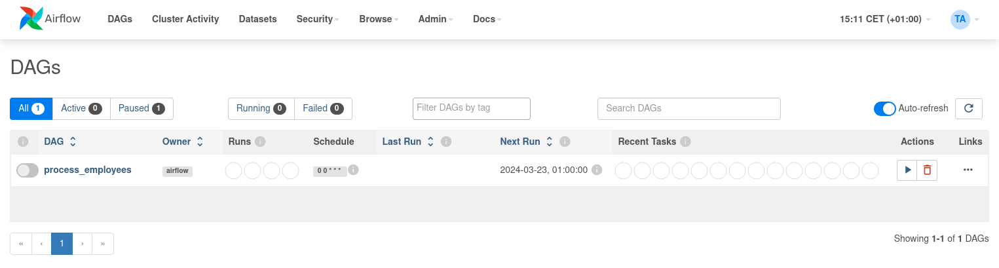
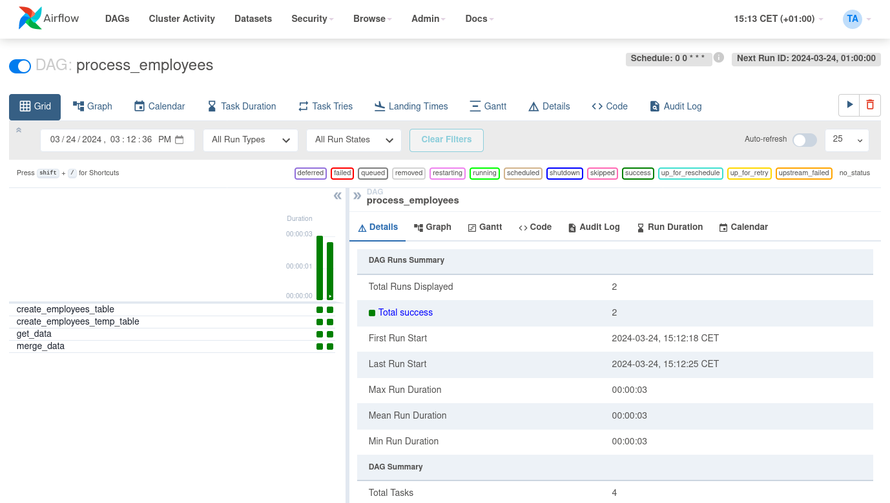

 .. Licensed to the Apache Software Foundation (ASF) under one
    or more contributor license agreements.  See the NOTICE file
    distributed with this work for additional information
    regarding copyright ownership.  The ASF licenses this file
    to you under the Apache License, Version 2.0 (the
    "License"); you may not use this file except in compliance
    with the License.  You may obtain a copy of the License at

 ..   http://www.apache.org/licenses/LICENSE-2.0

 .. Unless required by applicable law or agreed to in writing,
    software distributed under the License is distributed on an
    "AS IS" BASIS, WITHOUT WARRANTIES OR CONDITIONS OF ANY
    KIND, either express or implied.  See the License for the
    specific language governing permissions and limitations
    under the License.

Building a Running Pipeline
===========================

Lets look at another example: we need to get some data from a file which is hosted online and insert it into our local database. We also need to look at removing duplicate rows while inserting.

*Be advised:* The operator used in this tutorial is `deprecated <https://airflow.apache.org/docs/apache-airflow-providers-postgres/stable/_api/airflow/providers/postgres/operators/postgres/index.html>`_.
Its recommended successor, `SQLExecuteQueryOperator <https://airflow.apache.org/docs/apache-airflow-providers-common-sql/stable/_api/airflow/providers/common/sql/operators/sql/index.html#airflow.providers.common.sql.operators.sql.SQLExecuteQueryOperator>`_ works similarly.
You might find `this guide <https://airflow.apache.org/docs/apache-airflow-providers-postgres/stable/operators/postgres_operator_howto_guide.html#creating-a-postgres-database-table>`_ helpful.

Initial setup
-------------

We need to have Docker installed as we will be using the :doc:`/howto/docker-compose/index` procedure for this example.
The steps below should be sufficient, but see the quick-start documentation for full instructions.

.. code-block:: bash

  # Download the docker-compose.yaml file
  curl -LfO 'https://airflow.apache.org/docs/apache-airflow/stable/docker-compose.yaml'

  # Make expected directories and set an expected environment variable
  mkdir -p ./dags ./logs ./plugins
  echo -e "AIRFLOW_UID=$(id -u)" > .env

  # Initialize the database
  docker compose up airflow-init

  # Start up all services
  docker compose up

After all services have started up, the web UI will be available at: ``http://localhost:8080``. The default account has the username ``airflow`` and the password ``airflow``.

We will also need to create a `connection <https://airflow.apache.org/docs/apache-airflow/stable/concepts/connections.html>`_ to the postgres db. To create one via the web UI, from the "Admin" menu, select "Connections", then click the Plus sign to "Add a new record" to the list of connections.

Fill in the fields as shown below. Note the Connection Id value, which we'll pass as a parameter for the ``postgres_conn_id`` kwarg.

- Connection Id: tutorial_pg_conn
- Connection Type: postgres
- Host: postgres
- Schema: airflow
- Login: airflow
- Password: airflow
- Port: 5432

Test your connection and if the test is successful, save your connection.

Table Creation Tasks
--------------------

We can use the `PostgresOperator <https://airflow.apache.org/docs/apache-airflow-providers-postgres/stable/operators/postgres_operator_howto_guide.html#creating-a-postgres-database-table>`_ to define tasks that create tables in our postgres db.

We'll create one table to facilitate data cleaning steps (``employees_temp``) and another table to store our cleaned data (``employees``).

.. code-block:: python

  from airflow.providers.postgres.operators.postgres import PostgresOperator

  create_employees_table = PostgresOperator(
      task_id="create_employees_table",
      postgres_conn_id="tutorial_pg_conn",
      sql="""
          CREATE TABLE IF NOT EXISTS employees (
              "Serial Number" NUMERIC PRIMARY KEY,
              "Company Name" TEXT,
              "Employee Markme" TEXT,
              "Description" TEXT,
              "Leave" INTEGER
          );""",
  )

  create_employees_temp_table = PostgresOperator(
      task_id="create_employees_temp_table",
      postgres_conn_id="tutorial_pg_conn",
      sql="""
          DROP TABLE IF EXISTS employees_temp;
          CREATE TABLE employees_temp (
              "Serial Number" NUMERIC PRIMARY KEY,
              "Company Name" TEXT,
              "Employee Markme" TEXT,
              "Description" TEXT,
              "Leave" INTEGER
          );""",
  )

Optional: Using SQL From Files
------------------------------

If you want to abstract these sql statements out of your DAG, you can move the statements sql files somewhere within the ``dags/`` directory and pass the sql file_path (relative to ``dags/``) to the ``sql`` kwarg. For ``employees`` for example, create a ``sql`` directory in ``dags/``, put ``employees`` DDL in ``dags/sql/employees_schema.sql``, and modify the PostgresOperator() to:

.. code-block:: python

  create_employees_table = PostgresOperator(
      task_id="create_employees_table",
      postgres_conn_id="tutorial_pg_conn",
      sql="sql/employees_schema.sql",
  )

and repeat for the ``employees_temp`` table.

Data Retrieval Task
-------------------

Here we retrieve data, save it to a file on our Airflow instance, and load the data from that file into an intermediate table where we can execute data cleaning steps.

.. code-block:: python

  import os
  import requests
  from airflow.decorators import task
  from airflow.providers.postgres.hooks.postgres import PostgresHook

  @task
  def get_data():
      # NOTE: configure this as appropriate for your airflow environment
      data_path = "/opt/airflow/dags/files/employees.csv"
      os.makedirs(os.path.dirname(data_path), exist_ok=True)

      url = "https://raw.githubusercontent.com/apache/airflow/main/docs/apache-airflow/tutorial/pipeline_example.csv"

      response = requests.request("GET", url)

      with open(data_path, "w") as file:
          file.write(response.text)

      postgres_hook = PostgresHook(postgres_conn_id="tutorial_pg_conn")
      conn = postgres_hook.get_conn()
      cur = conn.cursor()
      with open(data_path, "r") as file:
          cur.copy_expert(
              "COPY employees_temp FROM STDIN WITH CSV HEADER DELIMITER AS ',' QUOTE '\"'",
              file,
          )
      conn.commit()

Data Merge Task
---------------

Here we select completely unique records from the retrieved data, then we check to see if any employee ``Serial Numbers`` are already in the database (if they are, we update those records with the new data).

.. code-block:: python

  from airflow.decorators import task
  from airflow.providers.postgres.hooks.postgres import PostgresHook

  @task
  def merge_data():
      query = """
          INSERT INTO employees
          SELECT *
          FROM (
              SELECT DISTINCT *
              FROM employees_temp
          ) t
          ON CONFLICT ("Serial Number") DO UPDATE
          SET
                "Employee Markme" = excluded."Employee Markme",
                "Description" = excluded."Description",
                "Leave" = excluded."Leave";
      """
      try:
          postgres_hook = PostgresHook(postgres_conn_id="tutorial_pg_conn")
          conn = postgres_hook.get_conn()
          cur = conn.cursor()
          cur.execute(query)
          conn.commit()
          return 0
      except Exception as e:
          return 1

Completing our DAG
------------------

We've developed our tasks, now we need to wrap them in a DAG, which enables us to define when and how tasks should run, and state any dependencies that tasks have on other tasks. The DAG below is configured to:

* run every day at midnight starting on Jan 1, 2021,
* only run once in the event that days are missed, and
* timeout after 60 minutes

And from the last line in the definition of the ``process_employees`` DAG, we see:

.. code-block:: python

      [create_employees_table, create_employees_temp_table] >> get_data() >> merge_data()

* the ``merge_data()`` task depends on the ``get_data()`` task,
* the ``get_data()`` depends on both the ``create_employees_table`` and ``create_employees_temp_table`` tasks, and
* the ``create_employees_table`` and ``create_employees_temp_table`` tasks can run independently.

Putting all of the pieces together, we have our completed DAG.

.. code-block:: python

  import datetime
  import pendulum
  import os

  import requests
  from airflow.decorators import dag, task
  from airflow.providers.postgres.hooks.postgres import PostgresHook
  from airflow.providers.postgres.operators.postgres import PostgresOperator

  @dag(
      dag_id="process_employees",
      schedule_interval="0 0 * * *",
      start_date=pendulum.datetime(2021, 1, 1, tz="UTC"),
      catchup=False,
      dagrun_timeout=datetime.timedelta(minutes=60),
  )
  def ProcessEmployees():
      create_employees_table = PostgresOperator(
          task_id="create_employees_table",
          postgres_conn_id="tutorial_pg_conn",
          sql="""
              CREATE TABLE IF NOT EXISTS employees (
                  "Serial Number" NUMERIC PRIMARY KEY,
                  "Company Name" TEXT,
                  "Employee Markme" TEXT,
                  "Description" TEXT,
                  "Leave" INTEGER
              );""",
      )

      create_employees_temp_table = PostgresOperator(
          task_id="create_employees_temp_table",
          postgres_conn_id="tutorial_pg_conn",
          sql="""
              DROP TABLE IF EXISTS employees_temp;
              CREATE TABLE employees_temp (
                  "Serial Number" NUMERIC PRIMARY KEY,
                  "Company Name" TEXT,
                  "Employee Markme" TEXT,
                  "Description" TEXT,
                  "Leave" INTEGER
              );""",
      )

      @task
      def get_data():
          # NOTE: configure this as appropriate for your airflow environment
          data_path = "/opt/airflow/dags/files/employees.csv"
          os.makedirs(os.path.dirname(data_path), exist_ok=True)

          url = "https://raw.githubusercontent.com/apache/airflow/main/docs/apache-airflow/tutorial/pipeline_example.csv"

          response = requests.request("GET", url)

          with open(data_path, "w") as file:
              file.write(response.text)

          postgres_hook = PostgresHook(postgres_conn_id="tutorial_pg_conn")
          conn = postgres_hook.get_conn()
          cur = conn.cursor()
          with open(data_path, "r") as file:
              cur.copy_expert(
                  "COPY employees_temp FROM STDIN WITH CSV HEADER DELIMITER AS ',' QUOTE '\"'",
                  file,
              )
          conn.commit()

      @task
      def merge_data():
          query = """
              INSERT INTO employees
              SELECT *
              FROM (
                  SELECT DISTINCT *
                  FROM employees_temp
              ) t
              ON CONFLICT ("Serial Number") DO UPDATE
              SET
                "Employee Markme" = excluded."Employee Markme",
                "Description" = excluded."Description",
                "Leave" = excluded."Leave";
          """
          try:
              postgres_hook = PostgresHook(postgres_conn_id="tutorial_pg_conn")
              conn = postgres_hook.get_conn()
              cur = conn.cursor()
              cur.execute(query)
              conn.commit()
              return 0
          except Exception as e:
              return 1

      [create_employees_table, create_employees_temp_table] >> get_data() >> merge_data()

  dag = ProcessEmployees()

Save this code to a python file in the ``/dags`` folder (e.g. ``dags/process_employees.py``) and (after a `brief delay <https://airflow.apache.org/docs/apache-airflow/stable/configurations-ref.html#dag-dir-list-interval>`_), the ``process_employees`` DAG will be included in the list of available Dags on the web UI.

You can trigger the ``process_employees`` DAG by unpausing it (via the slider on the left end) and running it (via the Run button under **Actions**).

In the ``process_employees`` DAG's **Grid** view, we see all that all tasks ran successfully in all executed runs. Success!

What's Next?
-------------
You now have a pipeline running inside Airflow using Docker Compose. Here are a few things you might want to do next:

.. seealso::
    - Take an in-depth tour of the UI - click all the things! see what they do!
    - Keep reading the docs
      - Review the :doc:`how-to guides</howto/index>`, which include a guide for writing your own operator
      - Review the :ref:`Command Line Interface Reference<cli>`
      - Review the :ref:`List of operators <pythonapi:operators>`
      - Review the :ref:`Macros reference<macros>`
    - Write your first pipeline
