 .. Licensed to the Apache Software Foundation (ASF) under one
    or more contributor license agreements.  See the NOTICE file
    distributed with this work for additional information
    regarding copyright ownership.  The ASF licenses this file
    to you under the Apache License, Version 2.0 (the
    "License"); you may not use this file except in compliance
    with the License.  You may obtain a copy of the License at

 ..   http://www.apache.org/licenses/LICENSE-2.0

 .. Unless required by applicable law or agreed to in writing,
    software distributed under the License is distributed on an
    "AS IS" BASIS, WITHOUT WARRANTIES OR CONDITIONS OF ANY
    KIND, either express or implied.  See the License for the
    specific language governing permissions and limitations
    under the License.

UI / Screenshots
=================
The Airflow UI makes it easy to monitor and troubleshoot your data pipelines.
Here's a quick overview of some of the features and visualizations you
can find in the Airflow UI.

DAGs View
.........

List of the DAGs in your environment, and a set of shortcuts to useful pages.
You can see exactly how many tasks succeeded, failed, or are currently
running at a glance. To hide completed tasks set ``show_recent_stats_for_completed_runs = False``

In order to filter DAGs (e.g. by team), you can add tags in each DAG.
The filter is saved in a cookie and can be reset by the reset button.
For example:

.. code-block:: python

   dag = DAG("dag", tags=["team1", "sql"])

------------

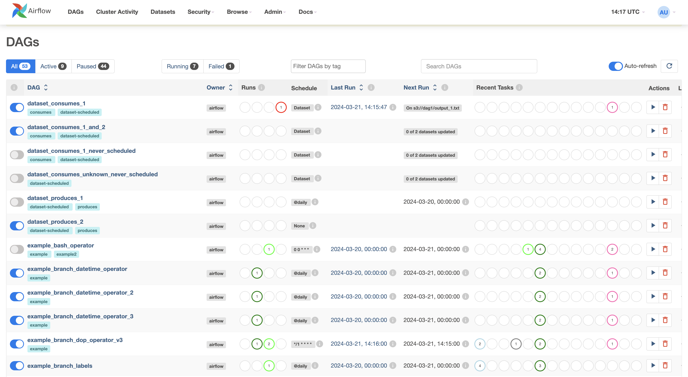

------------

.. _ui:cluster-activity-view:

Cluster Activity View
.....................

Native Airflow dashboard page into the UI to collect several useful metrics for monitoring your Airflow cluster.

------------

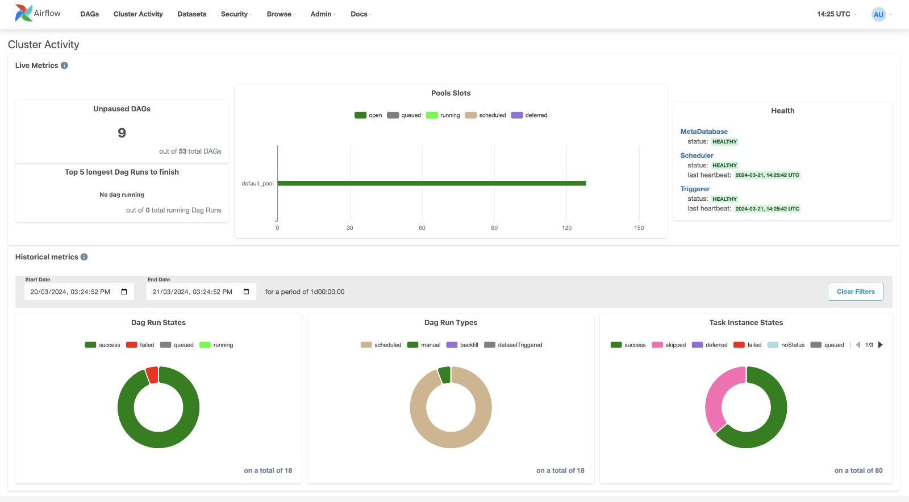

------------

.. _ui:assets-view:

Asset View
.............

A combined listing of the current assets and a graph illustrating how they are produced and consumed by DAGs.

Clicking on any dataset in either the list or the graph will highlight it and its relationships, and filter the list to show the recent history of task instances that have updated that dataset and whether it has triggered further DAG runs.

------------

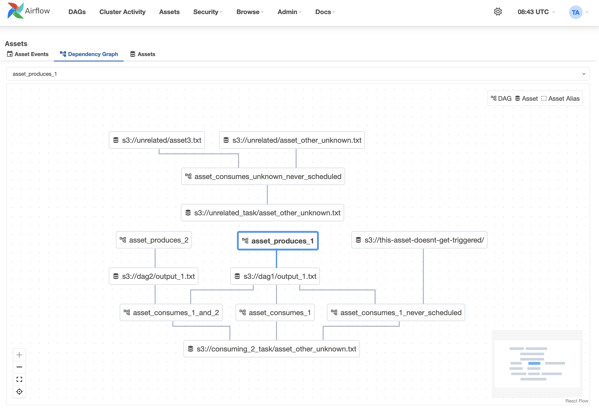

------------

Grid View
.........

A bar chart and grid representation of the DAG that spans across time.
The top row is a chart of DAG Runs by duration,
and below, task instances. If a pipeline is late,
you can quickly see where the different steps are and identify
the blocking ones.

------------

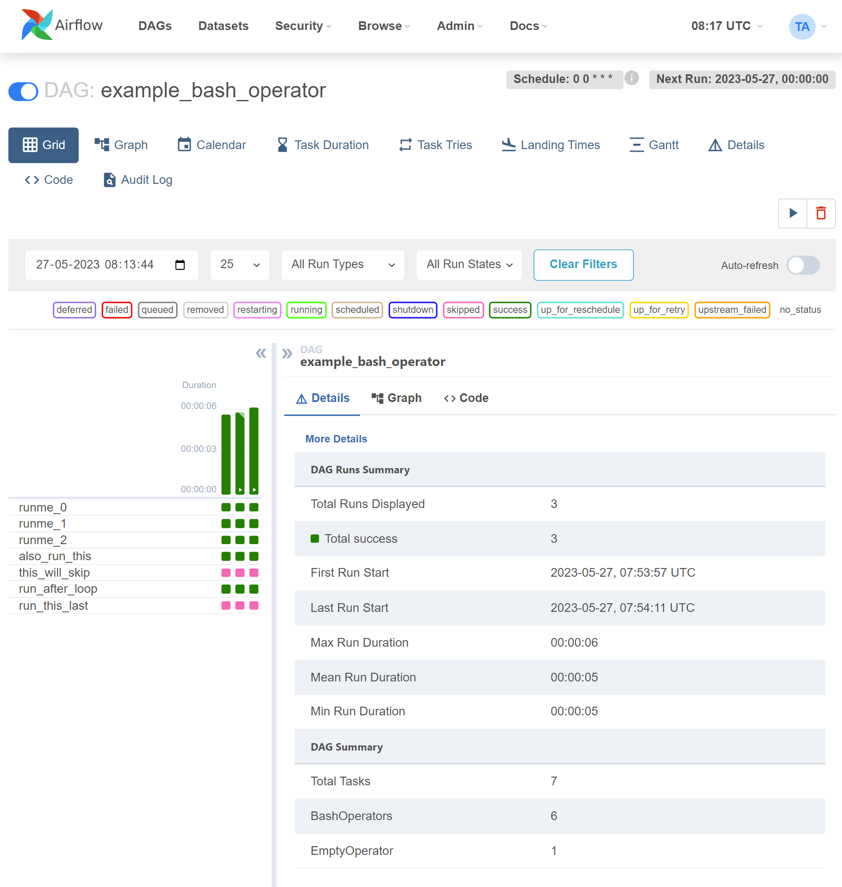

------------

The details panel will update when selecting a DAG Run by clicking on a duration bar:

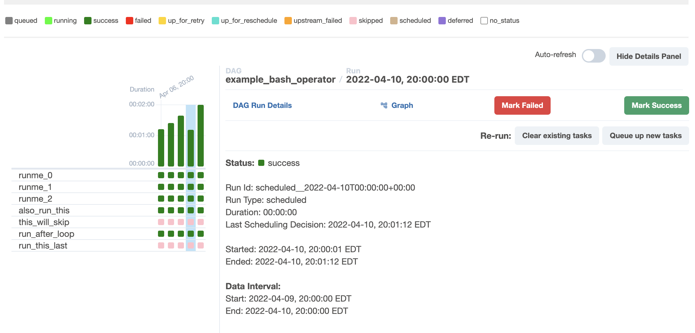

Or selecting a Task Instance by clicking on a status box:

.. image:: img/grid_instance_details.png

Or selecting a Task across all runs by click on the task_id:

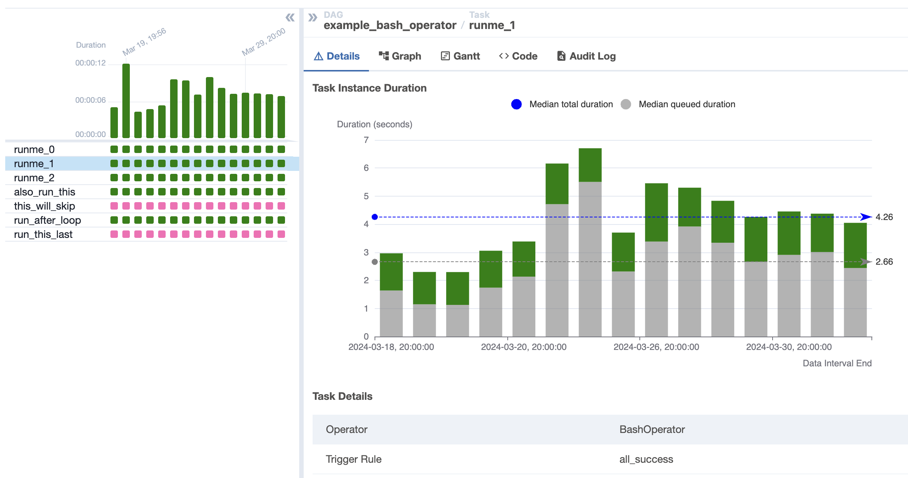

Manual runs are indicated by a play icon (just like the Trigger DAG button).
Asset triggered runs are indicated by a database icon:

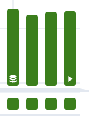

Task groups are indicated by a caret and can be opened or closed:

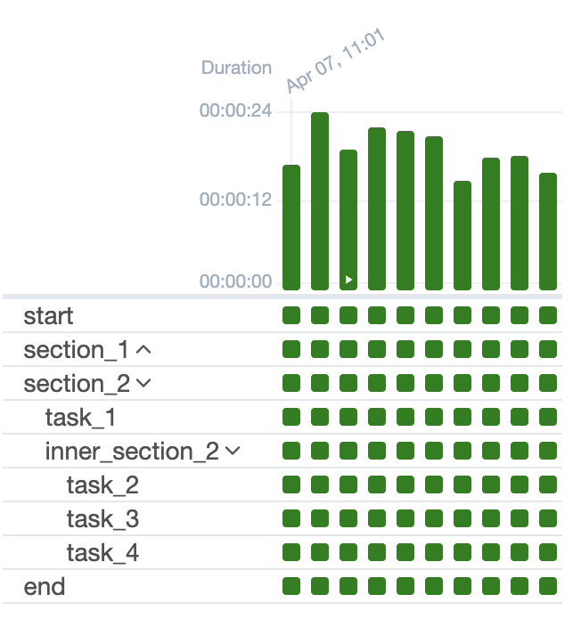

Mapped Tasks are indicated by square brackets and will show a table of each mapped task instance in the Mapped Tasks panel:

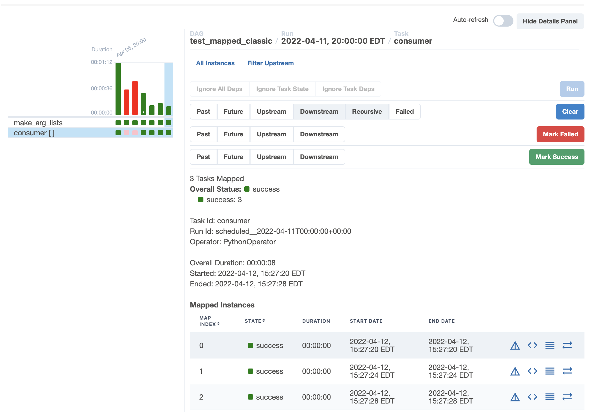

------------

.. _ui:graph-view:

Graph View
..........

The graph view is perhaps the most comprehensive. Visualize your DAG's
dependencies and their current status for a specific run.

------------

.. image:: img/graph.png

------------

Calendar View
.............

The calendar view gives you an overview of your entire DAG's history over months or even years.
Letting you quickly see trends of the overall success/failure rate of runs over time.

------------

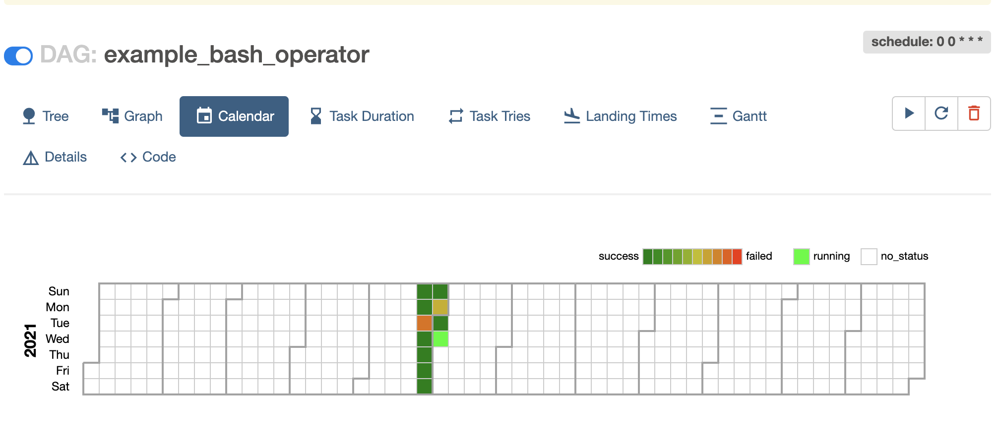

------------

Variable View
.............

The variable view allows you to list, create, edit or delete the key-value pair
of a variable used during jobs. The value of a variable will be hidden if the key contains
any words in ('password', 'secret', 'passwd', 'authorization', 'api_key', 'apikey', 'access_token')
by default, but can be configured to show in cleartext. See :ref:`security:mask-sensitive-values`.

------------

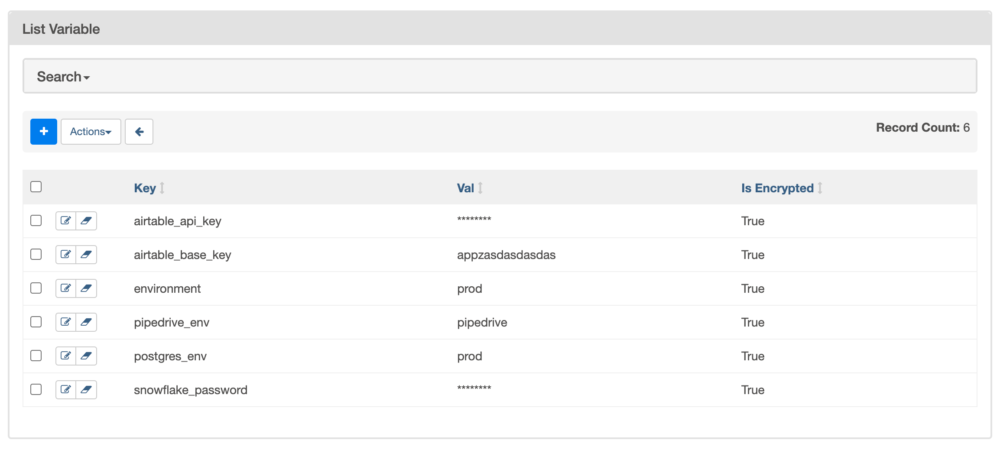

------------

Gantt Chart
...........

The Gantt chart lets you analyse task duration and overlap. You can quickly
identify bottlenecks and where the bulk of the time is spent for specific
DAG runs.

------------

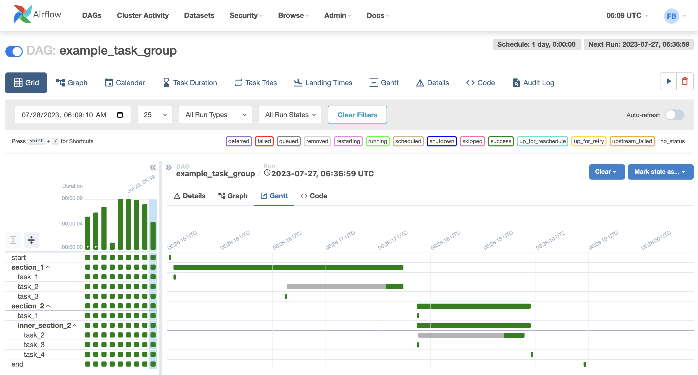

------------

.. _ui:task-duration:

Task Duration
.............

The duration of your different tasks over the past N runs. This view lets
you find outliers and quickly understand where the time is spent in your
DAG over many runs.

------------

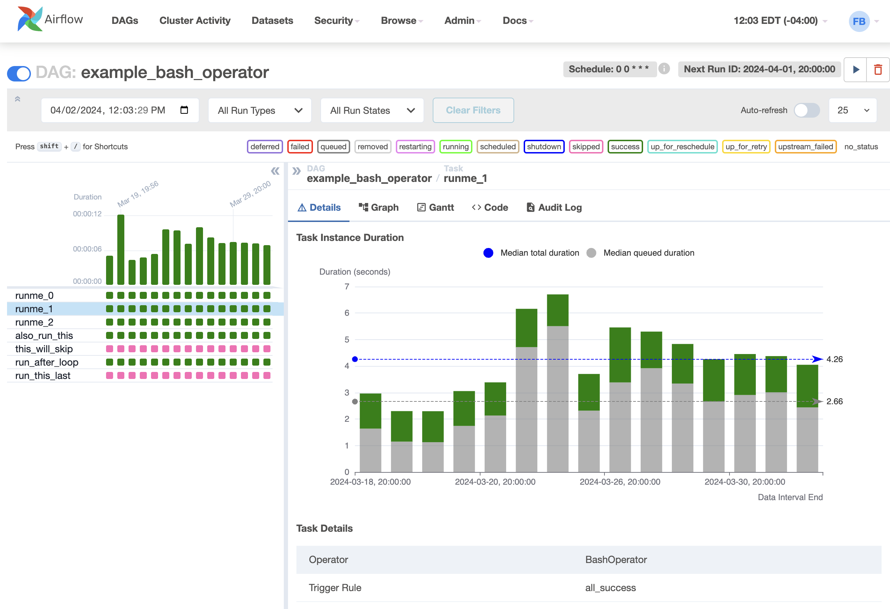

------------

.. _ui:landing-times:

Landing Times
.............

The landing time for a task instance is the delta between the dag run's data interval end
(typically this means when the dag "should" run) and the dag run completion time.

------------

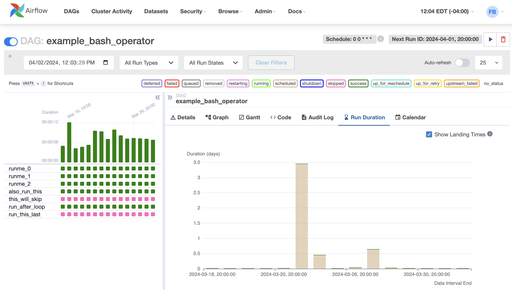

------------

Code View
.........

Transparency is everything. While the code for your pipeline is in source
control, this is a quick way to get to the code that generates the DAG and
provide yet more context.

------------

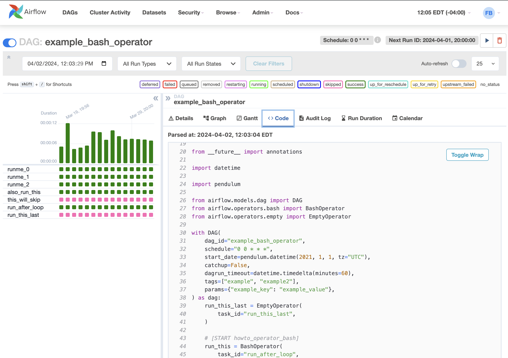

Trigger Form
............

If you trigger a manual DAG run with the arrow-button, a form is displayed.
The form display is based on the DAG Parameters as described in :doc:`core-concepts/params`.

------------

.. image:: img/trigger-dag-tutorial-form.png

Audit Log
.............

See all events related to a DAG. Filter events by changing the Task and DAG Run
selection and by including/excluding different event names.

------------

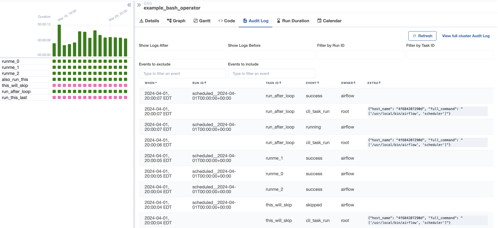

------------
