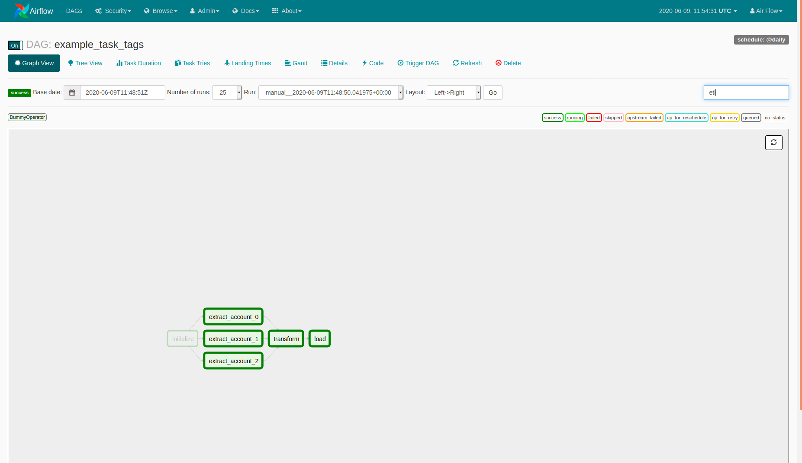
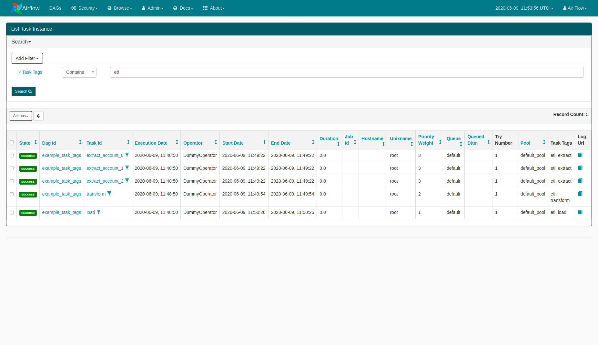

 .. Licensed to the Apache Software Foundation (ASF) under one
    or more contributor license agreements.  See the NOTICE file
    distributed with this work for additional information
    regarding copyright ownership.  The ASF licenses this file
    to you under the Apache License, Version 2.0 (the
    "License"); you may not use this file except in compliance
    with the License.  You may obtain a copy of the License at

 ..   http://www.apache.org/licenses/LICENSE-2.0

 .. Unless required by applicable law or agreed to in writing,
    software distributed under the License is distributed on an
    "AS IS" BASIS, WITHOUT WARRANTIES OR CONDITIONS OF ANY
    KIND, either express or implied.  See the License for the
    specific language governing permissions and limitations
    under the License.

Add tags to tasks
===================================================
Tags can be added to tasks simply by adding a ``task_tags`` parameter when constructing an operator.
Multiple tags can be added for every task. Duplicate tags are automatically removed.

.. code-block:: python

  operator = DummyOperator(
    task_id='example_task',
    task_tags=['example', 'dummy'],
    dag=dag
  )

Filtering by tags
^^^^^^^^^^^^^^^^^
In addition to filtering tasks by task ids in graph view, you can also filter by tags.

It is also possible to filter task instances by tags.

