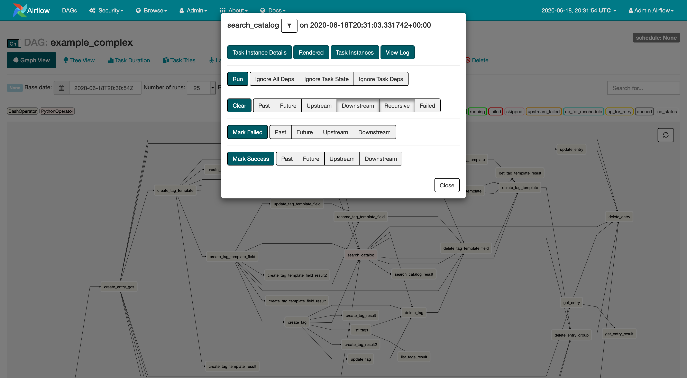

 .. Licensed to the Apache Software Foundation (ASF) under one
    or more contributor license agreements.  See the NOTICE file
    distributed with this work for additional information
    regarding copyright ownership.  The ASF licenses this file
    to you under the Apache License, Version 2.0 (the
    "License"); you may not use this file except in compliance
    with the License.  You may obtain a copy of the License at

 ..   http://www.apache.org/licenses/LICENSE-2.0

 .. Unless required by applicable law or agreed to in writing,
    software distributed under the License is distributed on an
    "AS IS" BASIS, WITHOUT WARRANTIES OR CONDITIONS OF ANY
    KIND, either express or implied.  See the License for the
    specific language governing permissions and limitations
    under the License.

How To Cancel a Running Job
===========================

The task can be marked as success or not failed from the web interface. When the task changes state, Airflow will execute the ``on_kill()`` method of the operator.
From the image seen below (Task Instance Context Menu), it is always possible to click on a task instance, and get to this rich context menu that can take you to more detailed metadata, and perform some actions.

Using the  ``Clear`` tab, you can choose one of the six options(Past,Future,Upstream,Downstream,Recursive,Failed) to clear the state and cancel the job.

For cases where the Airflow is running on local machine, clearing the tasks will not suffice and you have to kill the process instance in the remote machine.