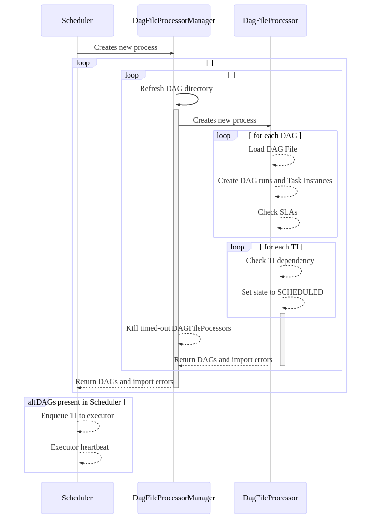

 .. Licensed to the Apache Software Foundation (ASF) under one
    or more contributor license agreements.  See the NOTICE file
    distributed with this work for additional information
    regarding copyright ownership.  The ASF licenses this file
    to you under the Apache License, Version 2.0 (the
    "License"); you may not use this file except in compliance
    with the License.  You may obtain a copy of the License at

 ..   http://www.apache.org/licenses/LICENSE-2.0

 .. Unless required by applicable law or agreed to in writing,
    software distributed under the License is distributed on an
    "AS IS" BASIS, WITHOUT WARRANTIES OR CONDITIONS OF ANY
    KIND, either express or implied.  See the License for the
    specific language governing permissions and limitations
    under the License.

Scheduler
==========

The scheduler is the core component in Airflow that is responsible for monitoring all tasks and DAGs and triggers the task instances once their dependencies are complete. And for this reason, it is imperative to learn about the working of the scheduler.

Scheduling in airflow involves the 3 following components.

1. ``DAGFileProcessor`` - Responsible for parsing the DAG definition in a file and creating the necessary DAG runs and TaskInstances

2. ``DAGFileProcessorManager`` - Responsible for listing the files in the DagBag and creating new DAGFileProcessors when required

3. ``SchedulerJob`` - Responsible for sending the TaskInstances to the executor

Logic behind scheduling is as follows:

1. Airflow kicks off DAGFileProcessorManager along with the SchedulerJob. The DAGFileProcessorManager enumerates all the files in the DAG directory.

2. The DAGFileProcessorManager spawns child processes known as DAGFileProcessor which is responsible for creating the necessary DAG Runs and TaskInstances. When it determines that task instances should run, it updates their state to ``SCHEDULED``. The number of DAGFileProcessor to spawn is configurable via ``num_runs`` in ``airflow.cfg``. TODO: Check if the configuration is correct

3. If any of the DAGFileProcessor have finished, another process is spawned to work on the next file in the series.

4. The cycle is repeated for all the files in the DAG Bag. If the process to parse DAG file is still running when the file's turn comes up in the next cycle, the file is skipped and the next file in the series will be assigned for the new processor. This isolation provides a non-blocking DAG parsing functionality.

To illustrate better,

TODO: Do we add missing task instance states in the TaskInstance document

If the task instance has a state of NONE it will be set to SCHEDULED if the scheduler determines that it needs to run.
Tasks in the SCHEDULED state are sent to the executor, at which point it is put into the QUEUED state until it actually runs. TODO: Add links to TaskInstance in the documentation. The reason that the task instances are created in the ``SCHEDULED`` state, but then are set to the ``QUEUED`` state once it is sent to the executor, is to ensure that a task instance isn't repeatedly send to the executor if the executor is slow and a DAG definition file is processed multiple times before the executor has a chance to run the task. When the DAGFileProcessor examines a DAG for potential tasks to put into the ``SCHEDULED`` state, it skips those task instances in the ``QUEUED`` state.

Since the scheduler can run indefinitely, it's necessary to periodically refresh the list of files in the DAG definition directory. The refresh interval is controlled with the ``dag_dir_list_interval`` configuration parameter. In cases where there are only a small number of DAG definition files, the loop could potentially process the DAG definition files many times a minute. To control the rate of DAG file processing, the ``min_file_process_interval`` can be set to a higher value. This parameter ensures that a DAG definition file is not processed more often than once every ``min_file_process_interval`` seconds.

TODO: I don't understand this line of another scheduler. Also do we need to add this here as this looks like a note to contributors.
Unfortunately a race condition remains for UP_FOR_RETRY tasks as another scheduler can pick those up.
To eliminate this, the check for UP_FOR_RETRY needs to migrate from the TI to the scheduler.
However, was it not for that fact that we have backfills... (see below)

The Airflow scheduler is designed to run as a persistent service in an
Airflow production environment. To kick it off, all you need to do is
execute the ``airflow scheduler`` command. It uses the configuration specified in
``airflow.cfg``.

The scheduler uses the configured :doc:`Executor </executor/index>` to run tasks that are ready.

To start a scheduler, simply run the command:

.. code-block:: bash

    airflow scheduler

Your DAGs will start executing once the scheduler is running successfully.

.. note::

    The first DAG Run is created based on the minimum ``start_date`` for the tasks in your DAG.
    Subsequent DAG Runs are created by the scheduler process, based on your DAG’s ``schedule_interval``,
    sequentially.

The scheduler won't trigger your tasks until the period it covers has ended e.g., A job with ``schedule_interval`` set as ``@daily`` runs after the day
has ended. This technique makes sure that whatever data is required for that period is fully available before the dag is executed.
In the UI, it appears as if Airflow is running your tasks a day **late**

.. note::

    If you run a DAG on a ``schedule_interval`` of one day, the run with ``execution_date`` ``2019-11-21`` triggers soon after ``2019-11-21T23:59``.

    **Let’s Repeat That**, the scheduler runs your job one ``schedule_interval`` AFTER the start date, at the END of the period.

    You should refer to :doc:`dag-run` for details on scheduling a DAG.

Using pools in tasks
--------------------
If the task instances have pools assigned to them in the DAG definition, the scheduler prioritizes the queued tasks in the pool and tries to run them if there are slots available. This is also applicable to the default pool.

Triggering DAG with Future Date
-------------------------------

If you want to use 'external trigger' to run future-dated execution dates, set ``allow_trigger_in_future = True`` in ``scheduler`` section in ``airflow.cfg``.
This only has effect if your DAG has no ``schedule_interval``.
If you keep default ``allow_trigger_in_future = False`` and try ``external trigger`` to run future-dated execution dates,
the scheduler won't execute it now but the scheduler will execute it in the future once the current date rolls over to the execution date.

Backfills
---------

Backfills are a bit of an awkward duck in the pond. They do not know about DagRuns, won't create them, and don't keep to the schedule so they can break ``depend_on_past``. They execute outside the scheduler and can therefore oversubscribe workers (using more resources than assigned). Backfills just create TaskInstances and start running them.
TODO: The race condition section?
In order to fix the scheduler and the race condition, first the scheduler and the backfills need to become aware of each other. This will make depend_on_past work and keep things in a consistent state. Avoiding oversubscribing the backfills should be managed by the scheduler.
