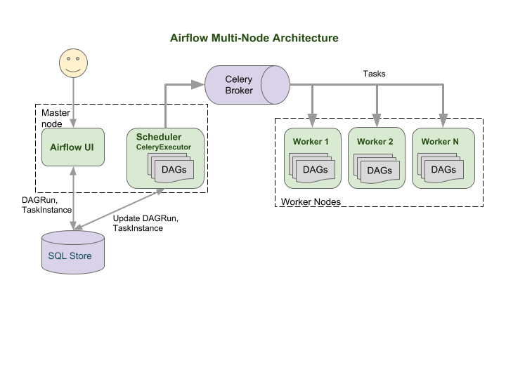
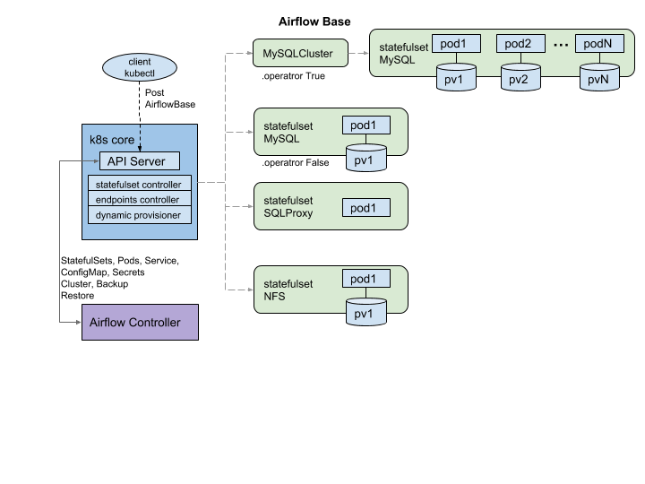
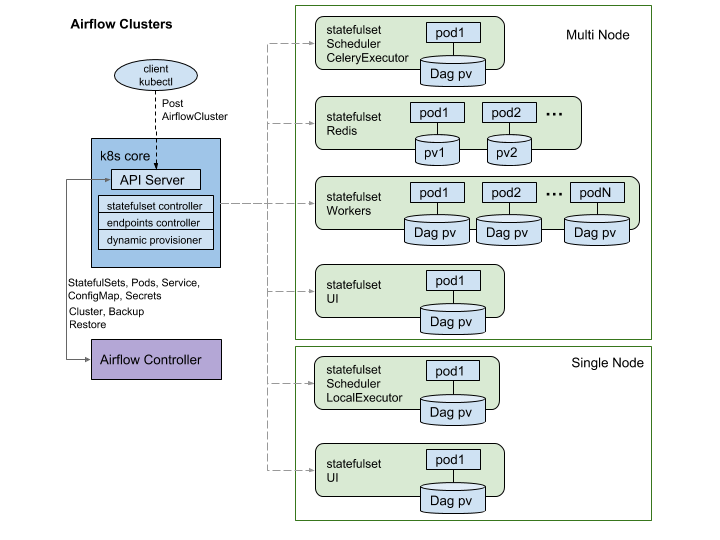
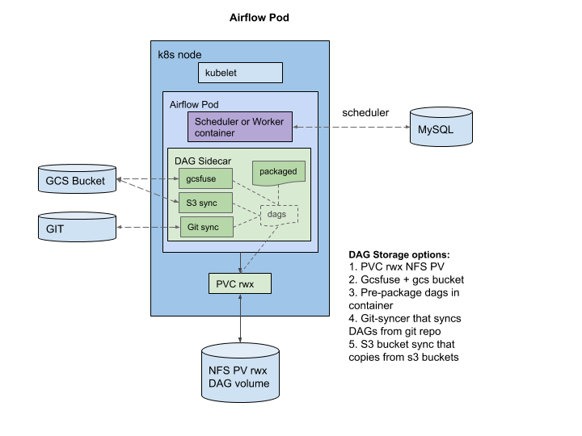
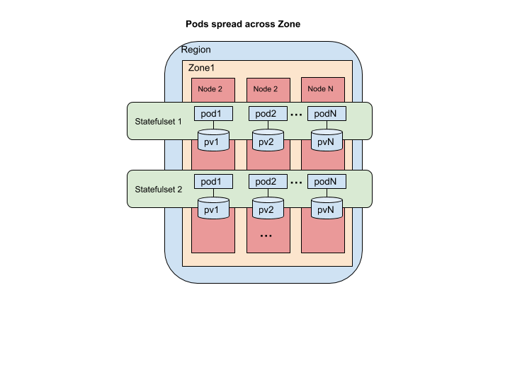
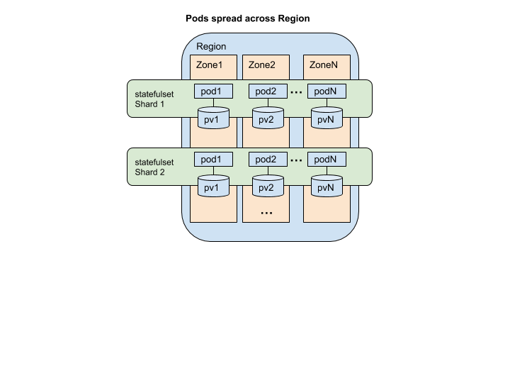

# Introduction

### Airflow
Apache Airflow is a platform to programmatically author, schedule and monitor workflows. Airflow is an Apache incubator project that is mature and has a good community momentum.

### Kubernetes (k8s)
Kubernetes(k8s) is a distributed workload orchestration system similar to Borg or Mesos. K8s can orchestrate containerized workloads on bare metal or on VMs and provides primitives modelled in a declarative way to manage the compute, memory, storage, networking, isolation, and life cycle. K8s can be accessed via kubectl(cli) or the APIs that consume the declarative specs. In the backend, the intent in the declarative specs are fulfilled by k8s core controllers that take actions (like create containers, network service, mount volume etc). k8s provides building blocks for stateless (Pods, Deployment) and stateful applications (statefulset) deployment. K8s controllers for these building blocks monitor the deployed instances to ensure cardinality, host to volume mapping across recreates, recovery on failures etc. 

### What is an Operator in Kubernetes
In case of some stateful applications, the declarative models provided by kubernetes are not sufficient to handle fault remediation, scaling with data integrity and availability. This is where an K8s Operator pattern excels. An operator encapsulates an application's operational domain knowledge and enable common day-N operations. An operator is an application-specific controller that extends the Kubernetes API to create, configure and manage stateful applications. An operator API is implemented by extending the existing k8s API with Custom Resources Definitions(CRDs) that declaratively describes the intent. Custom Resources are serializable as json and are stored in the API Server. The controller can watch these Custom Resources and take actions to move the system to the desired state. This enables meaningful extension of the k8s platform and make it suitable for complex stateful applications. 

`K8s Operator = K8s API +  CRD(declarative spec) + Custom Controller`

The goal is to ensure that Kubernetes works well as a substrate for deploying Airflow. 
# Airflow Operator Custom Resource (API)
The Airflow operator API is implemented by extending the k8s API with Custom Resources Definitions (CRDs) that declaratively describes the intent. Custom resources are serializable as json and are stored in the API Server. The Airflow controller watches these Custom Resources and take actions to move the Airflow cluster to the desired state. All CRDs inherit the contents of ObjectMeta and TypeMeta that are common to k8s resources. 
To improve cluster utilization and provide multiple users (in same trust domain) with some isolation, we are splitting the Airflow components into `AirflowBase` (common) and `AirflowCluster` (per user). `AirflowBase` includes MySQL, UI, NFS(DagStore). `AirflowCluster` includes Airflow Scheduler, Workers, Redis. This allows use cases where different users use different airflow plugins (opeartors, packages etc) in their setup.

The [API Design](https://github.com/GoogleCloudPlatform/airflow-operator/blob/master/docs/api.md) details the `AirflowBase` and `AirflowCluster` Custom Resource fields.

# Airflow Operator Custom Controllers

## AirflowBase Controller
AirflowBase controller  watches for AirflowBase CR and fulfils the intent. The intent translates to creation, updation or deletion of Statefulsets, Services, PVCs for MySQL, NFS.

#### MySQL
If MySQLSpec is specified and .operator is False a simple statefulset with a single instance of MySQL is deployed. This is not recommended for production deployments. For production cases, use CloudSQL connected using SQLProxy.

TODO
If .operator is True, a MySQLCluster and MySQLBackupSchedule CRs are created to deploy a MySQL cluster. MySQL Operator needs to be installed for handling the Custom Resources. 

#### StatefulSet
MySQL, SQLProxy, NFS cluster are all deployed as stateful sets. StatefulSet creates the desired number of pods and ensures pod-hostname to volume mapping. This is useful when a pod dies and a new pod takes its place. The network identity of the new pod is set to that of the pod being replaced. Similarly the volume mounted on the old pod is moved to the new pod. 

#### EndPoint (Service)
The AirflowUI and NFS cluster are exposed via a service for use by the users and AirflowClusters.

#### Persistent Volumes and claims
NFS cluster and MySQL use PVCs for data durability in the face of temporary compute degradation. Persistent Volume(PV) matching the Persistent Volume Claim(PVC)  is used when pods are created. If a matching PV is not found, dynamic provisioning is used to provision a PV and attached to the PVC created by the StatefulSets. For an elastic scalable service, dynamic provisioning is prefered. 

#### Pods
StatefulSet creates Pods. For NFS and MySQL, Persistent Volumes are attached to the Pod based on the PVC in the StatefulSet spec.  The AirflowUI and SQL-Proxy pods are simple single purpose pods and do not typically need data persistence. In case of MySQL controller, the details of MySQL pods can be found here. 

## AirflowCluster Controller

AirflowCluster Controller watches for AirflowCluster CR and fulfils the intent. The intent translates to creation, updation or deletion of Statefulsets, PVCs for Airflow UI, Scheduler, Workers and Redis. This Custom Resource allows users to spin-up their own Airflow clusters for providing DAG level isolation between users. This enables multi-user (same trust domain, tenant) Airflow deployment. It also allows users to iterate faster with one-time use schedulers. Isolation in SQL is achieved by creating separate database for each cluster. The controller also handles updates to CRs. 

TODO
It could drain celery workers nodes and k8s executor pods to prepare for upgrade.
Restarting airflow UI and Scheduler on detecting new DAGs in the DAG folder.

#### Redis
RedisSpec is required if .Spec.executor is celery. 
If .operator is False a simple statefulset with a single instance of Redis is deployed. Since redis is used as a non persistent cache, either can be used for production.

TODO
If .operator is True, a  RedisReplicas custom resource is created to deploy Redis. Redis Operator needs to be installed for handling the Custom Resources. 

#### StatefulSet
Airflow Scheduler and workers are deployed as stateful sets. StatefulSet creates the desired number of pods and ensures pod-name to volume mapping. The network identity of the new pod is set to that of the pod being replaced. Similarly the volume mounted on the old pod is moved to the new pod. 

#### EndPoint (service)
Since none of the services are exposed outside, Service definition is not needed. If in future we support clustered redis, we may use Service to front that cluster.

#### Persistent Volumes and claims
Airflow scheduler and workers could use PVCs for mounting data volumes that contain the DAGs. The PVCs need to be [RWX(read write many) or ROX(read only many)](https://kubernetes.io/docs/concepts/storage/persistent-volumes/#access-modes).

### Airflow Pods
Airflow Pods have the airflow container (scheduler,worker) and DAG Sidecar container. The DAG sidecar gets DAGs from the configured DAG source. In case of PVC as DAG source, the backing PV needs to be  mounted as RWX (RW many) or ROX (RO many). 

# Telemetry
## Logging
The airflow operator logs to the standard output and error file streams which is recommended for logging in containerized workloads. The K8s cluster level logging captures these logs in a central place. For airflow components it is recommended to log to the standard file streams as well.

## Metrics
The controller uses `pbweb/airflow-prometheus-exporter:latest` as a side-car to expose prometheus metircs for Airflow on port `9112`.

# Failure Modes and Remediation
Failures modes of the AirflowCluster, AirflowBase and Airflow controller are considered in addition to general failure modes.

## Process
If any of the pod processes dies or crashes, kubelet detects container exit and restarts it. Also Pod readiness and liveness checks are used to detect and restart Pods that have functionally degraded.

## Node
One could use  cluster.Spec.Affinity.*.topologyKey as “kubernetes.io/hostname” to spread Pods across Nodes within a Zone. This would limit the effect of node failures within a zone. K8s would reschedule the pods from failed node to another available node. Non-local PVs are moved to the new node and attached to the new pod. This means the user would experience reduced capacity during the time a new pod is created and added back to the cluster. For statefulsets with just 1 replica, we rely on the StatefulSet controller to recreate a pod on another node.

## Zonal
One could use  cluster.Spec.Affinity.*.topologyKey as “failure-domain.beta.kubernetes.io/zone” to spread Pods across Zones within a Region in a cluster that is deployed across zones. This would limit the effect of Zonal and node failures within a region.

Since PVs are zonal resources on most Cloud Providers, Pods may not be rescheduled into another available zone. This means the user may experience permanent reduced capacity unless the PV is unlinked manually and added back.

## Control plane
Deployed Airflow components do not require the operator control plane for normal operation. However if the cluster health degrades due to a failure, control plane is needed to recover and restore it to full health. Operator control plane health is monitored by kubernetes and recovered. Once recovered the operator would resync with the Airflow CRs and heal them if needed.

## Storage
Single instance storage failures would manifest and degraded Pod health and would be rescheduled. But since the PVC association is binding, rescheduled pods may face the same issue. 

TODO: on PV failure, detach PV from PVC and get a new PV ?

# Security
## Authn
The k8s API server uses authentication tokens in order to authorize requests. This model is a standard and is integrated with the IAM providers on most public clouds. MySQL operator managed MySQL instances are protected by a password that is either user provided in a Secret or auto generated and saved in a Secret. K8s IAM and RBAC protects this Secret. Similarly Redis operator managed Redis cluster provides data protection. 
TODO: Security for airflow components and NFS DAGs

## Authz
The Kubernetes API server provides for configurable RBAC (Role Based Access Control). The Airflow operator operates with a particular service account that would need appropriate RBAC to create and modify StatefulSet, Service, ConfigMap, Secrets and Pods. Same applies to MySQL operator and Redis operators if used.

## Data in Flight
MySQL supports encrypted connections. Clients should use ssl to connect to MySQL server. Similarly Redis offers secure connection to clients. Airflow UI enables SSL for secure HTTP access. 
TODO: Confirm Airflow uses secured connections to MySQL and Redis

## Data at Rest
MySQL operator and Redis operator ensures secure data at rest. K8s API data is encrypted at the application layer in the API server. For  DAG volumes, one could use TDE (Transparent Disk Encryption) for both the PVs and Object Storage.
