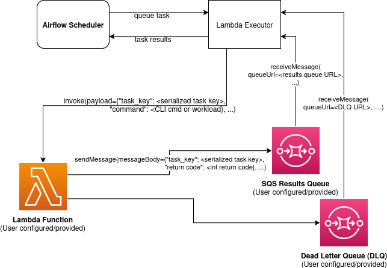

.. Licensed to the Apache Software Foundation (ASF) under one
    or more contributor license agreements.  See the NOTICE file
    distributed with this work for additional information
    regarding copyright ownership.  The ASF licenses this file
    to you under the Apache License, Version 2.0 (the
    "License"); you may not use this file except in compliance
    with the License.  You may obtain a copy of the License at

 ..   http://www.apache.org/licenses/LICENSE-2.0

 .. Unless required by applicable law or agreed to in writing,
    software distributed under the License is distributed on an
    "AS IS" BASIS, WITHOUT WARRANTIES OR CONDITIONS OF ANY
    KIND, either express or implied.  See the License for the
    specific language governing permissions and limitations
    under the License.

.. warning::
   The Lambda Executor is alpha/experimental at the moment and may unstable and be subject to change without warning.
.. |executorName| replace:: Lambda
.. |dockerfileLink| replace:: `here <https://github.com/apache/airflow/blob/main/providers/amazon/src/airflow/providers/amazon/aws/executors/aws_lambda/docker/Dockerfile>`__
.. |appHandlerLink| replace:: `here <https://github.com/apache/airflow/blob/main/providers/amazon/src/airflow/providers/amazon/aws/executors/aws_lambda/docker/app.py>`__

===================
AWS Lambda Executor
===================

This is an Airflow executor powered by AWS Lambda. Each task that Airflow schedules
for execution is run as an asynchronous Lambda function invocation. Some benefits
of an executor like this include:

1. Task isolation: No task can be a noisy neighbor for another. Resources are
   isolated to each individual task. Any failures affect only the single task
   running in that Lambda function. No single user can overload the environment
   by triggering too many tasks.
2. Lightweight execution: Lambda functions start quickly and have minimal overhead,
   making this executor ideal for short-running tasks that don't require substantial
   CPU or memory.
3. Cost effective: Compute resources only exist for the lifetime of the Airflow task
   itself. Lambda's pay-per-use pricing model ensures you only pay for actual task
   execution time.
4. Highly scalable: Lambda can scale to handle thousands of concurrent executions
   with no pre-provisioning.

For a quick start guide please see :ref:`here <lambda_setup_guide>`, it will
get you up and running with a basic configuration. Both an example Dockerfile
(found |dockerfileLink|) and Lambda invocation handler (found |appHandlerLink|)
are provided. The below sections provide more generic details about configuration,
the provided example Dockerfile and logging.

How Does it Work?
-----------------
The executor leverages AWS Lambda for compute and SQS as a communication channel.
When a task is queued to run with the Lambda executor a Lambda function is asynchronously
invoked with a payload containing the task key being run and the Airflow CLI
command/workload to run. The Lambda function executes the task and then must
publish a message to the SQS results queue with the same task key it received as well as
the return code of the Airflow task execution process. The Lambda executor periodically
polls this SQS results queue for messages and updates its internal state with the results
it receives. The Lambda function must also be configured with a Dead Letter Queue (DLQ) to
which Lambda will automatically send messages to for invocations that fail to be processed,
for example due to the 15 minute max timeout of Lambda functions. The Lambda executor will
also poll this DLQ for messages and update the internal state with the results it receives.

Quotas
------

When working with the Lambda Executor it is important to be familiar with the AWS Lambda quotas
as they may affect performance and scalability. For more information,
please refer to the `official AWS Lambda documentation on quotas <http://docs.aws.amazon.com/lambda/latest/dg/gettingstarted-limits.html>`__.

.. _lambda_config-options:

Config Options
--------------

There are a number of configuration options available, which can either
be set directly in the airflow.cfg file under an "aws_lambda_executor"
section or via environment variables using the
``AIRFLOW__AWS_LAMBDA_EXECUTOR__<OPTION_NAME>`` format, for example
``AIRFLOW__AWS_LAMBDA_EXECUTOR__FUNCTION_NAME = "myLambdaFunction"``. For
more information on how to set these options, see `Setting Configuration
Options <https://airflow.apache.org/docs/apache-airflow/stable/howto/set-config.html>`__

.. note::
   Configuration options must be consistent across all the hosts/environments running the Airflow components (Scheduler, Webserver, Lambda function, etc). See `here <https://airflow.apache.org/docs/apache-airflow/stable/configurations-ref.html>`__ for more details on setting configurations.

In the case of conflicts, the order of precedence from lowest to highest is:

1. Load default values for options which have defaults.
2. Load any values explicitly provided through airflow.cfg or
   environment variables. These are checked with Airflow's config
   precedence.

.. note::
   ``executor_config`` is an optional parameter that can be provided to operators. It is a dictionary type and in the context of the Lambda Executor it is passed to each Lambda invocation as part of the payload. This allows you to pass additional context to the Lambda function for any particular task execution. The Lambda function can then access this configuration via the ``executor_config`` key in the payload within the Lambda handler code.

Required config options:
~~~~~~~~~~~~~~~~~~~~~~~~

-  FUNCTION_NAME - Name or ARN of the AWS Lambda function to invoke. Required.
-  QUEUE_URL - URL of the SQS queue that will receive task execution results. Required.
-  DEAD_LETTER_QUEUE_URL - URL of the Dead Letter Queue for processing Lambda execution failures. Required

Optional config options:
~~~~~~~~~~~~~~~~~~~~~~~~

-  FUNCTION_QUALIFIER - Version or alias of the Lambda function to invoke. Defaults to ``$LATEST``.
-  CONN_ID - The Airflow connection (i.e. credentials) used by the Lambda
   executor to make API calls to AWS Lambda and SQS. Defaults to ``aws_default``.
-  REGION_NAME - The name of the AWS Region where AWS Lambda and SQS are configured.
-  CHECK_HEALTH_ON_STARTUP - Whether to check the Lambda Executor health on startup by testing connectivity to required AWS services. Defaults to ``True``.
-  MAX_INVOKE_ATTEMPTS - The maximum number of times the Lambda Executor should attempt to invoke a function. This refers to instances where the invocation fails (i.e. AWS API failures, throttling, etc). Defaults to ``3``.

For a more detailed description of available options, including type
hints and examples, see the ``config_templates`` folder in the Amazon
provider package.

.. _dockerfile_for_lambda_executor:

.. include:: general.rst
  :start-after: .. BEGIN DOCKERFILE
  :end-before: .. END DOCKERFILE

The most secure method is to use IAM roles. When creating a Lambda Function
Definition, you are able to select an execution role. This role needs
permissions to publish messages to the SQS queues and to write to CloudWatchLogs
or S3 if using AWS remote logging and/or using S3 to synchronize Dags
(e.g. ``CloudWatchLogsFullAccess`` or ``CloudWatchLogsFullAccessV2``).
The AWS credentials used on the Scheduler need permissions to
describe and invoke Lambda functions as well as to describe and read/delete
SQS messages.

To create a new role for use by Lambda follow the below:

1. Navigate to the IAM page on the AWS console, and from the left hand
   tab, under Access Management, select Roles.
2. On the Roles page, click Create role on the top right hand corner.
3. Under Trusted entity type, select AWS Service.
4. Select Lambda from the drop down under Use case. Click Next.
5. In the Permissions page, select the permissions the role will need,
   depending on the actions it will perform (at least including the
   permissions described above).
   Click Next after selecting all the required permissions.
6. Enter a name for the new role, and an optional description. Review
   the Trusted Entities, and the permissions for the role. Add any tags
   as necessary, and click Create role.

When creating the Lambda Function (see the :ref:`setup guide <lambda_setup_guide>` for more details), select the newly created role.

.. include:: general.rst
  :start-after: .. BEGIN DOCKERFILE_AUTH_SECOND_METHOD
  :end-before: .. END DOCKERFILE_AUTH_SECOND_METHOD

Base Image
~~~~~~~~~~

The Docker image is built upon the ``public.ecr.aws/lambda/python`` image.
This base image contains the necessary components for the Lambda function to
run. Apache Airflow is installed into the image via pip. You can modify the
Dockerfile to install additional packages or different versions of Airflow as
needed for your use case.

It is also possible to build the image based of ``apache/airflow:latest``
 and the Lambda runtime can be included separately (follow steps `here <https://docs.aws.amazon.com/lambda/latest/dg/images-create.html#images-ric>`__).

.. include:: general.rst
  :start-after: .. BEGIN LOADING_DAGS_OVERVIEW
  :end-before: .. END LOADING_DAGS_OVERVIEW

From S3 Bucket
^^^^^^^^^^^^^^

Dags can be loaded from S3 when using the provided example app.py, which
contains logic to synchronize the Dags from S3 to the local filesystem of
the Lambda function (see the app.py code |appHandlerLink|).

To load Dags from an S3 bucket add ``--build-arg s3_uri=YOUR_S3_URI`` in
the docker build command. Replace ``YOUR_S3_URI`` with the URI of your S3
bucket/path containing your Dags. Make sure you have the appropriate
permissions to read from the bucket.

.. code-block:: bash

   docker build -t my-airflow-image --build-arg s3_uri=YOUR_S3_URI .

.. include:: general.rst
  :start-after: .. BEGIN LOADING_DAGS_FROM_LOCAL
  :end-before: .. END LOADING_DAGS_FROM_LOCAL

.. include:: general.rst
  :start-after: .. BEGIN DEPENDENCIES
  :end-before: .. END DEPENDENCIES

Using the AWS Lambda Executor Docker Image
~~~~~~~~~~~~~~~~~~~~~~~~~~~~~~~~~~~~~~~~~~

Detailed instructions on how to use the Docker image, that you have
created via these steps can be found :ref:`here <lambda_setup_guide>`.

.. _lamba_logging:

.. include:: general.rst
  :start-after: .. BEGIN LOGGING
  :end-before: .. END LOGGING

-  The configuration options for Airflow remote logging should be
   configured on all hosts and containers running Airflow. For example
   the Webserver requires this config so that it can fetch logs from
   the remote location and the Lambda container requires the config so that
   it can upload the logs to the remote location. See
   `here <https://airflow.apache.org/docs/apache-airflow/stable/howto/set-config.html>`__
   to read more about how to set Airflow configuration via config file
   or environment variable exports.
-  Adding the Airflow remote logging config to Lambda can be done
   in many ways. Some examples include, but are not limited to:

   -  Exported as environment variables directly in the Dockerfile (see
      the Dockerfile section :ref:`above <dockerfile_for_lambda_executor>`)
   -  Updating the ``airflow.cfg`` file or copy/mounting/downloading a
      custom ``airflow.cfg`` in the Dockerfile.
   -  Added in the Lambda Function definition in plain text or via
      `Secrets/System
      Manager <https://docs.aws.amazon.com/secretsmanager/latest/userguide/retrieving-secrets_lambda.html>`__

-  Remember that you must have credentials configured within the container to be able
   to interact with the remote service for your logs (e.g. S3,
   CloudWatch Logs, etc). This can be done in many ways. Some examples
   include, but are not limited to:

   -  Export credentials into the Dockerfile directly (see the
      Dockerfile section :ref:`above <dockerfile_for_lambda_executor>`)
   -  Configure an Airflow Connection and provide this as the `remote
      logging conn
      id <https://airflow.apache.org/docs/apache-airflow/stable/configurations-ref.html#remote-log-conn-id>`__
      (exported into the Lambda Function by any of the means listed above or
      your preferred method). Airflow will then use these credentials
      *specifically* for interacting with your chosen remote logging
      destination.

.. note::
   Configuration options must be consistent across all the hosts/environments running the Airflow components (Scheduler, Webserver, Lambda invocations, etc). See `here <https://airflow.apache.org/docs/apache-airflow/stable/configurations-ref.html>`__ for more details on setting configurations.

.. _lambda_logging:

Lambda Logging
~~~~~~~~~~~~~~~~

Lambda will send logging information to CloudWatch Logs for the Function
invocations themselves. These logs will include the Airflow Task Operator
logging and any other logging that occurs throughout the life of the process
running in the Lambda function. This can be helpful for debugging issues with
remote logging or while testing remote logging configuration.

**Note: These logs will NOT be viewable from the Airflow Webserver UI.**

.. _lambda_setup_guide:

Setting up a Lambda Executor for Apache Airflow
-----------------------------------------------

There are 3 steps involved in getting a Lambda Executor to work in Apache Airflow:

1. Creating a database that Airflow and the tasks running in Lambda Functions can
   connect to (Note: In Airflow 3, tasks no longer directly access the DB).

2. Creating and configuring a Lambda Function (and its associated SQS queues) that
   can run tasks from Airflow.

3. Configuring Airflow to use the Lambda Executor

There are different options for selecting a database backend. See `here <https://airflow.apache.org/docs/apache-airflow/stable/howto/set-up-database.html>`_ for more information about the different options supported by Airflow. The following guide will explain how to set up a PostgreSQL RDS Instance on AWS.

.. include:: general.rst
  :start-after: .. BEGIN DATABASE_CONNECTION
  :end-before: .. END DATABASE_CONNECTION

Creating a Lambda Function
--------------------------

To create them Lambda Function first start with building the docker image above (see the :ref:`Dockerfile <dockerfile_for_lambda_executor>` section for instructions).

Once the image is built, it needs to be put in a repository where it can be pulled by Lambda. There are multiple ways
to accomplish this. This guide will use Amazon Elastic Container Registry (ECR).

.. include:: general.rst
  :start-after: .. BEGIN ECR_STEPS
  :end-before: .. END ECR_STEPS

Create SQS Queue
~~~~~~~~~~~~~~~~

You will also need two SQS queues 1) to send the results of the Airflow Task executions
and 2) a Dead Letter Queue (DLQ) to handle failed invocations of the Lambda function.

Create SQS queues by following these steps (for each queue):

1. Log in to your AWS Management Console and navigate to the Amazon SQS Service.

2. Click "Create queue".

3. Select "Standard" as the queue type.

4. Provide a name for the queue, and select the defaults that work for your use case.

2. Click Create.

Create Function
~~~~~~~~~~~~~~~

Finally create the function:

1. Log in to your AWS Management Console and navigate to the AWS Lambda Service.

2. Click "Create Function".

3. Select "Container image" as the function type.

4. Provide a name for the function, select the ECR repository and image tag that you created in the previous steps, and
   select the execution role that you created for use in the Lambda Function.

5. Click Create.

6. Once created, add the following environment variables to the container under Configuration > Environment variables:

- ``AIRFLOW__DATABASE__SQL_ALCHEMY_CONN``, with the value being the PostgreSQL connection string in the following format using the values set during the `Database section <#create-the-rds-db-instance>`_ above:

.. code-block:: bash

   postgresql+psycopg2://<username>:<password>@<endpoint>/<database_name>

- ``AIRFLOW__LAMBDA_EXECUTOR__QUEUE_URL``, with the value being the URL of the SQS queue created above.

7. Add other configuration as necessary for Airflow generally (see `here <https://airflow.apache.org/docs/apache-airflow/stable/configurations-ref.html>`__), the Lambda executor (see :ref:`here <lambda_config-options>`) or for remote logging (see :ref:`here <lamba_logging>`). Note that any configuration changes should be made across the entire Airflow environment to keep configuration consistent.

8. Add the dead letter queue URL to the Lambda function under Configuration > Asynchronous invocation > edit > Dead-letter queue. Select the SQS queue you created above.

9. If using Airflow 2 allow access to the database. There are many possible methods, but one simple approach is to add a connection to the RDS database via Configuration > RDS databases, follow the steps of the wizard.

Configure Airflow
~~~~~~~~~~~~~~~~~

To configure Airflow to utilize the Lambda Executor and leverage the resources we've set up, create a script (e.g., ``lambda_executor_config.sh``) with at least the following contents:

.. code-block:: bash

   export AIRFLOW__CORE__EXECUTOR='airflow.providers.amazon.aws.executors.aws_lambda.AwsLambdaExecutor'

   export AIRFLOW__DATABASE__SQL_ALCHEMY_CONN=<postgres-connection-string>

   export AIRFLOW__AWS_LAMBDA_EXECUTOR__FUNCTION_NAME=<lambda-function-name>

   export AIRFLOW__AWS_LAMBDA_EXECUTOR__QUEUE_URL=<sqs_queue_url>

   export AIRFLOW__AWS_LAMBDA_EXECUTOR__DEAD_LETTER_QUEUE_URL=<sqs_dlq_queue_url>

.. include:: general.rst
  :start-after: .. BEGIN INIT_DB
