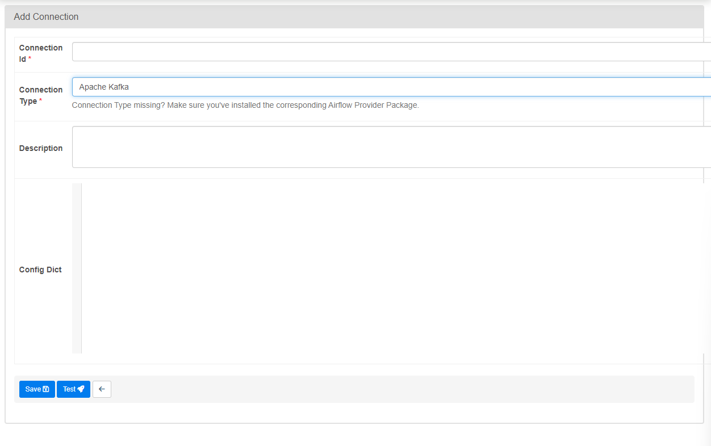

 .. Licensed to the Apache Software Foundation (ASF) under one
    or more contributor license agreements.  See the NOTICE file
    distributed with this work for additional information
    regarding copyright ownership.  The ASF licenses this file
    to you under the Apache License, Version 2.0 (the
    "License"); you may not use this file except in compliance
    with the License.  You may obtain a copy of the License at

 ..   http://www.apache.org/licenses/LICENSE-2.0

 .. Unless required by applicable law or agreed to in writing,
    software distributed under the License is distributed on an
    "AS IS" BASIS, WITHOUT WARRANTIES OR CONDITIONS OF ANY
    KIND, either express or implied.  See the License for the
    specific language governing permissions and limitations
    under the License.

.. _howto/connection:kafka:

Apache Kafka Connection
========================

The Apache Kafka connection type configures a connection to Apache Kafka via the ``confluent-kafka`` Python package.

Default Connection IDs
----------------------

Kafka hooks and operators use ``kafka_default`` by default, this connection is very minimal and should not be assumed useful for more than the most trivial of testing.

Configuring the Connection
--------------------------

Connections are configured as a json serializable string provided to the ``extra`` field. The ``error_cb`` parameter can be
used to specify a callback function by providing a path to the function. e.g ``"module.callback_func"``. A full list
of parameters are described in the
`Confluent Kafka python library <https://github.com/confluentinc/librdkafka/blob/master/CONFIGURATION.md>`_.

.. warning::

    Callback options supplied as dotted-path strings (``error_cb``, ``throttle_cb``, ``stats_cb``,
    ``log_cb``, ``oauth_cb``, ``on_commit``) are only imported when listed in the
    :ref:`config:apache_kafka__callback_allowlist` configuration. Each allowlist entry is the full
    importable path of the callback itself — module plus attribute, e.g.
    ``my_company.kafka.auth.oauth_cb`` — and must match the connection value exactly; a bare module
    such as ``my_company.kafka.auth`` does not lead to authorization of the callables inside it.
    This is enforced for security reasons, to prevent malicious callbacks from being executed.
    The allowlist is empty by default, which disables string-valued callbacks entirely.
    Automatically injected managed authentication (Amazon MSK IAM, Google Managed Kafka) does not
    use the allowlist. An explicitly configured ``oauth_cb`` does.

If you are defining the Airflow connection from the Airflow UI, the ``extra`` field will be renamed to ``Config Dict``.

Most operators and hooks will check that at the minimum the ``bootstrap.servers`` key exists and has a value set to be valid.

Amazon MSK with IAM authentication
----------------------------------

`Amazon MSK <https://aws.amazon.com/msk/>`_ clusters (both provisioned and serverless) can be
authenticated with `IAM <https://docs.aws.amazon.com/msk/latest/developerguide/iam-access-control.html>`_.
This requires the ``aws-msk-iam-sasl-signer-python`` package, which is installed with the ``msk`` extra:

.. code-block:: bash

    pip install apache-airflow-providers-apache-kafka[msk]

When the ``bootstrap.servers`` point at an Amazon MSK endpoint (for example
``*.kafka.<region>.amazonaws.com`` or ``*.kafka-serverless.<region>.amazonaws.com``) and
``sasl.mechanism`` is set to ``OAUTHBEARER``, the hook automatically generates and refreshes the
IAM authentication token, deriving the AWS region from the bootstrap servers. The credentials are
resolved by the signer using the standard AWS credential provider chain (environment variables,
shared config/credentials files, instance/task IAM roles, etc.).

An example ``extra`` (``Config Dict``) for an MSK connection:

.. code-block:: json

    {
        "bootstrap.servers": "boot-abcde1.c2.kafka-serverless.us-east-1.amazonaws.com:9098",
        "security.protocol": "SASL_SSL",
        "sasl.mechanism": "OAUTHBEARER",
        "group.id": "my-group"
    }

An explicit ``oauth_cb`` provided in the connection configuration is always respected and is never
overwritten by the automatic MSK IAM callback.

Explicit MSK IAM callback with an AWS connection
~~~~~~~~~~~~~~~~~~~~~~~~~~~~~~~~~~~~~~~~~~~~~~~~

To use credentials from a specific Airflow AWS connection instead of the signer's default credential
chain, set ``oauth_cb`` explicitly. Install the Amazon provider with its ``msk`` extra so the callback
and MSK IAM signer are available:

.. code-block:: bash

    pip install 'apache-airflow-providers-amazon[msk]'

Create an `Amazon Web Services connection
<https://airflow.apache.org/docs/apache-airflow-providers-amazon/stable/connections/aws.html>`_
with the connection ID ``aws_msk_prod`` and the credentials or IAM role to use. Set its Extra to
specify the MSK cluster's region:

.. code-block:: json

    {"region_name": "us-east-1"}

Allow the public callback in the Airflow configuration:

.. code-block:: ini

    [apache_kafka]
    callback_allowlist = airflow.providers.amazon.aws.hooks.msk.oauth_cb

Then create a Kafka connection with the following Extra (``Config Dict`` in the UI):

.. code-block:: json

    {
        "bootstrap.servers": "boot-abcde1.c2.kafka-serverless.us-east-1.amazonaws.com:9098",
        "security.protocol": "SASL_SSL",
        "sasl.mechanism": "OAUTHBEARER",
        "group.id": "my-group",
        "oauth_cb": "airflow.providers.amazon.aws.hooks.msk.oauth_cb",
        "sasl.oauthbearer.config": "{\"aws_conn_id\":\"aws_msk_prod\"}"
    }

``confluent-kafka`` passes the ``sasl.oauthbearer.config`` string to ``oauth_cb(config_str)``.
The callback parses it as JSON and uses ``aws_conn_id`` to select the AWS connection. You can
also include ``region_name`` in that JSON string to override the region in the AWS connection.
The explicit callback is used instead of the automatic MSK IAM callback.

.. warning::

    The callback allowlist controls which function can be imported, but does not restrict the
    ``aws_conn_id`` passed to it. Anyone who can edit this Kafka connection can change which AWS
    connection the callback uses. Restrict access to the Kafka connection accordingly.
