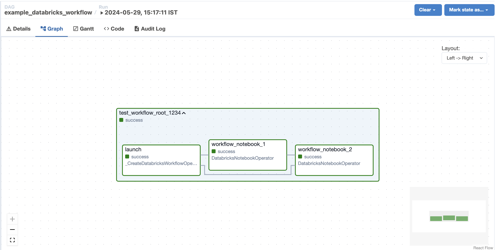
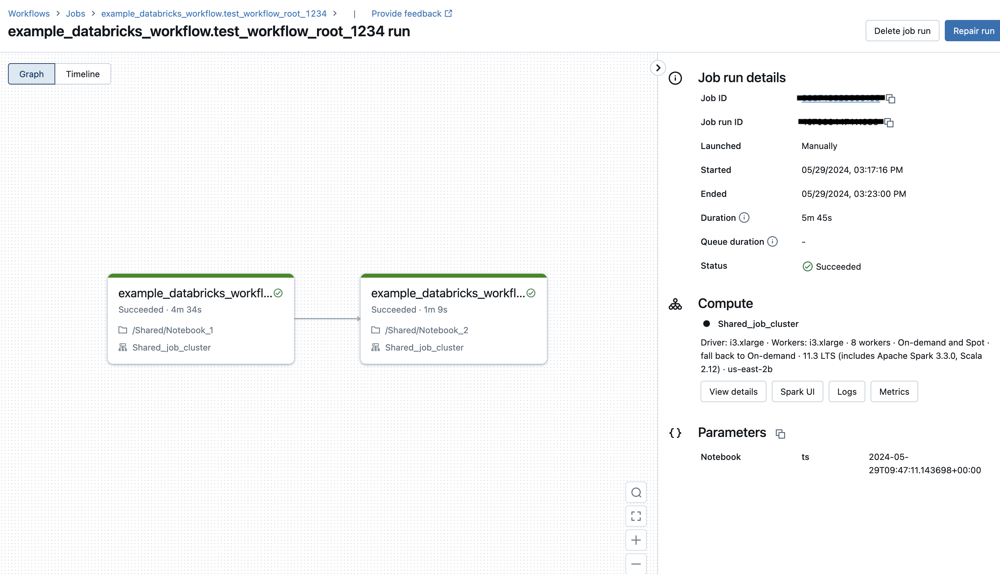

 .. Licensed to the Apache Software Foundation (ASF) under one
    or more contributor license agreements.  See the NOTICE file
    distributed with this work for additional information
    regarding copyright ownership.  The ASF licenses this file
    to you under the Apache License, Version 2.0 (the
    "License"); you may not use this file except in compliance
    with the License.  You may obtain a copy of the License at

 ..   http://www.apache.org/licenses/LICENSE-2.0

 .. Unless required by applicable law or agreed to in writing,
    software distributed under the License is distributed on an
    "AS IS" BASIS, WITHOUT WARRANTIES OR CONDITIONS OF ANY
    KIND, either express or implied.  See the License for the
    specific language governing permissions and limitations
    under the License.

.. _howto/operator:DatabricksWorkflowTaskGroup:

DatabricksWorkflowTaskGroup
===========================

Use the :class:`~airflow.providers.databricks.operators.databricks_workflow.DatabricksWorkflowTaskGroup` to launch and monitor
Databricks notebook job runs as Airflow tasks. The task group launches a `Databricks Workflow <https://docs.databricks.com/en/workflows/index.html/>`_ and runs the notebook jobs from within it, resulting in a `75% cost reduction <https://www.databricks.com/product/pricing>`_ ($0.40/DBU for all-purpose compute, $0.07/DBU for Jobs compute) when compared to executing ``DatabricksNotebookOperator`` outside of ``DatabricksWorkflowTaskGroup``.

There are a few advantages to defining your Databricks Workflows in Airflow:

=======================================  =============================================  =================================
Authoring interface                      via Databricks (Web-based with Databricks UI)  via Airflow(Code with Airflow Dag)
=======================================  =============================================  =================================
Workflow compute pricing                 ✅                                             ✅
Notebook code in source control          ✅                                             ✅
Workflow structure in source control     ✅                                             ✅
Retry from beginning                     ✅                                             ✅
Retry single task                        ✅                                             ✅
Task groups within Workflows                                                            ✅
Trigger workflows from other Dags                                                       ✅
Workflow-level parameters                                                               ✅
=======================================  =============================================  =================================

Examples
--------

Example of what a Dag looks like with a DatabricksWorkflowTaskGroup
~~~~~~~~~~~~~~~~~~~~~~~~~~~~~~~~~~~~~~~~~~~~~~~~~~~~~~~~~~~~~~~~~~~
.. exampleinclude:: /../../databricks/tests/system/databricks/example_databricks_workflow.py
    :language: python
    :start-after: [START howto_databricks_workflow_notebook]
    :end-before: [END howto_databricks_workflow_notebook]

With this example, Airflow will produce a job named ``<dag_name>.test_workflow_<USER>_<GROUP_ID>`` that will
run task ``notebook_1`` and then ``notebook_2``. The job will be created in the databricks workspace
if it does not already exist. If the job already exists, it will be updated to match
the workflow defined in the Dag.

The following image displays the resulting Databricks Workflow in the Airflow UI (based on the above example provided)
~~~~~~~~~~~~~~~~~~~~~~~~~~~~~~~~~~~~~~~~~~~~~~~~~~~~~~~~~~~~~~~~~~~~~~~~~~~~~~~~~~~~~~~~~~~~~~~~~~~~~~~~~~~~~~~~~~~~~~

The corresponding Databricks Workflow  in the Databricks UI for the run triggered from the Airflow Dag is depicted below
~~~~~~~~~~~~~~~~~~~~~~~~~~~~~~~~~~~~~~~~~~~~~~~~~~~~~~~~~~~~~~~~~~~~~~~~~~~~~~~~~~~~~~~~~~~~~~~~~~~~~~~~~~~~~~~~~~~~~~~~

To minimize update conflicts, we recommend that you keep parameters in the ``notebook_params`` of the
``DatabricksWorkflowTaskGroup`` and not in the ``DatabricksNotebookOperator`` whenever possible.
This is because, tasks in the ``DatabricksWorkflowTaskGroup`` are passed in on the job trigger time and
do not modify the job definition.
