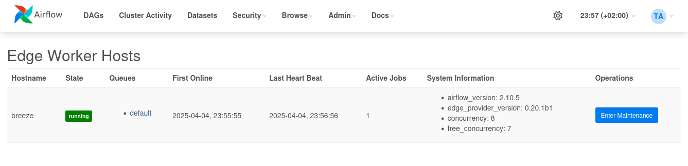

 .. Licensed to the Apache Software Foundation (ASF) under one
    or more contributor license agreements.  See the NOTICE file
    distributed with this work for additional information
    regarding copyright ownership.  The ASF licenses this file
    to you under the Apache License, Version 2.0 (the
    "License"); you may not use this file except in compliance
    with the License.  You may obtain a copy of the License at

 ..   http://www.apache.org/licenses/LICENSE-2.0

 .. Unless required by applicable law or agreed to in writing,
    software distributed under the License is distributed on an
    "AS IS" BASIS, WITHOUT WARRANTIES OR CONDITIONS OF ANY
    KIND, either express or implied.  See the License for the
    specific language governing permissions and limitations
    under the License.

Edge Worker Deployment
======================

Edge Workers can be deployed outside of the central Airflow infrastructure. They
are connected to the Airflow API server via HTTP(s). The Edge Worker is a
lightweight component that can be deployed on any machine that has outbound
HTTP(s) access to the Airflow API server. It allows you to run Airflow tasks on machines
that are not part of your main data center, e.g. edge servers. This also allows to
deploy only reduced dependencies on the edge worker.

Here are a few imperative requirements for your workers:

- ``airflow`` needs to be installed, and the Airflow CLI needs to be in the path. This includes
  the Task SDK as well as the edge3 provider package.
- Airflow configuration settings should be homogeneous across the cluster and on the edge site
- Operators that are executed on the Edge Worker need to have their dependencies
  met in that context. Please take a look to the respective provider package
  documentations
- The worker needs to have access to the ``DAGS_FOLDER``, and you need to
  synchronize the filesystems by your own means. A common setup would be to
  store your ``DAGS_FOLDER`` in a Git repository and sync it across machines using
  Chef, Puppet, Ansible, or whatever you use to configure machines in your
  environment. If all your boxes have a common mount point, having your
  pipelines files shared there should work as well

Minimum Airflow configuration settings for the Edge Worker to make it running is:

- Section ``[api_auth]``

  - ``jwt_secret``: A shared secret between workers and the api-server to authenticate
    (starting from version 3.0.0).

- Section ``[core]``

  - ``execution_api_server_url``: If not set, the base URL from ``edge.api_url`` will be used. For example,
    when ``edge.api_url`` is set to ``https://your-hostname-and-port/subpath/edge_worker/v1/rpcapi``, it will
    default to ``https://your-hostname-and-port/subpath/execution/`` (starting from version Airflow version 3.0.0).
  - ``executor``: Executor must be set or added to be ``airflow.providers.edge3.executors.EdgeExecutor``
  - ``internal_api_secret_key``: An encryption key must be set on api-server and Edge Worker component as
    shared secret to authenticate traffic. It should be a random string like the fernet key
    (for versions earlier than 3.0.0 - from Airflow 3.0 and above this is using ``api_auth.jwt_secret``).

- Section ``[edge]``

  - ``api_enabled``: Must be set to true. It is disabled intentionally to not expose
    API endpoint by default. This is the endpoint the worker connects to.
    In a future release a dedicated API server can be started.
  - ``api_url``: Must be set to the URL which exposes the api endpoint as it is reachable from the
    worker. Typically this looks like ``https://your-hostname-and-port/edge_worker/v1/rpcapi``.

To kick off a worker, you need to setup Airflow and kick off the worker
subcommand

.. code-block:: bash

    airflow edge worker
    2025-09-27T12:28:32.954316Z [info     ] Starting worker with API endpoint http://localhost:8080/edge_worker/v1/rpcapi
      ____________       _____________
     ____    |__( )_________  __/__  /________      __
    ____  /| |_  /__  ___/_  /_ __  /_  __ \_ | /| / /
    ___  ___ |  / _  /   _  __/ _  / / /_/ /_ |/ |/ /
    _/_/  |_/_/  /_/    /_/    /_/  \____/____/|__/
       ____   __           _      __         __
      / __/__/ /__ ____   | | /| / /__  ____/ /_____ ____
     / _// _  / _  / -_)  | |/ |/ / _ \/ __/   _/ -_) __/
    /___/\_,_/\_, /\__/   |__/|__/\___/_/ /_/\_\\__/_/
            /___/

    2025-09-27T12:28:33.171525Z [info     ] No new job to process

You can also start this worker in the background by running
it as a daemonized process. Additionally, you can redirect stdout
and stderr to their respective files.

Make sure to set umask in [worker_umask] to set permissions
for newly created files by workers.

.. code-block:: bash

    airflow edge worker -D --stdout edge-worker.o.log --stderr edge-worker.e.log

Your worker should start picking up tasks as soon as they get fired in
its direction. To stop a worker running on a machine you can use:

.. code-block:: bash

    airflow edge stop

It will try to stop the worker gracefully by sending ``SIGINT`` signal to main
process as and wait until all running tasks are completed. Also in a console you can use
``Ctrl-C`` to stop the worker.

If you want to monitor the remote activity and worker, use the UI plugin which
is included in the provider package and install it on the api-server / webserver and use the
"Admin" - "Edge Worker Hosts" and "Edge Worker Jobs" pages.
(Note: The plugin is not available on Airflow 3.0 UI, it is only in 3.1++)

If you want to check status of the worker via CLI you can use the command

.. code-block:: bash

    airflow edge status

Some caveats:

- Tasks can consume resources. Make sure your worker has enough resources to run ``worker_concurrency`` tasks
- Make sure that the ``pool_slots`` of a Tasks matches with the ``worker_concurrency`` of the worker.
  See also :ref:`edge_executor:concurrency_slots`.
- Queue names are limited to 256 characters

See :doc:`apache-airflow:administration-and-deployment/modules_management` for details on how Python and Airflow manage modules.

.. _deployment:maintenance:

Worker Maintenance Mode
-----------------------

Sometimes infrastructure needs to be maintained. The Edge Worker provides a
maintenance mode to
- Stop accepting new tasks
- Drain all ongoing work gracefully

Also please note if the worker detects that the Airflow or Edge provider package version
is not the same as the one running on the API server, it will stop accepting new tasks and shut down gracefully.
This is to prevent running tasks with different versions of the code.

Worker status can be checked via the web UI in the "Admin" - "Edge Worker" page. Maintenance can be set on a per worker basis.

.. note::

    Airflow 3.0 does not support UI plugins. The UI plugin is only available in Airflow 3.1 and newer.
    Alternatively you can use the CLI commands as described in :ref:`deployment:maintenance-mgmt-cli`.

Worker maintenance can also be triggered via the CLI command on the machine that runs the worker.

.. code-block:: bash

    airflow edge maintenance --comments "Some comments for the maintenance" on

This will stop the local worker instance from accepting new tasks and will complete running tasks.
If you add the command argument ``--wait`` the CLI will wait until all
running tasks are completed before return.

If you want to know the status of you local worker while waiting on maintenance you can
use the command

.. code-block:: bash

    airflow edge status

This will show the status of the local worker instance as JSON and the tasks running on it.

The status and maintenance comments will also be shown in the web UI
in the "Admin" - "Edge Worker" page.

The local worker instance can be started to fetch new tasks via the command

.. code-block:: bash

    airflow edge maintenance off

This will start the worker again and it will start accepting tasks again.

.. _deployment:maintenance-mgmt-cli:

Worker Maintenance Management CLI
---------------------------------

Besides the CLI command to trigger maintenance on the local worker instance, there are also additional commands to
manage the maintenance of all workers in the cluster. These commands can be used to trigger maintenance
on all workers in the cluster or to check the status of all workers in the cluster.

These set of commands need database access, and can only be called on the central Airflow
instance. The commands are:

- ``airflow edge list-workers``: List all workers in the cluster
- ``airflow edge remote-edge-worker-request-maintenance``: Request a remote edge worker to enter maintenance mode
- ``airflow edge remote-edge-worker-update-maintenance-comment``: Updates the maintenance comment for a remote edge worker
- ``airflow edge remote-edge-worker-exit-maintenance``: Request a remote edge worker to exit maintenance mode
- ``airflow edge shutdown-remote-edge-worker``: Shuts down a remote edge worker gracefully
- ``airflow edge shutdown-all-workers``: Request graceful shutdown of all registered edge workers
- ``airflow edge remove-remote-edge-worker``: Remove a worker instance from the cluster
- ``airflow edge add-worker-queues``: Add queues to an edge worker
- ``airflow edge remove-worker-queues``: Remove queues from an edge worker
