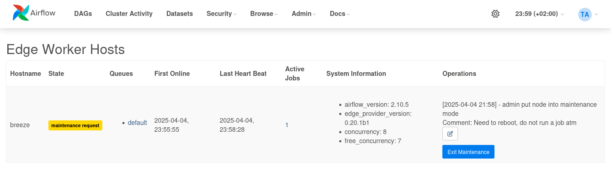

 .. Licensed to the Apache Software Foundation (ASF) under one
    or more contributor license agreements.  See the NOTICE file
    distributed with this work for additional information
    regarding copyright ownership.  The ASF licenses this file
    to you under the Apache License, Version 2.0 (the
    "License"); you may not use this file except in compliance
    with the License.  You may obtain a copy of the License at

 ..   http://www.apache.org/licenses/LICENSE-2.0

 .. Unless required by applicable law or agreed to in writing,
    software distributed under the License is distributed on an
    "AS IS" BASIS, WITHOUT WARRANTIES OR CONDITIONS OF ANY
    KIND, either express or implied.  See the License for the
    specific language governing permissions and limitations
    under the License.

Edge Executor
=============

``EdgeExecutor`` is an option if you want to distribute tasks to workers distributed in different locations.
You can use it also in parallel with other executors if needed. Change your ``airflow.cfg`` to point
the executor parameter to ``EdgeExecutor`` and provide the related settings.

The configuration parameters of the Edge Executor can be found in the Edge provider's :doc:`configurations-ref`.

Here are a few imperative requirements for your workers:

- ``airflow`` needs to be installed, and the airflow CLI needs to be in the path
- Airflow configuration settings should be homogeneous across the cluster and on the edge site
- Operators that are executed on the Edge Worker need to have their dependencies
  met in that context. Please take a look to the respective provider package
  documentations
- The worker needs to have access to its ``DAGS_FOLDER``, and you need to
  synchronize the filesystems by your own means. A common setup would be to
  store your ``DAGS_FOLDER`` in a Git repository and sync it across machines using
  Chef, Puppet, Ansible, or whatever you use to configure machines in your
  environment. If all your boxes have a common mount point, having your
  pipelines files shared there should work as well

Minimum configuration for the Edge Worker to make it running is:

- Section ``[core]``

  - ``executor``: Executor must be set or added to be ``airflow.providers.edge3.executors.EdgeExecutor``
  - ``internal_api_secret_key``: An encryption key must be set on webserver and Edge Worker component as
    shared secret to authenticate traffic. It should be a random string like the fernet key
    (but preferably not the same).

- Section ``[edge]``

  - ``api_enabled``: Must be set to true. It is disabled intentionally to not expose
    the endpoint by default. This is the endpoint the worker connects to.
    In a future release a dedicated API server can be started.
  - ``api_url``: Must be set to the URL which exposes the web endpoint

To kick off a worker, you need to setup Airflow and kick off the worker
subcommand

.. code-block:: bash

    airflow edge worker

Your worker should start picking up tasks as soon as they get fired in
its direction. To stop a worker running on a machine you can use:

.. code-block:: bash

    airflow edge stop

It will try to stop the worker gracefully by sending ``SIGINT`` signal to main
process as and wait until all running tasks are completed.

If you want to monitor the remote activity and worker, use the UI plugin which
is included in the provider package and install it on the webserver and use the
"Admin" - "Edge Worker Hosts" and "Edge Worker Jobs" pages.
(Note: The plugin is not ported to Airflow 3.0 web UI at time of writing)

If you want to check status of the worker via CLI you can use the command

.. code-block:: bash

    airflow edge status

Some caveats:

- Tasks can consume resources. Make sure your worker has enough resources to run ``worker_concurrency`` tasks
- Make sure that the ``pool_slots`` of a Tasks matches with the ``worker_concurrency`` of the worker
- Queue names are limited to 256 characters

See :doc:`apache-airflow:administration-and-deployment/modules_management` for details on how Python and Airflow manage modules.

Current Limitations Edge Executor
---------------------------------

If you plan to use the Edge Executor / Worker in the current stage you need to ensure you test properly
before use. The following features have been initially tested and are working:

- Some core operators

  - ``BashOperator``
  - ``PythonOperator``
  - ``@task`` decorator
  - ``@task.branch`` decorator
  - ``@task.virtualenv`` decorator
  - ``@task.bash`` decorator
  - Dynamic Mapped Tasks
  - XCom read/write
  - Variable and Connection access
  - Setup and Teardown tasks

- Some known limitations

  - Tasks that require DB access will fail - no DB connection from remote site is possible
    (which is the default in Airflow 3.0)
  - This also means that some direct Airflow API via Python is not possible (e.g. airflow.models.*)
  - Log upload will only work if you use a single web server instance or they need to share one log file volume.
    Logs are uploaded in chunks and are transferred via API. If you use multiple webservers w/o a shared log volume
    the logs will be scattered across the webserver instances.
  - Performance: No extensive performance assessment and scaling tests have been made. The edge executor package is
    optimized for stability. This will be incrementally improved in future releases. Setups have reported stable
    operation with ~50 workers until now. Note that executed tasks require more webserver API capacity.

Architecture
------------

.. graphviz::

    digraph A{
        rankdir="TB"
        node[shape="rectangle", style="rounded"]

        subgraph cluster {
            label="Cluster";
            {rank = same; dag; database}
            {rank = same; workers; scheduler; web}

            workers[label="(Central) Workers"]
            scheduler[label="Scheduler"]
            web[label="Web server"]
            database[label="Database"]
            dag[label="DAG files"]

            web->workers
            web->database

            workers->dag
            workers->database

            scheduler->dag
            scheduler->database
        }

        subgraph edge_worker_subgraph {
            label="Edge site";
            edge_worker[label="Edge Worker"]
            edge_dag[label="DAG files (Remote)"]

            edge_worker->edge_dag
        }

        edge_worker->web[label="HTTP(s)"]
    }

Airflow consist of several components:

* **Workers** - Execute the assigned tasks - most standard setup has local or centralized workers, e.g. via Celery
* **Edge Workers** - Special workers which pull tasks via HTTP as provided as feature via this provider package
* **Scheduler** - Responsible for adding the necessary tasks to the queue
* **Web server** - HTTP Server provides access to DAG/task status information
* **Database** - Contains information about the status of tasks, DAGs, Variables, connections, etc.

.. _edge_executor:queue:

Queues
------

When using the EdgeExecutor, the workers that tasks are sent to
can be specified. ``queue`` is an attribute of BaseOperator, so any
task can be assigned to any queue. The default queue for the environment
is defined in the ``airflow.cfg``'s ``operators -> default_queue``. This defines
the queue that tasks get assigned to when not specified, as well as which
queue Airflow workers listen to when started.

Workers can listen to one or multiple queues of tasks. When a worker is
started (using command ``airflow edge worker``), a set of comma-delimited queue
names (with no whitespace) can be given (e.g. ``airflow edge worker -q remote,wisconsin_site``).
This worker will then only pick up tasks wired to the specified queue(s).

This can be useful if you need specialized workers, either from a
resource perspective (for say very lightweight tasks where one worker
could take thousands of tasks without a problem), or from an environment
perspective (you want a worker running from a specific location where required
infrastructure is available).

Concurrency slot handling
-------------------------

Some tasks may need more resources than other tasks, to handle these use case the Edge worker supports
concurrency slot handling. The logic behind this is the same as the pool slot feature
see :doc:`apache-airflow:administration-and-deployment/pools`.
Edge worker reuses ``pool_slots`` of task_instance to keep number if task instance parameter as low as possible.
The ``pool_slots`` value works together with the ``worker_concurrency`` value which is defined during start of worker.
If a task needs more resources, the ``pool_slots`` value can be increased to reduce number of tasks running in parallel.
The value can be used to block other tasks from being executed in parallel on the same worker.
A ``pool_slots`` of 2 and a ``worker_concurrency`` of 3 means
that a worker which executes this task can only execute a job with a ``pool_slots`` of 1 in parallel.
If no ``pool_slots`` is defined for a task the default value is 1. The ``pool_slots`` value only supports
integer values.

Here is an example setting pool_slots for a task:

.. code-block:: python

    import os

    import pendulum

    from airflow import DAG
    from airflow.decorators import task
    from airflow.example_dags.libs.helper import print_stuff
    from airflow.settings import AIRFLOW_HOME

    with DAG(
        dag_id="example_edge_pool_slots",
        schedule=None,
        start_date=pendulum.datetime(2021, 1, 1, tz="UTC"),
        catchup=False,
        tags=["example"],
    ) as dag:

        @task(executor="EdgeExecutor", pool_slots=2)
        def task_with_template():
            print_stuff()

        task_with_template()

Worker maintenance
------------------

Sometimes infrastructure needs to be maintained. The Edge Worker provides a
maintenance mode to
- Stop accepting new tasks
- Drain all ongoing work gracefully

Worker status can be checked via the web UI in the "Admin" - "Edge Worker Hosts" page.

.. image:: img/worker_hosts.png

.. note::

    As of time of writing the web UI to see edge jobs and manage workers is not ported to Airflow 3.0

Worker maintenance can also be triggered via the CLI command

.. code-block:: bash

    airflow edge maintenance --comments "Some comments for the maintenance" on

This will stop the worker from accepting new tasks and will complete running tasks.
If you add the command argument ``--wait`` the CLI will wait until all
running tasks are completed before return.

If you want to know the status of a worker while waiting on maintenance you can
use the command
.. code-block:: bash

    airflow edge status

This will show the status of the worker as JSON and the tasks running on it.

The status and maintenance comments will also be shown in the web UI
in the "Admin" - "Edge Worker Hosts" page.

The worker can be started to fetch new tasks via the command

.. code-block:: bash

    airflow edge maintenance off

This will start the worker again and it will start accepting tasks again.

Feature Backlog of MVP to Release Readiness
-------------------------------------------

The current version of the EdgeExecutor is a MVP (Minimum Viable Product). It will mature over time.

The following features are known missing and will be implemented in increments:

- API token per worker: Today there is a global API token available only
- Edge Worker Plugin

  - Overview about queues / jobs per queue
  - Allow starting Edge Worker REST API separate to webserver
  - Add some hints how to setup an additional worker

- Edge Worker CLI

  - Use WebSockets instead of HTTP calls for communication
  - Send logs also to TaskFileHandler if external logging services are used
  - Integration into telemetry to send metrics from remote site
  - Publish system metrics with heartbeats (CPU, Disk space, RAM, Load)
  - Be more liberal e.g. on patch version. Currently requires exact version match
    (In current state if versions do not match, the worker will gracefully shut
    down when jobs are completed, no new jobs will be started)

- Tests

  - Integration tests in Github
  - Test/Support on Windows for Edge Worker

- Scaling test - Check and define boundaries of workers/jobs. Today it is known to
  scale into a range of 50 workers. This is not a hard limit but just an experience reported.
- Load tests - impact of scaled execution and code optimization
- Incremental logs during task execution can be served w/o shared log disk on webserver

- Documentation

  - Describe more details on deployment options and tuning
  - Provide scripts and guides to install edge components as service (systemd)
  - Extend Helm-Chart for needed support
  - Provide an example docker compose for worker setup
