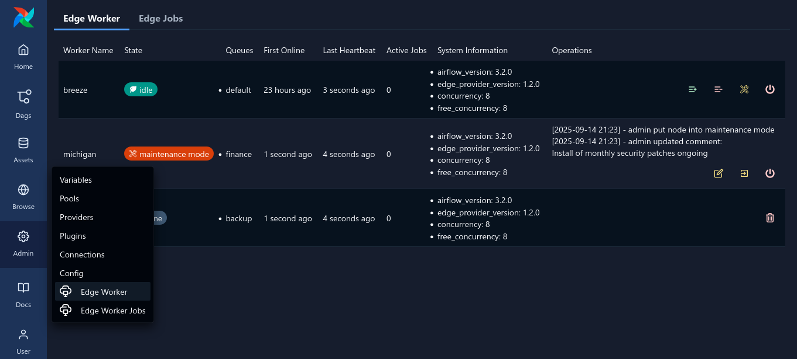

 .. Licensed to the Apache Software Foundation (ASF) under one
    or more contributor license agreements.  See the NOTICE file
    distributed with this work for additional information
    regarding copyright ownership.  The ASF licenses this file
    to you under the Apache License, Version 2.0 (the
    "License"); you may not use this file except in compliance
    with the License.  You may obtain a copy of the License at

 ..   http://www.apache.org/licenses/LICENSE-2.0

 .. Unless required by applicable law or agreed to in writing,
    software distributed under the License is distributed on an
    "AS IS" BASIS, WITHOUT WARRANTIES OR CONDITIONS OF ANY
    KIND, either express or implied.  See the License for the
    specific language governing permissions and limitations
    under the License.

Edge UI Plugin and REST API
===========================

The Edge provider uses a Plugin to

- Extend the REST API endpoints for connecting workers to the Airflow cluster
- Provide a web UI for managing the workers and monitoring their status and tasks
  (Note: Airflow 3.0 does not have support for UI plugins. The UI plugin is only available in Airflow 3.1 and newer.)

REST API endpoints
------------------

The Edge provider adds the following REST API endpoints to the Airflow API:

- ``/edge_worker/v1/jobs``: Endpoints to fetch jobs for workers and report state
- ``/edge_worker/v1/logs``: Endpoint to push log chunks from workers to the Airflow cluster
- ``/edge_worker/v1/workers``: Endpoints to register and manage workers, report heartbeat
- ``/edge_worker/v1/health``: Check that the API endpoint is deployed and active

To see full documentation of the API endpoints open the Airflow web UI and navigate to
the sub-path ``/edge_worker/docs``.

Web UI Plugin
-------------

.. note::

    Airflow 3.0 does not support UI plugins. The UI plugin is only available in Airflow 3.1 and newer.
    Alternatively you can use the CLI commands as described in :ref:`deployment:maintenance-mgmt-cli`.

The Edge provider adds a web UI plugin to the Airflow web UI. The plugin is
made to be able to see job queue and Edge Worker status.

Pending and processes tasks can be checked in "Admin" - "Edge Worker Jobs" page.

Worker status can be checked via the web UI in the "Admin" - "Edge Worker" page.

Via the UI you can also set the status of the worker to "Maintenance" or "Active".

The status and maintenance comments will also be shown in the web UI
in the "Admin" - "Edge Worker" page.

Note that maintenance mode can also be adjusted via CLI.
See :ref:`deployment:maintenance` for more details.
