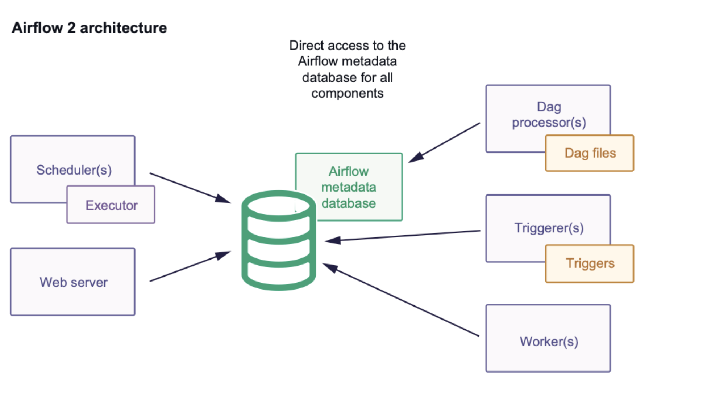
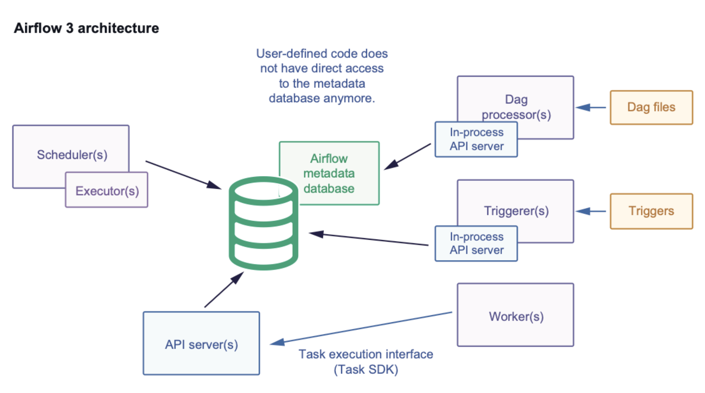

.. Licensed to the Apache Software Foundation (ASF) under one
   or more contributor license agreements.  See the NOTICE file
   distributed with this work for additional information
   regarding copyright ownership.  The ASF licenses this file
   to you under the Apache License, Version 2.0 (the
   "License"); you may not use this file except in compliance
   with the License.  You may obtain a copy of the License at

..   http://www.apache.org/licenses/LICENSE-2.0

.. Unless required by applicable law or agreed to in writing,
   software distributed under the License is distributed on an
   "AS IS" BASIS, WITHOUT WARRANTIES OR CONDITIONS OF ANY
   KIND, either express or implied.  See the License for the
   specific language governing permissions and limitations
   under the License.

Concepts
========

This section covers the fundamental concepts that DAG authors need to understand when working with the Task SDK.

Terminology
-----------
- **Task**: a Python function (decorated with ``@task``) or Operator invocation representing a unit of work in a DAG.
- **Task Execution**: the runtime machinery that executes user tasks in isolated subprocesses, managed via the Supervisor and Execution API.

Airflow 2.x vs 3.x Architecture
-------------------------------

Understanding the architectural differences between Airflow 2.x and 3.x helps DAG authors understand the benefits and changes in the Task SDK approach.

Airflow 2.x Architecture
^^^^^^^^^^^^^^^^^^^^^^^^

- All components communicate with the Airflow metadata database.
- Airflow 2 was designed to run all components within the same network space: task code and task execution code (airflow package code that runs user code) run in the same process.
- Workers communicate directly with the Airflow database and execute all user code.
- User code could import sessions and perform malicious actions on the Airflow metadata database.
- The number of connections to the database was excessive, leading to scaling challenges.

Airflow 3.x Architecture
^^^^^^^^^^^^^^^^^^^^^^^^

- The API server is currently the sole access point for the metadata DB for tasks and workers.
- It supports several applications: the Airflow REST API, an internal API for the Airflow UI that hosts static JS, and an API for workers to interact with when executing TIs via the task execution interface.
- Workers communicate with the API server.
- DAG processor and Triggerer utilize the task execution mechanism for their tasks, especially when they require variables or connections.

Database Access Restrictions
----------------------------

In Airflow 3.x, direct metadata database access from task code is now restricted. This is a key security and architectural improvement that affects how DAG authors interact with Airflow resources:

- **No Direct Database Access**: Task code can no longer directly import and use Airflow database sessions or models.
- **API-Based Resource Access**: All runtime interactions (state transitions, heartbeats, XComs, and resource fetching) are handled through a dedicated Task Execution API.
- **Enhanced Security**: This ensures isolation and security by preventing malicious task code from accessing or modifying the Airflow metadata database.
- **Stable Interface**: The Task SDK provides a stable, forward-compatible interface for accessing Airflow resources without direct database dependencies.

Task Lifecycle
--------------

Understanding the task lifecycle helps DAG authors write more effective tasks and debug issues:

- **Scheduled**: The Airflow scheduler enqueues the task instance. The Executor assigns a workload token used for subsequent API authentication and validation.
- **Queued**: Workers poll the queue to retrieve and reserve queued task instances.
- **Subprocess Launch**: The worker's Supervisor process spawns a dedicated subprocess (Task Runner) for the task instance, isolating its execution.
- **Run API Call**: The Supervisor sends a ``POST /run`` call to the Execution API to mark the task as running; the API server responds with a ``TIRunContext`` (including retry limits, fail-fast flags, etc.).
- **Resource Fetch**: During execution, if the task code requests Airflow resources (variables, connections, etc.), it writes a request to STDOUT. The Supervisor intercepts it, issues a corresponding API call, and writes the API response into the subprocess's STDIN.
- **Heartbeats & Token Renewal**: The Task Runner periodically emits ``POST /heartbeat`` calls. Each call authenticates via JWT; if the token has expired, the API server returns a refreshed token in the ``Refreshed-API-Token`` header.
- **XCom Operations**: Upon successful task completion (or when explicitly invoked during execution), the Supervisor issues API calls to set or clear XCom entries for inter-task data passing.
- **State Patch**: When the task reaches a terminal (success/failed), deferred, or rescheduled state, the Supervisor invokes ``PATCH /state`` with the final task status and metadata.

Supervisor & Task Runner
------------------------

Within an Airflow worker, a Supervisor process manages the execution of task instances:

- Spawns isolated subprocesses (Task Runners) for each task, following a parent–child model.
- Establishes dedicated STDIN, STDOUT, and log pipes to communicate with each subprocess.
- Proxies Execution API calls: forwards subprocess requests (e.g., variables, connections, XCom operations, state transitions) to the API server and relays responses.
- Monitors subprocess liveness via heartbeats and marks tasks as failed if heartbeats are missed.
- Generates and refreshes JWT tokens on behalf of subprocesses through heartbeat responses to ensure authenticated API calls.

A Task Runner subprocess provides a sandboxed environment where user task code runs:

- Receives startup messages (run parameters) via STDIN from the Supervisor.
- Executes the Python function or operator code in isolation.
- Emits logs through STDOUT and communicates runtime events (heartbeats, XCom messages) via the Supervisor.
- Performs final state transitions by sending authenticated API calls through the Supervisor.
