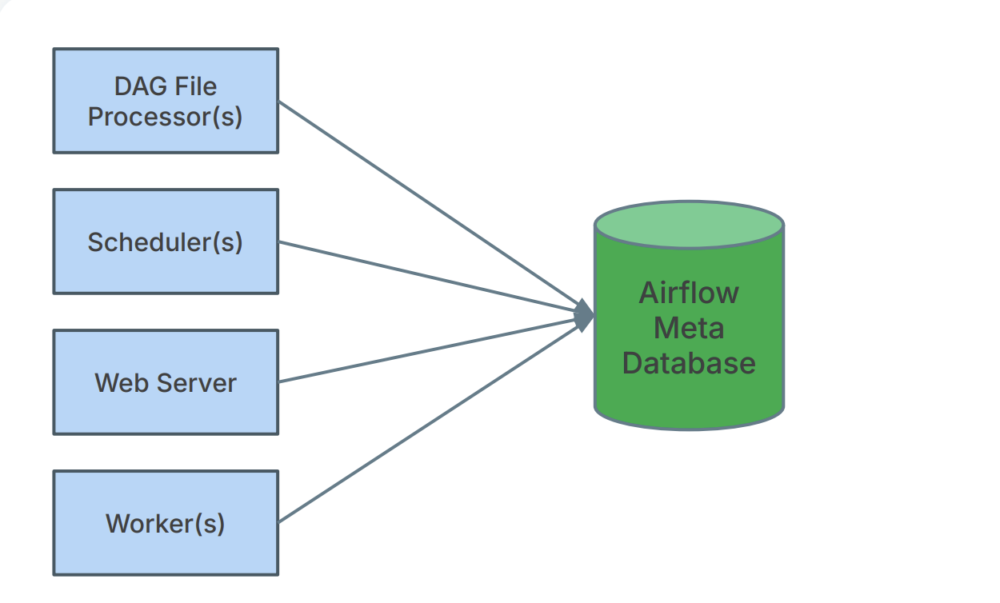
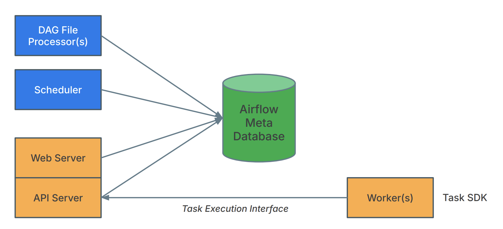

 .. Licensed to the Apache Software Foundation (ASF) under one
    or more contributor license agreements.  See the NOTICE file
    distributed with this work for additional information
    regarding copyright ownership.  The ASF licenses this file
    to you under the Apache License, Version 2.0 (the
    "License"); you may not use this file except in compliance
    with the License.  You may obtain a copy of the License at

 ..   http://www.apache.org/licenses/LICENSE-2.0

 .. Unless required by applicable law or agreed to in writing,
    software distributed under the License is distributed on an
    "AS IS" BASIS, WITHOUT WARRANTIES OR CONDITIONS OF ANY
    KIND, either express or implied.  See the License for the
    specific language governing permissions and limitations
    under the License.

Apache Airflow Task SDK
=================================

The Apache Airflow Task SDK provides python-native interfaces for defining Dags,
executing tasks in isolated subprocesses and interacting with Airflow resources
(e.g., Connections, Variables, XComs, Metrics, Logs, and OpenLineage events) at runtime.
It also includes core execution-time components to manage communication between the worker
and the Airflow scheduler/backend.

The goal of task-sdk is to decouple Dag authoring from Airflow internals (Scheduler, API Server, etc.), providing a forward-compatible, stable interface for writing and maintaining Dags across Airflow versions. This approach reduces boilerplate and keeps your Dag definitions concise and readable.

1. Introduction and Getting Started
-----------------------------------

Below is a quick introduction and installation guide to get started with the Task SDK.

Installation
^^^^^^^^^^^^
To install the Task SDK, run:

.. code-block:: bash

   pip install apache-airflow-task-sdk

Getting Started
^^^^^^^^^^^^^^^
Define a basic Dag and task in just a few lines of Python:

.. exampleinclude:: ../../airflow-core/src/airflow/example_dags/example_simplest_dag.py
   :language: python
   :start-after: [START simplest_dag]
   :end-before: [END simplest_dag]
   :caption: Simplest Dag with :func:`@dag <airflow.sdk.dag>`  and :func:`@task <airflow.sdk.task>`

2. Public Interface
-------------------

Direct metadata database access from task code is now restricted. A dedicated Task Execution API handles all runtime interactions (state transitions, heartbeats, XComs, and resource fetching), ensuring isolation and security.

Airflow now supports a service-oriented architecture, enabling tasks to be executed remotely via a new Task Execution API. This API decouples task execution from the scheduler and introduces a stable contract for running tasks outside of Airflow's traditional runtime environment.

To support remote execution, Airflow provides the Task SDK — a lightweight runtime environment for running Airflow tasks in external systems such as containers, edge environments, or other runtimes. This lays the groundwork for language-agnostic task execution and brings improved isolation, portability, and extensibility to Airflow-based workflows.

Airflow 3.0 also introduces a new ``airflow.sdk`` namespace that exposes the core authoring interfaces for defining Dags and tasks. Dag authors should now import objects like :class:`airflow.sdk.DAG`, :func:`airflow.sdk.dag`, and :func:`airflow.sdk.task` from ``airflow.sdk`` rather than internal modules. This new namespace provides a stable, forward-compatible interface for Dag authoring across future versions of Airflow.

3. Dag authoring Enhancements
-----------------------------

Writing your Dags is now more consistent in Airflow 3.0. Use the stable :mod:`airflow.sdk` interface to define your workflows and tasks.

Why use ``airflow.sdk``?
^^^^^^^^^^^^^^^^^^^^^^^^

- Decouple your Dag definitions from Airflow internals (Scheduler, API Server, etc.)
- Enjoy a consistent API that won't break across Airflow upgrades
- Import only the classes and decorators you need, without installing the full Airflow core

**Key imports from airflow.sdk**

**Classes**

- :class:`airflow.sdk.Asset`
- :class:`airflow.sdk.BaseHook`
- :class:`airflow.sdk.BaseNotifier`
- :class:`airflow.sdk.BaseOperator`
- :class:`airflow.sdk.BaseOperatorLink`
- :class:`airflow.sdk.BaseSensorOperator`
- :class:`airflow.sdk.Connection`
- :class:`airflow.sdk.Context`
- :class:`airflow.sdk.DAG`
- :class:`airflow.sdk.EdgeModifier`
- :class:`airflow.sdk.Label`
- :class:`airflow.sdk.ObjectStoragePath`
- :class:`airflow.sdk.Param`
- :class:`airflow.sdk.TaskGroup`
- :class:`airflow.sdk.TaskInstanceState`
- :class:`airflow.sdk.DagRunState`
- :class:`airflow.sdk.WeightRule`
- :class:`airflow.sdk.Variable`

**Decorators and helper functions**

- :func:`airflow.sdk.asset`
- :func:`airflow.sdk.dag`
- :func:`airflow.sdk.setup`
- :func:`airflow.sdk.task`
- :func:`airflow.sdk.task_group`
- :func:`airflow.sdk.teardown`
- :func:`airflow.sdk.chain`
- :func:`airflow.sdk.chain_linear`
- :func:`airflow.sdk.cross_downstream`
- :func:`airflow.sdk.get_current_context`
- :func:`airflow.sdk.get_parsing_context`

All Dags must update their imports to refer to ``airflow.sdk`` instead of using internal Airflow modules directly. Deprecated legacy import paths, such as ``airflow.models.dag.DAG`` and ``airflow.decorator.task``, will be removed in a future version of Airflow. Some utilities and helper functions currently used from ``airflow.utils.*`` and other modules will gradually be migrated to the Task SDK over the next minor releases. These upcoming updates aim to completely separate Dag creation from internal Airflow services. Dag authors can look forward to continuous improvements to airflow.sdk, with no backwards-incompatible changes to their existing code.

Legacy imports (deprecated):

.. code-block:: python

   # Airflow 2.x
   from airflow.models import DAG
   from airflow.decorators import task

Use instead:

.. code-block:: python

   # Airflow 3.x
   from airflow.sdk import DAG, task

4. Example Dag References
-------------------------

Explore a variety of Dag examples and patterns in the :doc:`examples` page.

5. Concepts
-----------

Discover the fundamental concepts that Dag authors need to understand when working with the Task SDK, including Airflow 2.x vs 3.x architectural differences, database access restrictions, and task lifecycle. For full details, see the :doc:`concepts` page.

Airflow 2.x Architecture
^^^^^^^^^^^^^^^^^^^^^^^^

Architectural Decoupling: Task Execution Interface (Airflow 3.x)
^^^^^^^^^^^^^^^^^^^^^^^^^^^^^^^^^^^^^^^^^^^^^^^^^^^^^^^^^^^^^^^^

6. API References
-----------------

For the full public API reference, see the :doc:`api` page.

.. toctree::
  :hidden:

  examples
  dynamic-task-mapping
  api
  concepts
